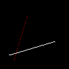
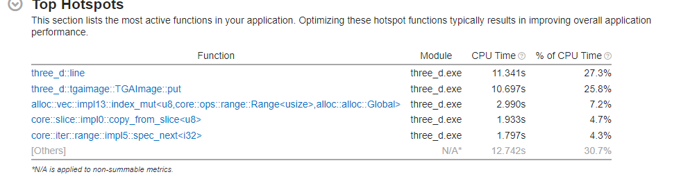
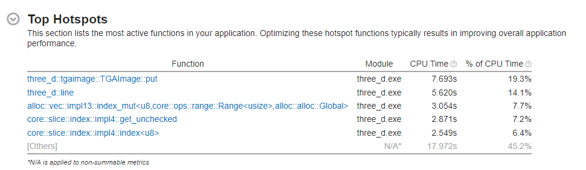
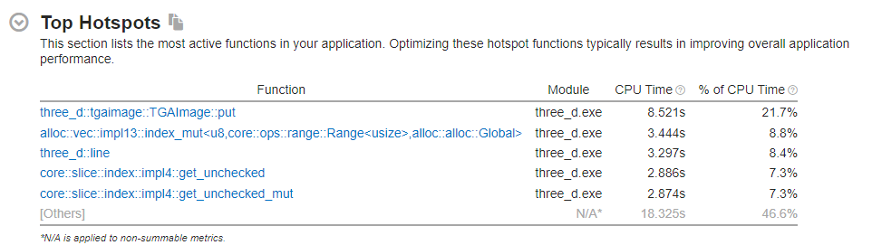
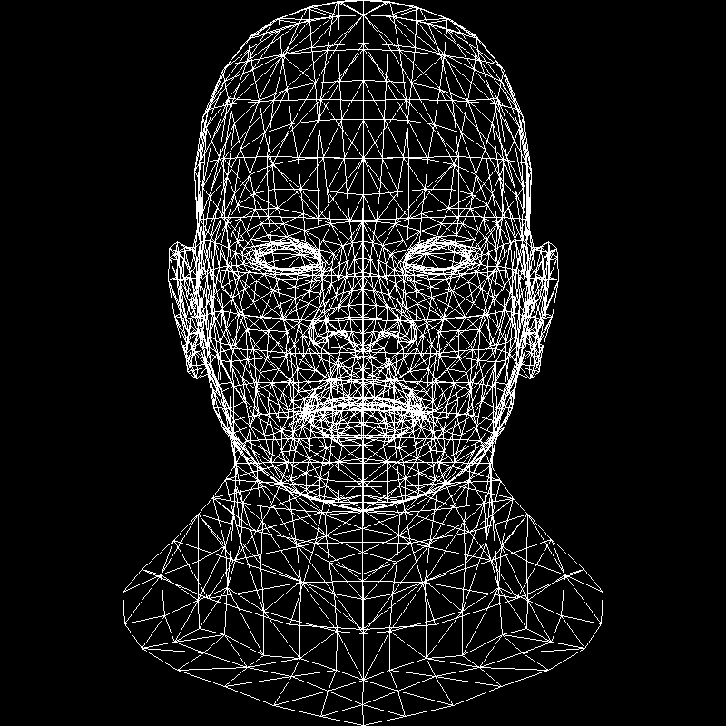

# 1. 畫直線

我們第一步要先在一張空白的紙上畫一條直線。

給定起點終點 $(x_0, y_0), (x_1, y_1)$，我們可以寫出這條直線的截距式方程：

$$
(y-y_0) = \frac{y_1-y_0}{x_1-x_0} (x-x_0)
$$

其中 $\frac{y_1-y_0}{x_1-x_0}$ 就是這一條線的斜率。給定一個 $x$，我們就可以計算出 $y$。

$$
y = \frac{y_1-y_0}{x_1-x_0} (x-x_0) + y_0
$$

```rust
fn line(
    x0: i32,
    y0: i32,
    x1: i32,
    y1: i32,
    imgbuf: &mut TGAImage,
    color: &TGAColour,
) {
    let m: f32 = (y1 - y0) as f32 / (x1 - x0) as f32;
    for x in x0..x1 {
        let y = m * (x - x0) as f32 + y0 as f32;
        imgbuf.put(x as u16, y as u16, color);
    }
}
```

用上面的代碼畫三條線：

```rust
line(13, 20, 80, 40, &mut imgbuf, WHITE);
line(20, 13, 40, 80, &mut imgbuf, RED);
line(80, 40, 13, 20, &mut imgbuf, RED);
```



這裡很快就遇到了問題：第二條線的斜率太大了，以至於 $x$ 每走一步，$y$ 就走了很多步，這樣就會出現很多空白的點。至於第三條線，因為他的 $x_1$ 比 $x_0$ 小，而我們是從 $x_0$ 開始遍歷，所以他根本不會被畫出來。

對於終點在起點右邊的線，我們可以把起點終點對調一下，這樣就可以保證 $x_0$ 比 $x_1$ 小了。而對於斜率大於 1 的線，我們可以把它的坐標進行轉置，即把 $x$ 和 $y$ 對調一下。這樣就能保證 $x$ 的一個步長，不會對應到 $y$ 的很多步長了。最後在畫的時候，再把 $x$ 和 $y$ 對調回來。

```rust
fn line(
    x0: i32,
    y0: i32,
    x1: i32,
    y1: i32,
    imgbuf: &mut ImageBuffer<Rgba<u8>, Vec<u8>>,
    color: Rgba<u8>,
) {
    let steep = (y1 - y0).abs() > (x1 - x0).abs();
    let (mut x0, mut y0, mut x1, mut y1) = if steep {
        (y0, x0, y1, x1)
    } else {
        (x0, y0, x1, y1)
    };

    if x0 > x1 {
        std::mem::swap(&mut x0, &mut x1);
        std::mem::swap(&mut y0, &mut y1);
    }

    let m: f32 = (y1 - y0) as f32 / (x1 - x0) as f32;
    for x in x0..=x1 {
        let y = m * (x - x0) as f32 + y0 as f32;
        if steep {
            imgbuf.put(x as u16, y as u16, color);
        } else {
            imgbuf.put(x as u16, y as u16, color);
        }
    }
}
```

:::info
轉置要放在判斷是否對調起點終點的前面，因為如果先對調了起點終點，再轉置，有可能會把起點終點對調回去。
:::


## 性能分析

因為在 3D 中，需要大量的畫線，所以這個函數的新能非常關鍵。提升一點點性能，就能大大提升整個程序的性能。

將以上 3 條線循環執行 1000,000,00 次，用 Vtune 進行分析，可以看到函數的執行時間是最多的，佔了 27.3%，而這就是我們要優化的地方。



在上面的函數裡，我們大量的使用了浮點數乘法，以及浮點數和整數的轉換。這些操作都是非常耗時的。要盡可能的避免這些操作。


我們在屏幕上畫一條線，這條線的起點和重點實際上是在我們指定像素的中間。因為一個像素的長度是 1 個單位，所以如果 $y$ 軸偏移了 0.5 個單位，那麼對應像素的 $y$ 坐標就也會偏移 1 個像素。

因此我們可以用一個浮點數來表示 $y$ 隨 $x$ 變化的偏移量，如果偏移量大於 0.5，代表我們要畫的像素的 $y$ 坐標要加 1。同時，我們也會把偏移量減去 1，這代表 $y$ 軸相對於現在像素中心點的偏移量。

```rust
fn line(x0: i32, y0: i32, x1: i32, y1: i32, imgbuf: &mut TGAImage, color: &TGAColour) {
    let steep = (y1 - y0).abs() > (x1 - x0).abs();
    let (mut x0, mut y0, mut x1, mut y1) = if steep {
        (y0, x0, y1, x1)
    } else {
        (x0, y0, x1, y1)
    };

    if x0 > x1 {
        std::mem::swap(&mut x0, &mut x1);
        std::mem::swap(&mut y0, &mut y1);
    }

    let mut error = 0_f32;
    let derror = (y1 - y0).abs() as f32 / (x1 - x0) as f32;
    let direction = if y1 > y0 { 1 } else { -1 };
    let mut y = y0;
    for x in x0..=x1 {
        if steep {
            imgbuf.put(y as u16, x as u16, color);
        } else {
            imgbuf.put(x as u16, y as u16, color);
        }
        error += derror;
        if error > 0.5 {
            y += direction;
            error -= 1.0;
        }
    }
}
```

最終我們成功優化了這個函數，現在他已經不是性能瓶頸了。



但我們可以再進一步優化。我們能不能不用浮點數？比較即使是加減法，浮點數也要比整數慢很多。

我們會需要做浮點計算，主要是因為 `derror` 也就是斜率，是浮點數。但我們可以兩邊同乘 `dx` 來消去分母，這樣就可以把 `derror` 變成整數了。我們另起一個新變數 `let derrordx = dy.abs();`，為了保證原本 `error += derror;` 的效果不變，我們把 `error` 也同乘 `dx`，並且下面的 `error -= 1.0;` 也改成 `errordx -= dx;`。

但 `error > 0.5` 這個判斷式即使同乘 `dx` 也還是浮點數，為此我們還需要再乘 2，這樣就變成了 `errordx2 > dx`。`derrordx` 為了適應這個變化，也要變成 `let derrordx2 = dy.abs() * 2;`。

```rust
fn line(x0: i32, y0: i32, x1: i32, y1: i32, imgbuf: &mut TGAImage, color: &TGAColour) {
    let (mut x0, mut y0, mut x1, mut y1) = if x0 > x1 {
        (x1, y1, x0, y0)
    } else {
        (x0, y0, x1, y1)
    };

    let steep = (y1 - y0).abs() > (x1 - x0).abs();
    if steep {
        (x0, y0, x1, y1) = (y0, x0, y1, x1)
    }

    let dx = x1 - x0;
    let dy = y1 - y0;
    let mut errordx2 = 0;
    let derrordx2 = dy.abs() * 2;
    let direction = if y1 > y0 { 1 } else { -1 };
    let mut y = y0;
    for x in x0..=x1 {
        if steep {
            imgbuf.put(y as u16, x as u16, color);
        } else {
            imgbuf.put(x as u16, y as u16, color);
        }
        errordx2 += derrordx2;
        if errordx2 > dx {
            y += direction;
            errordx2 -= dx * 2;
        }
    }
}
```

同樣做 1000,000,00 次循環，`line` 函數的時間佔比進一步的降低到了 8.4%。




## 线框渲染

最後，下載一份[測試模型](https://github.com/ssloy/tinyrenderer/tree/f6fecb7ad493264ecd15e230411bfb1cca539a12)，他使用的是 [Wavefront_obj](https://en.wikipedia.org/wiki/Wavefront_.obj_file) 格式。其中的頂點坐標是一組相對坐標，我們想吧模型渲染到屏幕中央，就要先對坐標進行縮放和平移。

```rust
for i in 0..model.faces_len() {
    let face = model.get_face(i);
    for j in 0..3 {
        let v0 = model.get_vert(face[j]);
        let v1 = model.get_vert(face[(j + 1) % 3]);
        let x0 = ((v0.x + 1.0) * (WIDTH / 2) as f32) as i32;
        let y0 = ((v0.y + 1.0) * (HEIGHT / 2) as f32) as i32;
        let x1 = ((v1.x + 1.0) * (WIDTH / 2) as f32) as i32;
        let y1 = ((v1.y + 1.0) * (HEIGHT / 2) as f32) as i32;
        line(x0, y0, x1, y1, &mut image, &WHITE);
    }
}
```

