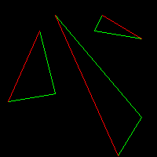
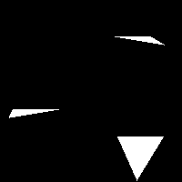
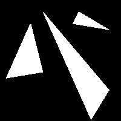
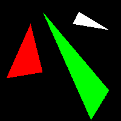
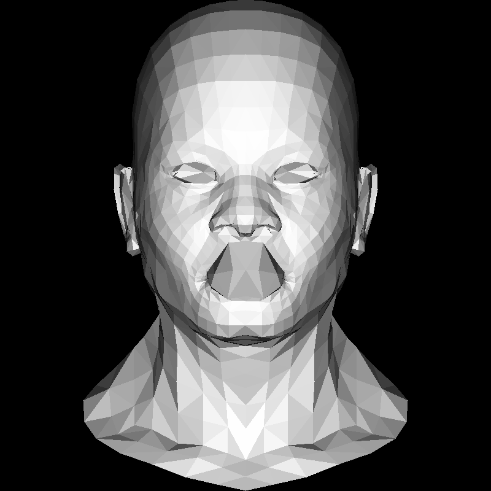

# 2. 柵格化三角形和背面剔除

要求：給定三角形的三個頂點，畫出實心的三角形，並且不依賴點的順序。

## 方法一

這種方法，會先把三角形分成左右兩個邊，然後每行從左邊的邊開始，一直畫到右邊的邊。但問題在於，如何判斷三角形的邊？

將三角形的三個點，以 $y$ 軸從小到大排序，從下到上依次為 $t_0, t_1, t_2$。我們規定，邊 $A$ 為 $\overlinesegment{t_0t_2}$，邊 $B$ 則由 $\overlinesegment{t_0t_1}$ 和 $\overlinesegment{t_1t_2}$ 組成。


 ```rust
 fn triangle(v1: &Vertex<i32>, v2: &Vertex<i32>, v3: &Vertex<i32>, imgbuf: &mut TGAImage) {
    let mut v1 = v1;
    let mut v2 = v2;
    let mut v3 = v3;

    if v1.y > v2.y {
        std::mem::swap(&mut v1, &mut v2);
    }
    if v1.y > v3.y {
        std::mem::swap(&mut v1, &mut v3);
    }
    if v2.y > v3.y {
        std::mem::swap(&mut v2, &mut v3);
    }

    let m_a = (v3.y - v1.y) as f32 / (v3.x - v1.x) as f32;
}

fn main() {
    let mut image = TGAImage::new(WIDTH, HEIGHT, Format::RGB);
    let t1 = vec![
        Vertex { x: 10, y: 70, z: 0 },
        Vertex { x: 50, y: 160, z: 0 },
        Vertex { x: 70, y: 80, z: 0 },
    ];
    let t2 = vec![
        Vertex { x: 180, y: 50, z: 0 },
        Vertex { x: 150, y: 1, z: 0 },
        Vertex { x: 70, y: 180, z: 0 },
    ];
    let t3 = vec![
        Vertex { x: 180, y: 150, z: 0 },
        Vertex { x: 120, y: 160, z: 0 },
        Vertex { x: 130, y: 180, z: 0 },
    ];
    triangle(&t1[0], &t1[1], &t1[2], &mut image);
    triangle(&t2[0], &t2[1], &t2[2], &mut image);
    triangle(&t3[0], &t3[1], &t3[2], &mut image);
    image.flip_vertically();
    image.write("output.tga", true);
}
```
其中 A 邊是紅色，B 邊是綠色。



因為 B 邊是由兩部分組成，所以我們以 $t_1$ 為分界線，把三角形分成上下兩個部分分別畫。我們會沿著 y 軸一行一行的從 A 邊劃到 B 邊。因此我們首先要知道給定一個 $y$ 坐標，如何求出 A 邊和 B 邊的 x 坐標。

我們可以利用相似三角形的性質，我們知道 $y$ 坐標相對於 $y_0$ 的距離，那麼等比就能求出 $x$ 坐標相對於 $x_0$ 的距離。即：

$$
\frac{y - y_0}{y_2 - y_0} = \frac{x - x_0}{x_2 - x_0}
$$

```rust
fn triangle(
    v1: &Vertex<i32>,
    v2: &Vertex<i32>,
    v3: &Vertex<i32>,
    imgbuf: &mut TGAImage,
    color: &TGAColour,
) {
    let mut v0 = v0;
    let mut v1 = v1;
    let mut v2: &Vertex<i32> = v2;

    if v0.y > v1.y {
        std::mem::swap(&mut v0, &mut v1);
    }
    if v0.y > v2.y {
        std::mem::swap(&mut v0, &mut v2);
    }
    if v1.y > v2.y {
        std::mem::swap(&mut v1, &mut v2);
    }
    let total_y = v2.y - v0.y;
    let segment_y = v1.y - v0.y;
    for y in v0.y..v1.y {
        let alpha = (y - v0.y) as f32 / total_y as f32;
        let beta = (y - v0.y) as f32 / segment_y as f32;
        let mut ax = v0.x + ((v2.x - v0.x) as f32 * alpha) as i32;
        let mut bx = v0.x + ((v1.x - v0.x) as f32 * beta) as i32;
        if ax > bx {
            std::mem::swap(&mut ax, &mut bx);
        }
        for x in ax..=bx {
            imgbuf.put(x as u16, y as u16, color);
        }
    }
}
```



再把三角形的上半部分畫出來：

```rust
fn triangle(
    v0: &Vertex<i32>,
    v1: &Vertex<i32>,
    v2: &Vertex<i32>,
    imgbuf: &mut TGAImage,
    color: &TGAColour,
) {
    let mut v0 = v0;
    let mut v1 = v1;
    let mut v2: &Vertex<i32> = v2;

    if v0.y > v1.y {
        std::mem::swap(&mut v0, &mut v1);
    }
    if v0.y > v2.y {
        std::mem::swap(&mut v0, &mut v2);
    }
    if v1.y > v2.y {
        std::mem::swap(&mut v1, &mut v2);
    }
    let total_y = v2.y - v0.y;
    let segment_y = v1.y - v0.y;
    for y in v0.y..=v1.y {
        let alpha = (y - v0.y) as f32 / total_y as f32;
        let beta = (y - v0.y) as f32 / segment_y as f32;
        let mut ax = v0.x + ((v2.x - v0.x) as f32 * alpha) as i32;
        let mut bx = v0.x + ((v1.x - v0.x) as f32 * beta) as i32;
        if ax > bx {
            std::mem::swap(&mut ax, &mut bx);
        }
        for x in ax..=bx {
            imgbuf.put(x as u16, y as u16, color);
        }
    }

    let segment_y = v2.y - v1.y;
    for y in v1.y..=v2.y {
        let alpha = (y - v0.y) as f32 / total_y as f32;
        let beta = (y - v1.y) as f32 / segment_y as f32;
        let mut ax = v0.x + ((v2.x - v0.x) as f32 * alpha) as i32;
        let mut bx: i32 = v1.x + ((v2.x - v1.x) as f32 * beta) as i32;
        if ax > bx {
            std::mem::swap(&mut ax, &mut bx);
        }
        for x in ax..=bx {
            imgbuf.put(x as u16, y as u16, color);
        }
    }
}
```


## 方法二

這個方法的邏輯是，先找到能包含給定頂點的最小矩形，然後依次判斷矩形內的每個像素是否在三角形內。找最小矩陣很簡單，但問題是如何判斷是否在三角形內。

三角形是一個凸多邊形，所以我們可以利用凸多邊形的性質來判斷。假設三角形的三個頂點分別是 $A,B,C$，那麼三角形內的所有點 $P$，都滿足：
$$
P=(1-u-v)A+uB+vC
$$
其中 $u,v\geq 0$ 且 $u+v\leq 1$。換句話說就是 $A,B,C$ 的係數都是非負的，且和為 1。

我們把一個點減去另一個點，就可以得到一個向量。因此我們可以把上面的式子改寫成：

$$
\begin{align*}
    0&=(A-P)+u(B-A)+v(C-A)\\
    &=\vec{PA} + u\vec{AB} + v\vec{AC}
\end{align*}
$$

以我們現在關注的平面上來說，它有 $x,y$ 兩個坐標，因此我們可以把上面的式子改寫成：

$$
\begin{cases}
    \vec{PA}_x + u\vec{AB}_x + v\vec{AC}_x = 0\\
    \vec{PA}_y + u\vec{AB}_y + v\vec{AC}_y = 0
\end{cases}
$$

或者把他寫成矩陣的形式：

$$
\begin{cases}
    \begin{bmatrix}
        1 & u & v
    \end{bmatrix}
    \begin{bmatrix}
        \vec{PA}_x\\
        \vec{AB}_x\\
        \vec{AC}_x
    \end{bmatrix}
    = 0\\
    \begin{bmatrix}
        1 & u & v
    \end{bmatrix}
    \begin{bmatrix}
        \vec{PA}_y\\
        \vec{AB}_y\\
        \vec{AC}_y
    \end{bmatrix}
    = 0
\end{cases}
$$

這就很容易看出來，我們實際上是在找一條同時與 $(PA_x,AB_x,AC_x)$ 和 $(PA_y,AB_y,AC_y)$ 垂直的直線。而我們只需要計算它們的外積就可以了。

$$
c(1, u, v) = (PA_x, AB_x, AC_x) \times (PA_y, AB_y, AC_y)
$$

```rust
fn is_in_triangle(a: &Vertex<i32>, b: &Vertex<i32>, c: &Vertex<i32>, p: &Vertex<i32>) -> bool {
    //cross product
    let ab_x = b.x - a.x;
    let ab_y = b.y - a.y;
    let ac_x = c.x - a.x;
    let ac_y = c.y - a.y;
    let pa_x = a.x - p.x;
    let pa_y = a.y - p.y;
    //cross product
    let x1 = ab_x * ac_y - ac_x * ab_y;
    let x2 = ac_x * pa_y - pa_x * ac_y;
    let x3 = pa_x * ab_y - ab_x * pa_y;
    // check if degenerate triangle
    if x2 == 0 || x1 == 0 {
        return false;
    }
    // check if point is in triangle
    if x1 >= 0 && x2 >= 0 && x3 >= 0 {
        return x2 + x3 <= x1;
    }
    if x1 <= 0 && x2 <= 0 && x3 <= 0 {
        return x2 + x3 >= x1;
    }
    false
}
```

以上代碼中，我們還檢查了三角形是否退化，即三個頂點共線。因為 `x1` 剛好是 $\vec{AB}$ 和 $\vec{AC}$ 的外積，在二位平面上，外積的結果相當於兩個向量組成的平行四邊形的面積。如果三個頂點共線，那麼這個面積就是 0。

如果三角形沒退化，那麼 x2/x1 和 x3/x1 就是 $u$ 和 $v$。還記得我們要求 $u,v\geq 0$ 且 $u+v\leq 1$，為了避免浮點數運算，我們直接比較 x1 和 x2+x3 的大小就可以了。

```rust
fn triangle(
    v0: &Vertex<i32>,
    v1: &Vertex<i32>,
    v2: &Vertex<i32>,
    imgbuf: &mut TGAImage,
    color: &TGAColour,
) {
    let boxmin_x = min(v0.x, min(v1.x, v2.x));
    let boxmin_y = min(v0.y, min(v1.y, v2.y));
    let boxmax_x = max(v0.x, max(v1.x, v2.x));
    let boxmax_y = max(v0.y, max(v1.y, v2.y));

    for x in boxmin_x..=boxmax_x {
        for y in boxmin_y..=boxmax_y {
            let p = Vertex { x, y, z: 0 };
            if is_in_triangle(v0, v1, v2, &p) {
                imgbuf.put(x as u16, y as u16, color);
            }
        }
    }
}

fn main() {
    let mut image = TGAImage::new(WIDTH, HEIGHT, Format::RGB);
    let t1 = vec![
        Vertex { x: 10, y: 10, z: 0 },
        Vertex { x: 100, y: 30, z: 0 },
        Vertex { x: 190, y: 160, z: 0 },
    ];
    triangle(&t1[0], &t1[1], &t1[2], &mut image, &WHITE);

    image.flip_vertically();
    image.write("output.tga", true);
}
```




第二種方法相比第一種計算了更多的像素點，因为它考虑了三角形外的像素点。但第二種方法可以並行計算，我們可以分別計算每個像素點是否在三角形內，因為像素點之間的判斷是無關的。但第二種方法最多只能做到行之間並行。

## 平面著色渲染（Flat shading render）

光在照射物體時，通常越垂直於光線的屏幕看起來會越亮。而平行甚至是背對光線的部分則會比較暗。而我們判斷屏幕是否垂直於光線的方法，就是用屏幕的法向量與光線向量做內機。而我們的光線向量會是 $(0,0,-1)$，這相當於是從屏幕射入我們眼睛的光路。因此如何與這條光線做內機，則數值越大，顏色越亮。如果內機是負的，說明平面是背對光線的，則我們不需要渲染。

我們知道，平面的法向量是由平面裡任意兩條向量的外積得到，在這裡則是由三個頂點的向量的外積得到。但外積的正副取決於計算的順序，順序不同，正負號也不同。在我們的模型文件裡，三角形頂點時以逆時針順序儲存的。我們知道這個信息就能控制法向量的方向了。

```rust
fn main() {
    let mut image = TGAImage::new(WIDTH, HEIGHT, Format::RGB);
    let model = Model::load("./obj/african_head.obj").unwrap();
    let light_dir = Vertex {
        x: 0.0,
        y: 0.0,
        z: -1.0,
    };
    for i in 0..model.faces_len() {
        let face = model.get_face(i);
        let vertexs: [&Vertex<f32>; 3] = [
            model.get_vert(face[0]),
            model.get_vert(face[1]),
            model.get_vert(face[2]),
        ];
        let mut n = (vertexs[2] - vertexs[0]) ^ (vertexs[1] - vertexs[0]);
        n.normalize();
        let intensity = n * light_dir;
        if intensity > 0.0 {
            let color = (intensity * 255.0) as u8;
            triangle(
                &Vertex {
                    x: ((vertexs[0].x + 1.0) * WIDTH as f32 / 2.0) as i32,
                    y: ((vertexs[0].y + 1.0) * HEIGHT as f32 / 2.0) as i32,
                    z: 0,
                },
                &Vertex {
                    x: ((vertexs[1].x + 1.0) * WIDTH as f32 / 2.0) as i32,
                    y: ((vertexs[1].y + 1.0) * HEIGHT as f32 / 2.0) as i32,
                    z: 0,
                },
                &Vertex {
                    x: ((vertexs[2].x + 1.0) * WIDTH as f32 / 2.0) as i32,
                    y: ((vertexs[2].y + 1.0) * HEIGHT as f32 / 2.0) as i32,
                    z: 0,
                },
                &mut image,
                &TGAColour::new(color, color, color, 255),
            );
        }
    }
```

