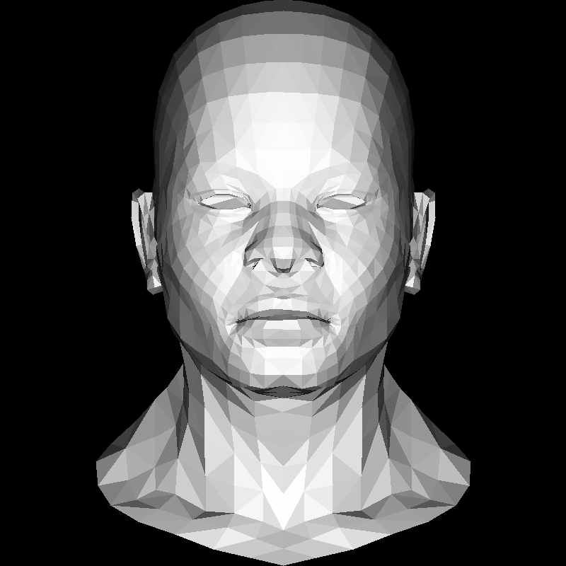
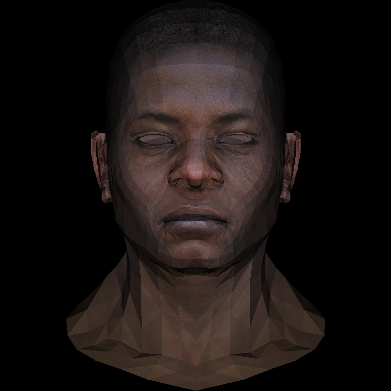

# 隱藏面去除

我們現在可以渲染平面，並且選擇不去渲染那些背對我們的面。但有更多的面，是被其他面遮擋住了，這些面也不應該被渲染。這就是隱藏面去除（Hidden Surface Removal）的問題。

我們可以選擇先畫離我們比較遠的平面，再畫比較近的面。這樣，後畫的面會覆蓋之前畫的部分。這樣的方法叫做`Painter's algorithm`。但假如我們要畫的圖形中，各個面存在交叉，這樣的方法就不適用了。

考慮一個場景


如果從正上方往下渲染，效果應該是這樣的：


如果還使用 `Painter's algorithm`，想要達到這個效果會很困難。

## Z-Buffer

一種解決思路是，我們用一個 buffer 來記錄這個像素中，離我們最近的面的深度。我們每次畫一個像素的時候，都去檢查這個 buffer，如果要畫的面相比 buffer 中記錄的離我們更遠，那麼我們就不畫。這個 buffer 就叫做 Z-Buffer。我們之前計算了像素對於三角形的重心坐標，我們可以利用這個重心坐標，來計算這個像素對應的深度，同樣是做凸組合，只不過這裡是做 z 軸的凸組合。

我們的 buffer 會是一個一維的數組，但我們的屏幕是二維的。所以在儲存時，我們會把二維拉成一維。我們可以用 `x + y * width` 來計算一個二維坐標對應的一維坐標。
```rust
fn triangle(
    v0: &Vertex<i32>,
    v1: &Vertex<i32>,
    v2: &Vertex<i32>,
    imgbuf: &mut TGAImage,
    color: &TGAColour,
    zbuffer: &mut Vec<f32>,
) {
    // to make sure the min is not negative
    let boxmin_x = max(0, min(v0.x, min(v1.x, v2.x)));
    // to make sure the max is not out of the image
    let boxmin_y = max(0, min(v0.y, min(v1.y, v2.y)));
    let boxmax_x = min(imgbuf.width() as i32 - 1, max(v0.x, max(v1.x, v2.x)));
    let boxmax_y = min(imgbuf.height() as i32 - 1, max(v0.y, max(v1.y, v2.y)));

    for x in boxmin_x..=boxmax_x {
        for y in boxmin_y..=boxmax_y {
            let p = Vertex { x, y, z: 0 };
            let bc = barycentric(v0, v1, v2, &p);
            if bc[0] < 0.0 || bc[1] < 0.0 || bc[2] < 0.0 {
                continue;
            }

            let z = v0.z as f32 * bc[0] + v1.z as f32 * bc[1] + v2.z as f32 * bc[2];
            let idx = (x + y * WIDTH as i32) as usize;
            if idx >= zbuffer.len() {
                println!("idx: {}", idx);
                println!("x: {}, y: {}", x, y);
            }
            if zbuffer[idx] < z {
                zbuffer[idx] = z;
                imgbuf.put(x as u16, y as u16, &color);
            }
        }
    }
}

fn main() {
    let mut image = TGAImage::new(WIDTH, HEIGHT, Format::RGB);
    let model = Model::load("./obj/african_head.obj").unwrap();
    let light_dir = Vertex {
        x: 0.0,
        y: 0.0,
        z: -1.0,
    };
    let mut zbuffer = vec![std::f32::MIN; (WIDTH * HEIGHT) as usize];
    for i in 0..model.faces_len() {
        let face = model.get_face(i);
        let ver = [
            model.get_vert(face[0]),
            model.get_vert(face[1]),
            model.get_vert(face[2]),
        ];
        let mut n = (ver[2] - ver[0]) ^ (ver[1] - ver[0]);
        n.normalize();
        let intensity = n * light_dir;
        if intensity > 0.0 {
            let screen_coords = [
                world_to_screen(&ver[0]),
                world_to_screen(&ver[1]),
                world_to_screen(&ver[2]),
            ];
            let color = (intensity * 255.0) as u8;
            let color = TGAColour::new(color, color, color, 255);
            triangle(
                &screen_coords[0],
                &screen_coords[1],
                &screen_coords[2],
                &mut image,
                &color,
                &mut zbuffer,
            );
        }
    }
    image.flip_vertically();
    image.write("output.tga", true);
}
```



## 材質貼圖

現在我們可以正確處理模型中的前後關係了。但是我們的模型看起來還是很單調。我們可以使用材質貼圖（Texture Mapping）來讓模型看起來更真實。在 obj 文件中，`vt` 表示的是對應三角形頂點的材質坐標。而三角形中間的點的材質坐標，同樣可以用重心坐標來計算。並且為了讓模型顯得更立體，我們把各個角度的反光強度乘上材質的顏色，來得到不同光照角度下的顏色。

```rust
fn triangle(
    v0: &Vertex<f32>,
    v1: &Vertex<f32>,
    v2: &Vertex<f32>,
    imgbuf: &mut TGAImage,
    zbuffer: &mut Vec<f32>,
    intensity: f32,
    texture: &TGAImage,
    p1: &Vertex<f32>,
    p2: &Vertex<f32>,
    p3: &Vertex<f32>,
) {
    // to make sure the min is not negative
    let boxmin_x = 0.0_f32.max(v0.x.min(v1.x.min(v2.x))) as i32;
    // to make sure the max is not out of the image
    let boxmin_y = 0.0_f32.max(v0.y.min(v1.y.min(v2.y))) as i32;
    let boxmax_x = (imgbuf.width() as f32 - 1.0).min(v0.x.max(v1.x.max(v2.x))) as i32;
    let boxmax_y = (imgbuf.height() as f32 - 1.0).min(v0.y.max(v1.y.max(v2.y))) as i32;

    for x in boxmin_x..=boxmax_x {
        for y in boxmin_y..=boxmax_y {
            let p = Vertex {
                x: x as f32,
                y: y as f32,
                z: 0.0,
            };
            let bc = barycentric(v0, v1, v2, &p);
            if bc[0] < 0.0 || bc[1] < 0.0 || bc[2] < 0.0 {
                continue;
            }
            let color = {
                let x = (p1.x as f32 * bc[0] + p2.x as f32 * bc[1] + p3.x as f32 * bc[2])
                    * texture.width() as f32;
                let y = (p1.y as f32 * bc[0] + p2.y as f32 * bc[1] + p3.y as f32 * bc[2])
                    * texture.height() as f32;
                texture.get(x as u16, y as u16).unwrap() * intensity
            };

            let z = v0.z as f32 * bc[0] + v1.z as f32 * bc[1] + v2.z as f32 * bc[2];
            let idx = (x + y * WIDTH as i32) as usize;
            if zbuffer[idx] < z {
                zbuffer[idx] = z;
                imgbuf.put(x as u16, y as u16, &color);
            }
        }
    }
}

fn world_to_screen(v: &Vertex<f32>) -> Vertex<f32> {
    Vertex {
        x: (0.5 + (v.x + 1.0) * WIDTH as f32 / 2.0),
        y: (0.5 + (v.y + 1.0) * HEIGHT as f32 / 2.0),
        z: v.z,
    }
}

fn main() {
    let mut image = TGAImage::new(WIDTH, HEIGHT, Format::RGB);
    let texture = TGAImage::open("./obj/african_head_diffuse.tga");
    let model = Model::load("./obj/african_head.obj").unwrap();
    let light_dir = Vertex {
        x: 0.0,
        y: 0.0,
        z: -1.0,
    };
    let mut zbuffer = vec![std::f32::MIN; (WIDTH * HEIGHT) as usize];
    for i in 0..model.faces_len() {
        let face = model.get_face(i);
        let ver = [
            model.get_vert(face[0][0]),
            model.get_vert(face[0][1]),
            model.get_vert(face[0][2]),
        ];
        let mut n = (ver[2] - ver[0]) ^ (ver[1] - ver[0]);
        n.normalize();
        let intensity = n * light_dir;
        if intensity > 0.0 {
            let screen_coords = [
                world_to_screen(&ver[0]),
                world_to_screen(&ver[1]),
                world_to_screen(&ver[2]),
            ];
            let texture_coords = [
                model.get_texture(face[1][0]),
                model.get_texture(face[1][1]),
                model.get_texture(face[1][2]),
            ];
            triangle(
                &screen_coords[0],
                &screen_coords[1],
                &screen_coords[2],
                &mut image,
                &mut zbuffer,
                intensity,
                &texture,
                texture_coords[0],
                texture_coords[1],
                texture_coords[2],
            );
        }
    }
    image.flip_vertically();
    image.write("output.tga", true);
}


```

