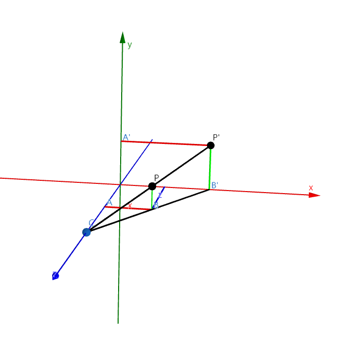
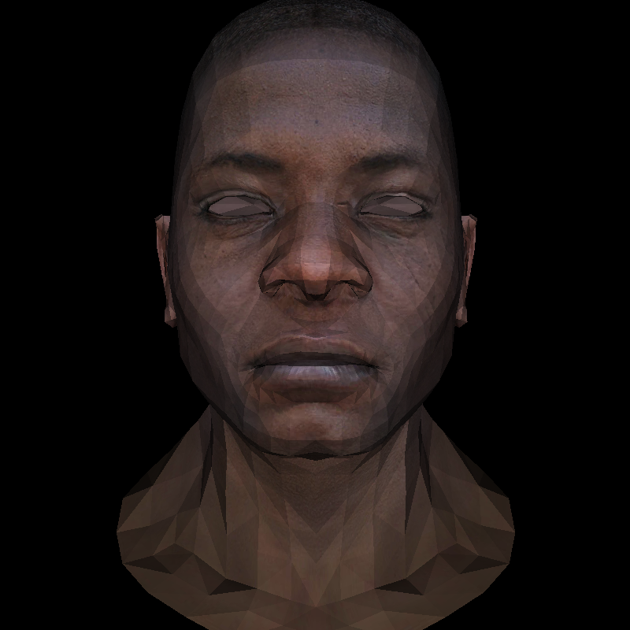

# 4. 透視投影

之前渲染模型的時候，我們都是直接忽略 z 軸的，相當於我們直接把一個立體的模型壓扁了。但我們的眼睛是有近大遠小的透視效果，直接這樣的平行投影顯然是不夠真實的。所以我們需要一種透視投影的方法。

我們假設屏幕的中央是原點，攝像機（眼睛）的位置在 z 軸上的 c 點。空間中有一個點 P=(x,y,z)，我們想要把它渲染出來，就要知道從攝像機看這個點的時候，他在屏幕上的坐標 P' 是多少。



那麼接下來的問題就是 P' 的坐標是多少。很明顯，三角形 CBA 和 CB'O 是相似的，所以有：

$$
\frac{|CA|}{|AB|} = \frac{|CO|}{|OB|}\implies
\frac{c-z}{x} = \frac{c}{x'}\implies
x' = \frac{cx}{c-z}
$$

或者可以寫成：

$$
x' = \frac{x}{1-z/c}
$$

我們可以對 y 軸做同樣的處理，所以有：

$$
y' = \frac{y}{1-z/c}
$$

我們假設相機在模型的坐標系中（不是屏幕的坐標），位置在 $(0,0,3)$

```rust
const camera: Vertex<f32> = Vertex {
    x: 0.0,
    y: 0.0,
    z: 3.0,
};
```

我們可以用函數把模型的原式坐標轉換為透視投影的坐標。這裡並不會把 z 設為 0，這是為了保留深度信息：

```rust
fn projection(v: &Vertex<f32>) -> Vertex<f32> {
    Vertex {
        x: v.x / (1.0 - v.z / camera.z),
        y: v.y / (1.0 - v.z / camera.z),
        z: v.z,
    }
}
```

將變換後的投影坐標再轉換成屏幕坐標：

```rust
let screen_coords = [
    world_to_screen(&projection(&ver[0])),
    world_to_screen(&projection(&ver[1])),
    world_to_screen(&projection(&ver[2])),
];
```

