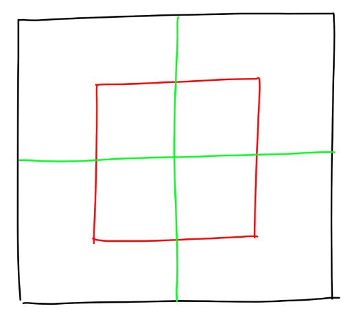
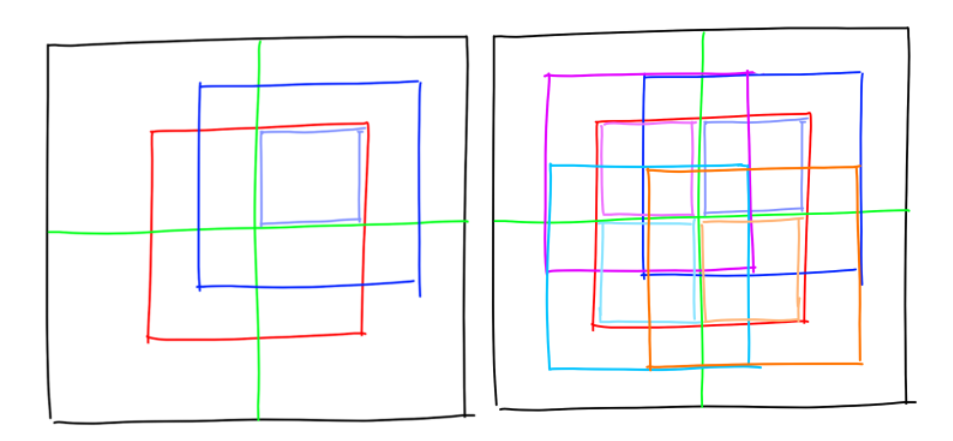
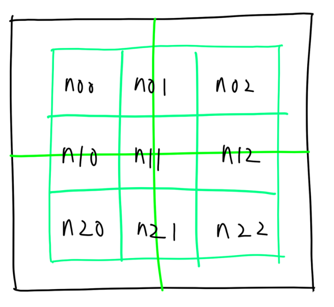

# Hashlife（Game of life）

生命遊戲是一個在二維網格上，根據一定規則自動演化的生命模擬遊戲。每個格子有兩個狀態：活著或死亡。每個格子的狀態取決於其周圍八個格子的狀態。生命遊戲的規則如下：

1. 活著的格子，如果周圍有2個或3個活著的格子，則下一代繼續活著；否則死亡。
2. 死亡的格子，如果周圍有3個活著的格子，則下一代變成活著；否則繼續死亡。
3. 其他情況下，下一代的狀態和當前狀態相同。

Hashlife 是一種基於遞迴和哈希表緩存的高效算法。因為生命遊戲往往有大量重複的狀態，Hashlife 通過哈希表緩存已經計算過的狀態，避免重複計算，從而提高計算效率。

Hashlife 通過將自身平均分割成四個子網格，每個子網格的邊長是原網格的一半，來實現遞迴計算。因此，棋盤的邊長必須是2的冪次方。

## 思路

棋盤本身是一個最大的節點（Node），每個節點包含了四個子節點，直到細分為 1x1 的節點，也就是棋盤上的一個格子，儲存了格子的狀態（bool）。

假設每個節點有 `level` 屬性，表示節點的層級，同樣代表節點的邊長為 `2^level`。而四個子節點的層級則是 `level - 1`。

因為遞回算法的性質，導致每個節點計算下一代時並不知道周圍的狀態，因此每個節點只能計算中心的狀態。而這中心的狀態本身可以形成一個層級為 `level - 1` 的節點。因此，我們可以通過子節點的狀態來計算父節點的狀態。

我們先假設 `level - 1` 層級的節點都已經實現了 `next()` 方法用以計算下一代的狀態，並且返回節點的層級為 `level - 2`。但當前節點還沒有實現 `next()` 方法。我們可以通過調用子節點的 `next()` 方法來實現當前節點的 `next()` 方法。也就是我們現在需要用下一代的狀態拼出紅色部分的節點。

紅色的節點同樣也由 4 個子節點組成。以左上角子節點舉例，他可以由藍色節點執行 `next()` 方法得到。以此類推，我們需要組成 4 個 `level - 1` 的節點，並分別調用它們的 `next()` 方法，得到 4 個 `level - 2` 的節點。最後，我們再將這 4 個 `level - 2` 的節點組合成一個 `level - 1` 的節點，並返回。

為了方便的創建 4 個 `level - 1` 的節點，我們可以創建 9 個 `level - 2` 的輔助節點。其中 `n00`，`n02`，`n20`，`n22` 是子節點的子節點，`n01` 和 `n21` 需要通過水平整合兩個子節點得到，`n10` 和 `n12` 需要通過垂直整合兩個子節點得到。`n11` 需要整合 4 個子節點得到。

通過以上描述可以觀察到，這個遞回過程最少需要向下訪問 2 曾節點。因此，算法最少需要 `level=3` 的節點。而對於 `level=2`，也就是邊長為 4 的節點，我們則直接根據遊戲規則計算出中間 2x2 的節點的狀態，並返回 `level=1` 的節點。

以上是遞回算法的基本思路。接下來我們可以維護一個 hash 表，用以緩存已經計算過的節點。每次調用 `next()` 時，我們會先查詢表，如果已經計算過，則直接返回。否則，我們用上述的遞回算法計算出下一代的狀態，並將結果存入 hash 表。

因為生命遊戲可能會出現重複的模式，這代表可能會有多個一樣結構的節點。因此在儲存方面，我們不需要儲存原始的節點，而是可以儲存節點的指針。這樣可以節省空間。

## 問題

在算法計算的過程中，因為已經將已經計算過的狀態緩存，因此計算的速度是很快的。而瓶頸則在於 hash 算法的實現。尤其是計算 hash 的過程同樣需要遞回計算，因此需要一個高效的 hash 算法。否則仍然會出現遞回 fibonacci 數列的問題。只是不是在計算生命遊戲的過程中，而是在計算 hash 的過程中。

