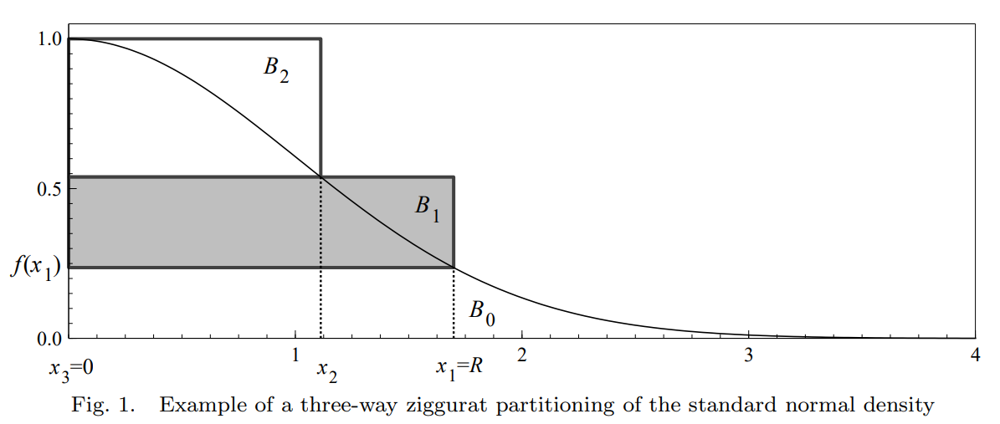

# Normal 分佈的隨機生成器

假設我們現在有操作系統提供的 $U(0,1)$ 随机数生成器。

## Box-Muller 轉換

$U_1, U_2 \stackrel{\text{iid}}{\sim} U(0,1)$ 且獨立，让

$$
\begin{align*}
X &= \sqrt{-2 \ln U_1} \cos(2\pi U_2) \\
Y &= \sqrt{-2 \ln U_1} \sin(2\pi U_2)
\end{align*}
$$

則 $X, Y \stackrel{\text{iid}}{\sim} N(0,1)$。

### 基本原理

这可以通过 Jacobian 计算得到。

$$
\begin{align*}
    
&\begin{align*}
\frac{\partial (X,Y)}{\partial (U_1, U_2)} &= 
\begin{vmatrix}

\frac{-2}{2U_1\sqrt{-2\ln U_1}} \cos(2\pi U_2) & \sqrt{-2\ln U_1} (-2\pi \sin(2\pi U_2)) \\
\frac{-2}{2U_1\sqrt{-2\ln U_1}} \sin(2\pi U_2) & \sqrt{-2\ln U_1} (2\pi \cos(2\pi U_2)) \\

\end{vmatrix}
\\
&= -\frac{1}{U_1} 2\pi  \cos^2(2\pi U_2) - \frac{1}{U_1} 2\pi  \sin^2(2\pi U_2) \\
&=-2\pi \frac{1}{U_1}

\end{align*}\\
&\implies J =  \frac{\partial (U_1, U_2)}{\partial (X,Y)}  =-\frac{U_1}{2\pi}

\end{align*}
$$

均勻分佈的機率在有效區間內是常數，所以我們不需要關心 $U_1,U_2$ 的反函數，但 $J$ 還是有包含 $U_1$，因此我們還是需要計算得到 $U_1=\exp{\frac{X^2+Y^2}{-2}}$，

$$
f_{(X,Y)}(x,y)=f_{(U_1,U_2)}(g_1(x,y), g_2(x,y))|J| = \frac{1}{2\pi} \exp{\frac{X^2+Y^2}{-2}} = \frac{1}{\sqrt{2\pi}} \exp{\frac{X^2}{-2}} \frac{1}{\sqrt{2\pi}} \exp{\frac{Y^2}{-2}}
$$

得到了兩個獨立的 normal 分佈的聯合概率密度函數，因此 $X, Y\stackrel{\text{iid}}{\sim} N(0,1)$ 獨立。


以 $U_1$ 为例，可以把 $U_1$ 看做是 $U_1=R\cos(\theta)$。其中 $\theta\stackrel{\text{iid}}{\sim} U(0,2\pi)$ ，相当于是均匀的选取一个角度。而 $R^2=-2\ln U_1$ 服从卡方分布 $\chi^2_2$。

$$
Z_1^2+Z_2^2 = \chi^2_2 = -2\ln U = -2\ln U (\cos^2\theta+\sin^2\theta)
$$

### 代碼實現

```rust
use rand::distributions::Standard;
use rand::prelude::*;
use std::f64::consts::PI;

fn box_muller() -> f64 {
    let mut u1: f64 = StdRng::from_entropy().sample(Standard);
    let mut u2: f64 = StdRng::from_entropy().sample(Standard);
    while u1 == 0.0 {
        u1 = StdRng::from_entropy().sample(Standard);
    }

    while u2 == 0.0 {
        u2 = StdRng::from_entropy().sample(Standard);
    }

    let z1 = (-2.0_f64 * u1.ln()).sqrt() * (2.0 * PI * u2).cos();
    return z1;
}
```

## Ziggurat 算法

Ziggurat 算法是一種採樣拒絕類的算法。它的基本思想是在平面上畫一個分佈函數的曲線，然後在曲線下隨機生成一個點。幾率高的地方，其曲線下方擁有更多的面積，因此點落在這些地方的概率也更大。因為本身就是以曲線為單位隨機生成點，因此在繪製曲線時可以省略標準化，比如 $N(0,1)$ 可以使用 $f(x)=\exp(-x^2/2)$ 作為曲線函數。

為了加快運行速度，Ziggurat 算法實際上是用許多矩形來逼近分佈函數的圖形，而這些矩形的坐標可以提前計算並儲存，這在生成大量隨機數時可以大大提高效率。



算法假設每個矩形的面積都相同，因此隨機生成的點落在每個矩形的幾率應該是相同的。反過來了，當要隨機生成一個點時，我們可以先公平地隨機選一個矩形，然後再在這個矩形中生成一個點。

從示意圖上可以注意到，矩形可以被分為兩個部分：完全處在曲線下方和部分處在曲線下方。在選擇好矩形後（如圖中 $B_1$），首先生成一個 $x$ 座標，服從 $U(0,x_1)$。如果 $x<x_2$，那麼無論 $y$ 的值如何，這個點都一定處在曲線下方，因此可以直接接受。如果落在第二部分，則需要生成一個服從 $U(f(x_1),f(x_2))$ 的 $y$ 座標，如果 $y<f(x)$，則接受，否則拒絕這個點並重新生成。

無論矩形的數量如何，尾部總會有無法被完全覆蓋的部分（如圖中 $x_1$ 右側部分）。當點落在這個部分時，則需要使用其他方式來驗證這個點是否在曲線下方。由於這部分的面積很小，因此可以選擇較慢的方法。

### 計算矩形

假設我們首先設定了每個矩形的面積都為 $V$，其中最下方的 $B_0$ 為矩形部分和尾部曲線組成。

$$
x_2[f(x_3)-f(x_2)] = x_1[f(x_2)-f(x_1)] = x_1f(x_1) + \int_{x_1}^{\infty}f(x)dx=V
$$

如果最右的 $x_1$ 也已經提供，那麼後續的點 $x_2$ 可以通過 $V$ 和 $f(x_1)$ 來計算：

$$
x_2 = f^{-1}(f(x_1) + V/x_1)
$$

如果我們要用 $C$ 個矩形來逼近，令 $x_C=0$，而前 $C-1$ 個矩形的 $x$ 座標可以通過遞推得到：

$$
x_i = f^{-1}(f(x_{i-1}) + V/x_{i-1}),\quad i=2,\cdots,C-1
$$

可以從看出 $x_i$ 實際上會隨著 $V$ 改變，而 $V$ 其實是 $x_1$ 的函數。因此，分割的關鍵在於如何確定 $x_1$。

$$
x_{C-1}(x_1)[f(x_C)-f(x_{C-1}(x_1))] = V(x_1)
$$

通過數值方法找到以上方程的解，就可以得到 $x_1$ 的值。