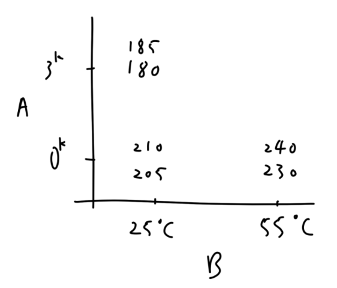
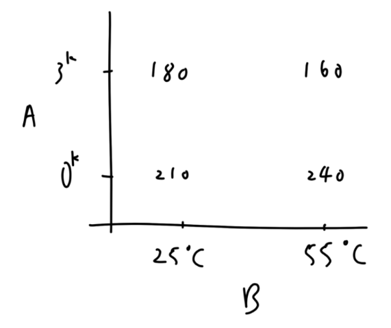
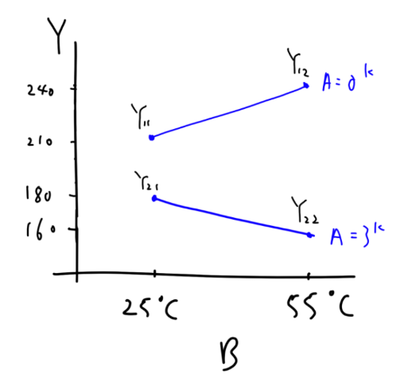
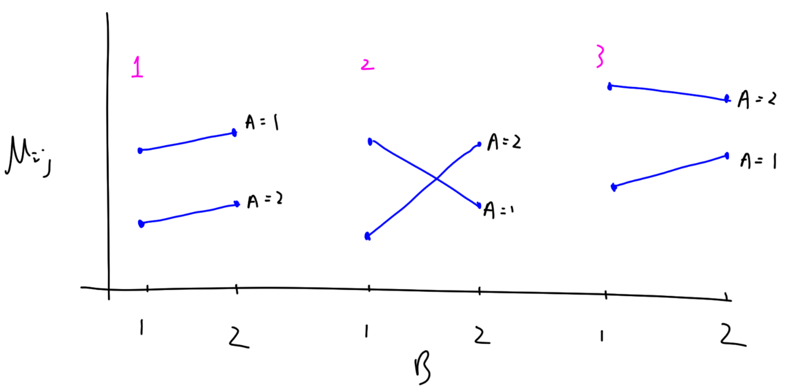

# Completely Randomized Design

完全隨機設計的重點在於：讓實驗單位（E.U.）完全隨機的分配 trt 以避免實驗單位間的差異性。這樣的設計方式可以讓我們更容易的去估計 trt 的效應。e.g. 實驗的唯一因素有 3 個 level，每個 level 進行 2 次實驗，共進行 6 次實驗。這 6 次實驗的順序應該是完全隨機，而不是固定的例如 1,2,3,1,2,3。

假設有 $k$ 個 trt，每個 trt 分別收集 $n_j$ 個觀察值，實驗數據可以建模為：$j=1,\cdots,k$; $i=1,\cdots,n_j$

$$
Y_{ij} = \mu + \tau_j + \varepsilon_{ij},\quad \varepsilon_{ij}\overset{\text{iid}}{\sim}N(0,\sigma^2_{\varepsilon})
$$

- $Y_{ij}$: $j$-th trt 的 $i$-th 觀測值。
- $\mu$: 整個實驗的共同效應，是未知的定值。
- $\tau_j$: $j$-th trt 的效應，是未知的定值。
- $\varepsilon_{ij}$: 隨機誤差項

Note: $\mu_j=\mu+\tau_j$ 代表 $j$-th trt 的平均效應，是未知的定值。

:::warning
以上下標存在符號濫用嫌疑。
:::

## 2 factor CRD Factorial experment

假設有 $a$ 個水平的 factor A 和 $b$ 個水平的 factor B，每個 trt 收集 $n_{ij}$ 個觀測值。可以將原始模型擴展為：

$$
Y_{ijk}= \mu_{ij}+\varepsilon_{ijk},\quad \varepsilon_{ijk}\overset{\text{iid}}{\sim}N(0,\sigma^2_{\varepsilon}),\quad \begin{align*}
i&=1,\cdots,a\\
j&=1,\cdots,b\\
k&=1,\cdots,n_{ij}
\end{align*}
$$

$$
\implies \mu_{ij}=E(Y_{ijk})=E(Y|A=i,B=j)
$$

## Factorial vs. OFAT

Factorial 實驗是對每個 treatment 都進行至少一次實驗，而 OFAT (One Factor At a Time) 則通過與選擇的 baseline trt 進行比較，來估計其他 trt 的效應，具體有以下步驟：
1. 選擇一個 baseline trt
2. 固定 B 因素，遍歷 A 因素的所有水平 => 得到最佳的 A 水平，記作 $i_A$
3. 固定 A 因素，遍歷 B 因素的所有水平 => 得到最佳的 B 水平，記作 $i_B$
4. 得到最佳 trt 組合 $(i_A,i_B)$

OFAT 並不會查看所有 trt 的組合，因此可能會錯過一些重要的交互作用。$(i_A, j_B)$ 也可能並沒有觀測值。

EX: Y 為某集成電路的電流量，有以下因素，假設希望數值越大越好：
- A: 海拔（$0^k, 3^k$）
- B: 溫度（25, 55）

以 OFAT 方式實驗收集到以下數據：

假設 baseline trt 為 $(0^k, 25)$，則：
- 固定 B 因素，$\bar{Y}:207.5\to 235\Rightarrow 27.5$
- 固定 A 因素，$\bar{Y}:207.5\to 182.5\Rightarrow -25$

得到結論，trt $(0^k, 55)$ 是最佳的。

以 Factorial 方式實驗收集到以下數據：

比較所有觀測值，得到結論，trt $(0^k, 55)$ 是最佳的。

兩種方法得到了相同的結論，但 Factorial 只需要 4 次實驗，OFAT 需要 6 次實驗。

如果我們將 B 因素設為 x 軸，觀察值設為 y 軸，並將 A 因素相同 level 的點連接起來，可以得到以下圖形：

可以從圖中看到 A 和 B 之間存在交互左右，因為不同 A 水平下會影響線條的斜率。而這是 OFAT 無法發現的。

## Graphical display of data

$$
Y_{ijk}=\mu+\tau_i+\beta_j+(\tau\beta)_{ij}+\varepsilon_{ijk}
$$

我們可以通過圖形化的方式來展示 $\mu_{ij}$ 的效應：x 軸為 B 因素，y 軸為 $\mu_ij$ 的效應，將 A 因素相同 level 的點連接起來。

如果 A 的 level 數 $a=2$，B 的 level 數 $b=2$，則有下列 3 中可能的圖像：

1. 平行（Parallel）
   
   $\implies $ A 的效應與 B 的 level 無關，B 的效應與 A 的 level 無關。

   $\implies$ A 和 B 之間不存在交互作用。
2. 相交（Crossed）
   
   $\implies$ A 的效應隨 B 的 level 改變，B 的效應隨 A 的 level 改變。

   $\implies$ A 和 B 之間存在強烈的交互作用。

3. 介於 Parallel 和 Crossed 之間

   $\implies$ 可能存在或不存在交互左右，需要進一步檢驗。

Note：$\mu_{ij}$ 是未知真實值，但可以通過對 trt(i,j) 的觀察值進行平均來估計。i.e.

$$
\widehat{\mu_{ij}}=\frac{1}{n_{ij}}\sum_{k=1}^{n_{ij}}Y_{ijk}=\bar{Y}_{ij\cdot}
$$

## Interaction

Note: A 與 B 如果不存在交互作用 $\iff$
- $\mu_{ij}-\mu_{i'j}=\mu_{ij'}-\mu_{i'j'}\quad\forall i\neq i', j\neq j'$, i.e. A 的效應與 B 的 level 無關。
- $\mu_{ij}-\mu_{ij'}=\mu_{i'j}-\mu_{i'j'}\quad\forall i\neq i', j\neq j'$, i.e. B 的效應與 A 的 level 無關。

合併以上兩點得到：

$$
\begin{align*}
    &\mu_{ij}+\mu_{i'j'}-\mu_{ij'}-\mu_{i'j}=0 \quad\forall i\neq i', j\neq j'\\
    \implies&\frac{1}{a\cdot b}\sum_{i'=1}^a\sum_{j'=1}^b(\mu_{ij}+\mu_{i'j'}-\mu_{ij'}-\mu_{i'j})=0\quad\forall i=1,\cdots,a, j=1,\cdots,b\\
    \implies&\mu_{ij}+\bar{\mu}_{\cdot\cdot}-\bar{\mu}_{i\cdot}-\bar{\mu}_{\cdot j}=0\quad \forall i=1,\cdots,a, j=1,\cdots,b
\end{align*}
$$

$$
\text{with}\quad \bar{\mu}=\bar{\mu}_{\cdot\cdot}=\frac{1}{a\cdot b}\sum_{i=1}^a\sum_{j=1}^b\mu_{ij},\quad \bar{\mu}_i=\bar{\mu}_{i\cdot}=\frac{1}{b}\sum_{j=1}^b\mu_{ij},\quad \bar{\mu}_j=\bar{\mu}_{\cdot j}=\frac{1}{a}\sum_{i=1}^a\mu_{ij}
$$

- $\mu$: Grand mean (整個實驗的平均效應)
- $\mu_i$: E(Y|A=i) (A 的效應)
- $\mu_j$: E(Y|B=j) (B 的效應)

Remark: $H_0:\mu_{ij}+\bar{\mu}-\bar{\mu}_i-\bar{\mu}_j=0 \forall i,j$ 如果被拒絕，則代表 $H_0: $ “A，B 之間不存在交互作用”被拒絕。

:::info[Definition]
$$
AB_{ij}=\mu_{ij}+\mu-\mu_i-\mu_j
$$

is called the interation of $A=i$ and $B=j$.
:::

Main effect: A 因素從 level $i\to i'$ 的效應。

$$
\begin{align*}
    \frac{1}{b}\sum_{j=1}^b\mu_{ij}-\frac{1}{b}\sum_{j=1}^b\mu_{i'j}&=\bar{\mu}_{i\cdot}-\bar{\mu}_{i'\cdot}=\mu_i-\mu_{i'}\\
    &=(\mu_i-\mu)-(\mu_{i'}-\mu)\\
    &=A_i-A_{i'}
\end{align*}
$$

:::info[Definition]
Main effect of A at level $i\triangleq \mu_i-\mu\quad i=1,\cdots,a$ donate $A_i$

Main effect of B at level $j\triangleq \mu_j-\mu\quad j=1,\cdots,b$ donate $B_j$
:::

模型也可以由以上定義進行解釋：

$$
\begin{align*}
    Y_{ijk}&=\mu_{ij}+\varepsilon_{(ij)k}\\
    &=\mu+(\mu_{ij}+\mu-\mu_i-\mu_j)+(\mu_i-\mu)+(\mu_j-\mu)+\varepsilon_{(ij)k}\\
    &=\mu+A_i+B_j+AB_{ij}+\varepsilon_{(ij)k}
\end{align*}
$$

## Fixed and Random effects

Effect 有兩種類型：
- Fixed effect：對特定的固定值感興趣。
- Random effect：對母體感興趣，而樣本只是其中的一部分。

對於不同類型效應的組合，可以形成不同的實驗模型，並且會對其加上不同的限制：
1. A, B both fixed effect $\iff$ *fixed model*
   
   $\implies$ Added： 

   $$
    \sum_{i=1}^aA_i=0,\quad \sum_{j=1}^bB_j=0
   $$

   $$
    \sum_{i=1}^aAB_{ij}=0,\quad\forall j,\quad \sum_{j=1}^bAB_{ij}=0,\quad\forall i
   $$

   這代表：A 有 $a-1$ 個 degree of freedom，B 有 $b-1$ 個 degree of freedom，AB 有 $(a-1)(b-1)$ 個 degree of freedom。
2. A, B both random effect $\iff$ *random model*
   
    $\implies$ Added：
    
    $$
     A_1,\cdots,A_a\overset{\text{iid}}{\sim}N(0,\sigma^2_A),\quad B_1,\cdots,B_b\overset{\text{iid}}{\sim}N(0,\sigma^2_B)
   $$

   $$
     AB_{ij}\overset{\text{iid}}{\sim}N(0,\sigma^2_{AB})\quad i=1,\cdots,a, j=1,\cdots,b
    $$

    且 $A_i\perp B_i\perp AB_{ij}\perp \varepsilon_{(ij)k}$

    Note: $\sigma^2_A=0\implies A_1=\cdots=A_a=0$, i.e. No A effect
    
3. One fixed, one random $\iff$ *mixed model*
   
   $\implies$ Added:

   $$
    \sum A_i=0,\quad B_1,\cdots,B_b\overset{\text{iid}}{\sim}N(0,\sigma^2_B), \quad AB_{ij}\overset{\text{iid}}{\sim}N(0,\sigma^2_{AB})
   $$

   $$
    \text{with } \sum_{i=1}^a A_iB_j=0\quad\forall j,\quad \sum_{j=1}^b A_iB_j\neq 0\quad \forall i\quad \text{ usually}
   $$

以上三種不同的模型有相同的 SS, e.g.

$$
\begin{align*}
   SS_{\text{total}}&=\sum_{i=1}^a\sum_{j=1}^b\sum_{k=1}^{n_{ij}}(Y_{ijk}-\bar{Y}_{\cdot\cdot\cdot})^2\\
   SS_A&=\sum_{i=1}^a\sum_{j=1}^b\sum_{k=1}^{n_{ij}}(\bar{Y}_{i\cdot\cdot}-\bar{Y}_{\cdot\cdot\cdot})^2\\
   SS_B&=\sum_{i=1}^a\sum_{j=1}^b\sum_{k=1}^{n_{ij}}(\bar{Y}_{\cdot j\cdot}-\bar{Y}_{\cdot\cdot\cdot})^2\\
   SS_{AB}&=\sum_{i=1}^a\sum_{j=1}^b\sum_{k=1}^{n_{ij}}(\bar{Y}_{ij\cdot}-\bar{Y}_{i\cdot\cdot}-\bar{Y}_{\cdot j\cdot}+\bar{Y}_{\cdot\cdot\cdot})^2
\end{align*}
$$

---

$$
(Y_{ijk}-\bar{Y}_{\cdot\cdot\cdot})^2=(Y_{ijk}-\bar{Y}_{ij\cdot}+\bar{Y}_{ij\cdot}-\bar{Y}_{\cdot\cdot\cdot})^2
$$

$$
\sum_k^{n_{ij}}(Y_{ijk}\bar{Y}_{ij\cdot}-Y_{ijk}\bar{Y}_{\cdot\cdot\cdot}-\bar{Y}_{ij\cdot}^2+\bar{Y}_{ij\cdot}\bar{Y}_{\cdot\cdot\cdot})=n_{ij}\bar{Y}_{ij\cdot}^2-n_{ij}\bar{Y}_{ij\cdot}\bar{Y}_{\cdot\cdot\cdot}-n_{ij}\bar{Y}_{ij\cdot}^2+n_{ij}\bar{Y}_{ij\cdot}\bar{Y}_{\cdot\cdot\cdot}=0
$$

$$
\begin{align*}
   \implies SS_{\text{total}}=&\sum_i\sum_j\sum_k(Y_{ijk}-\bar{Y}_{ij\cdot})^2+\sum_i\sum_j\sum_k(\bar{Y}_{ij\cdot}-\bar{Y}_{\cdot\cdot\cdot})^2+2\sum_i\sum_j\underbrace{\sum_k(Y_{ijk}-\bar{Y}_{ij\cdot})(\bar{Y}_{ij\cdot}-\bar{Y}_{\cdot\cdot\cdot})}_{=0}\\
   =&\sum_i\sum_j\sum_k(\bar{Y}_{ij\cdot}-\bar{Y}_{\cdot\cdot\cdot})^2+\sum_i\sum_j\sum_k(Y_{ijk}-\bar{Y}_{ij\cdot})^2\\
   =&SS_{\text{trt}}+SS_{\text{error}}
\end{align*}
$$

---

$$
(\bar{Y}_{ij\cdot}-\bar{Y}_{\cdot\cdot\cdot})^2=[(\bar{Y}_{i\cdot\cdot}-\bar{Y}_{\cdot\cdot\cdot})+(\bar{Y}_{\cdot j\cdot}-\bar{Y}_{\cdot\cdot\cdot})+(\bar{Y}_{ij\cdot}-\bar{Y}_{\cdot\cdot\cdot}-\bar{Y}_{\cdot j\cdot} +\bar{Y}_{\cdot\cdot\cdot})]^2
$$

$$
\implies SS_{\text{trt}}=SS_A+SS_B+SS_{AB}
$$

三種不同的模型都可以用相同的公式計算以上 SS ，但對於檢驗 $H_0:$ No (A/B/AB) effect/interaction 有不同的方法。（ EMS rule ）。

## ANOVA

### One-factor CRD

Level's # = k = # of trt's

$$
\begin{align*}
   Y_{ij}&=\mu_i+\varepsilon_{ij},\quad i=1\cdots,k, j=1,\cdots,n_i(=n\text{ if balanced})\\
   &=\mu+\tau_i+\varepsilon_{ij},\quad \varepsilon_{ij}\overset{\text{iid}}{\sim}N(0,\sigma^2_{\varepsilon})
\end{align*}
$$

- $\mu$: Grand mean
- $\tau_i$: $i$-th trt effect
- $\varepsilon_{ij}$: random error

Recall:

$$
\tau_i\begin{cases}
   \text{fixed}&\implies \sum\tau_i=0\\
   \text{random}&\implies \tau_i\overset{\text{iid}}{\sim}N(0,\sigma^2_{\tau})
\end{cases}
$$

$$
\begin{align*}
   \implies E(SS_E)&=E\left[\sum_{i=1}^k\sum_{j=1}^n(Y_{ij}-\bar{Y}_{i\cdot})^2 \right]\\
   &=E\left[\sum_{i=1}^k\sum_{j=1}^n(\mu+\tau_i+\varepsilon_{ij}-\mu-\tau_i-\bar{\varepsilon}_{i\cdot})^2 \right]\\
   &=E\left[\sum_{i=1}^k\sum_{j=1}^n(\varepsilon_{ij}-\bar{\varepsilon}_{i\cdot})^2 \right]\\
\end{align*}
$$

fixed $i$, $\varepsilon_{i1},\varepsilon_{i2},\cdots,\varepsilon_{in}\overset{\text{iid}}{\sim}N(0,\sigma^2_{\varepsilon})$

$$
E\left[\sum_{j=1}^n\frac{(\varepsilon_{ij}-\bar{\varepsilon}_{i\cdot})^2}{\sigma_\varepsilon^2} \right]=E[\chi^2_{n-1}]=n-1
$$

$$
\implies E(SS_E)=\sum_{i=1}^k(n-1)\sigma^2_{\varepsilon}=k(n-1)\sigma^2_{\varepsilon}
$$

:::info[Definition]
$$
MS_E=\frac{SS_E}{df}=\frac{SS_E}{k(n-1)}\implies E(MS_E)=\frac{E(SS_E)}{k(n-1)}=\sigma^2_{\varepsilon}
$$

$\implies MS_E$ is an unbiased estimator of $\sigma^2_{\varepsilon}$
:::

$$
\begin{align*}
   E(SS_{trt})&=E\left[\sum_{i=1}^k\sum_{j=1}^n(\bar{Y}_{i\cdot}-\bar{Y}_{\cdot\cdot})^2 \right]\\
   &=E\left[\sum_i^k n(\bar{Y}_{i\cdot}-\bar{Y}_{\cdot\cdot})^2 \right]\\
   &=E\left[\sum_{i=1}^k n(\mu-\tau_i+\bar{\varepsilon}_{i\cdot}-\mu-\bar{\tau}_{\cdot}-\bar{\varepsilon}_{\cdot\cdot})^2 \right]\\
   &=E\left[\sum_{i=1}^k n[(\tau_i-\bar{\tau}_{\cdot})^2+(\bar{\varepsilon}_{i\cdot}-\bar{\tau}_{\cdot\cdot})^2+2(\tau_i-\bar{\tau}_{\cdot})(\bar{\varepsilon}_{i\cdot}-\bar{\varepsilon}_{\cdot\cdot})] \right]\\
   &=nE\left[\sum_{i=1}^k(\tau_i-\bar{\tau}_{\cdot})^2 \right]+nE\left[\sum_{i=1}^k(\bar{\varepsilon}_{i\cdot}-\bar{\varepsilon}_{\cdot\cdot})^2 \right]+2n\underbrace{E\left[\sum_{i=1}^k(\tau_i-\bar{\tau}_{\cdot})(\bar{\varepsilon}_{i\cdot}-\bar{\varepsilon}_{\cdot\cdot}) \right]}_{=0,\quad \tau_i: \text{ fixed or random}}
\end{align*}
$$

$$
\bar{\varepsilon}_{1\cdot},\cdots,\bar{\varepsilon}_{k\cdot}\overset{\text{iid}}{\sim}N(0,\frac{\sigma^2_{\varepsilon}}{n})\implies\sum_{i=1}^k \frac{(\bar{\varepsilon}_{i\cdot}-\bar{\varepsilon}_{\cdot\cdot})^2}{\sigma^2_\varepsilon/n}\sim\chi^2_{k-1}\implies E\left[\sum_{i=1}^k(\bar{\varepsilon}_{i\cdot}-\bar{\varepsilon}_{\cdot\cdot})^2 \right]=(k-1)\sigma^2_{\varepsilon}
$$

$$
nE\left[\sum_{i=1}^k(\tau_i-\bar{\tau}_{\cdot})^2 \right]=\begin{cases}
   n\sum_{i=1}^k\tau_i^2 & \tau_i: \text{ fixed}\implies\sum\tau_i=0\implies\bar{\tau}_{\cdot}=0\\
   n(k-1)\sigma^2_{\tau} & \tau_i: \text{ random}\implies \sum^k\frac{(\tau_i-\bar{\tau}_\cdot)^2}{\sigma^2_\tau}\sim\chi^2_{k-1}
\end{cases}
$$

$$
\begin{align*}
   \implies E(SS_{trt})&=\begin{cases}
      (k-1)\sigma_\varepsilon^2+n\sum_{i=1}^k\tau_i^2 & \tau_i: \text{ fixed}\\
      (k-1)\sigma_\varepsilon^2+n(k-1)\sigma^2_{\tau} & \tau_i: \text{ random}
   \end{cases}\\
   &=\begin{cases}
      (k-1)\sigma_\varepsilon^2+n(k-1)\frac{\sum_{i=1}^k\tau_i^2}{k-1} & \tau_i: \text{ fixed, } \frac{\sum_{i=1}^k\tau_i^2}{k-1}\text{ donated by }\phi_\tau\\
      (k-1)\sigma_\varepsilon^2+n(k-1)\sigma^2_{\tau} & \tau_i: \text{ random}
   \end{cases}
\end{align*}
$$

- Fixed: $\phi_\tau=0\iff\forall\tau_i=0\iff$ No trt effect
- Random: $\sigma_\tau^2=0\iff$ No trt effect

:::info[Definition]
df of trt = k-1

$$
MS_{trt}=\frac{SS_{trt}}{k-1}\implies E(MS_{trt})=\begin{cases}
   \sigma^2_{\varepsilon}+n\phi_{\tau} & \tau_i: \text{ fixed}\\
   \sigma^2_{\varepsilon}+n\sigma^2_{\tau} & \tau_i: \text{ random}
\end{cases}
$$
:::

我們對 trt 是否有效應感興趣，因此會檢驗：

$$
H_0: \text{ No trt effect v.s. } H_1: \text{ Sig. trt effect}
$$

$$
\iff H_0:\begin{cases}
   \phi_\tau=0 \\
   \sigma^2_{\tau}=0
\end{cases}\quad\text{v.s. }\quad H_1:\begin{cases}
   \phi_\tau > 0 & \text{ fixed}\\
   \sigma^2_{\tau}> 0 & \text{ random}
\end{cases}
$$

- Under $H_0$: No trt effect $\implies E(MS_E)=\sigma_\varepsilon^2=E(MS_{trt})$, i.e. $MS_{trt}$ and $MS_E$ should be similar.
- Under $H_1$: Sig. trt effect $\implies E(MS_{trt})=\sigma_\varepsilon^2+n\cdot[\phi_\tau|\sigma_\tau^2]>\sigma_\varepsilon^2=E(MS_E)$, i.e. $MS_{trt}$ tend to be larger than $MS_E$.

$\implies$ Reject $H_0$ if $MS_{trt}>>MS_E\iff$ reject $H_0$ if $MS_{trt}/MS_E>>1$

:::info[Definition]
$$
F^*\triangleq\frac{MS_{trt}}{MS_E}\overset{H_0}{\sim}F(df_{trt},df_E)=F_{k-1,N-k}
$$
:::

**REmark**:

$$
N-1=(k-1)+df_E \implies df_E=N-k=nk-k=k(n-1)
$$

Hence, reject $H_0$ at level $\alpha \iff$

$$
\begin{align*}
   \alpha&=P(\text{reject }H_0|H_0\text{ is true})\\
   &=P_{H_0}(F^*>F_{k-1,N-k,\alpha})\\
\end{align*}
$$

:::info[Definition]
$$
F_{l,m,\alpha} \text{ is s.t. }P(F_{l,m}\ge F_{l,m,\alpha})=\alpha
$$
:::

$\implies$ Reject $H_0$ at level $\alpha\iff F^*>F_{k-1,N-k.\alpha}$ with $F^*=MS_{trt}/MS_E$

$\implies$ ANOVA table:

| Source | df  | SS           | MS=SS/df   | EMS=E(MS)                                              | F-value             | p-value              |
| ------ | --- | ------------ | ---------- | ------------------------------------------------------ | ------------------- | -------------------- |
| trt    | k-1 | $SS_{trt}$   | $MS_{trt}$ | $\sigma_\varepsilon^2+n[\phi_\tau \mid \sigma_\tau^2]$ | $MS_{trt}/MS_E=f^*$ | $P(F_{k-1,N-k}>f^*)$ |
| Error  | N-k | $SS_E$       | $MS_E$     | $\sigma_\varepsilon^2$                                 |                     |                      |
| Total  | N-1 | $SS_{total}$ |            |                                                        |                     |                      |

**Note**: $k=2$

$$
\perp\bigg<\begin{align*}
   Y_{11},Y_{12},\cdots,Y_{1n_1}\sim N(\mu_1,\sigma^2)\\
   Y_{21},Y_{22},\cdots,Y_{2n_2}\sim N(\mu_2,\sigma^2)
\end{align*}
$$

To test $H_0:\mu_1=\mu_2$ v.s. $H_1:\mu_1\neq\mu_2$ by two-sample t-test:

$$
\left|\frac{\bar{Y}_{1\cdot}-\bar{Y}_{2\cdot}}{\sqrt{(\frac{1}{n_1}+\frac{1}{n_2})S_p^2}}\right|>t_{N-2,\alpha/2}\qquad\text{with }S_p^2=\frac{1}{n_1+n_2-2}\left(\sum_{j=1}^{n_1}(Y_{1j}-\bar{Y}_{1\cdot})^2+ \sum_{j=1}^{n_2}(Y_{2j}-\bar{Y}_{2\cdot})^2\right)
$$

**Note**:

$$
t^*\overset{H_0}{\sim}t_{n_1+n_2-2}\xlongequal[\text{balanced}]{\text{if}}t_{n-2}\triangleq\frac{N(0,1)}{\sqrt{\frac{\chi^2_{2n-2}}{2n-2}}}\bigg>\perp
$$

$$
\implies (t^*)^2\overset{H_0}{\sim}(t_{n-2})^2\overset{H_0}{\sim}\frac{\chi^2_1/1}{\chi^2_{2n-2}/(2n-2)}\bigg>\perp\sim F_{1,2n-2}=F_{2-1,N-2}
$$

if $n_1=n_2=n$

$$
(t^*)^2=\left(\frac{\bar{Y}_{1\cdot}-\bar{Y}_{2\cdot}}{\sqrt{(\frac{1}{n}+\frac{1}{n})S_p^2}} \right)=\frac{(\bar{Y}_{1\cdot}-\bar{Y}_{2\cdot})^2}{\frac{2}{n}S_p^2}=\frac{n}{2}(\bar{Y}_{1\cdot}-\bar{Y}_{2\cdot})\frac{1}{S_p^2}=\frac{MS_{trt}}{MS_E}=F^*
$$

$$
\begin{align*}
   MS_{trt}&=\frac{SS_{trt}}{2-1}=\sum_{i=1}^2\sum_{j=1}^n(\bar{Y}_{i\cdot}-\bar{Y}_{\cdot\cdot})^2\\
   &=\sum_{i=1}^2n(\bar{Y}_{i\cdot}-\frac{1}{2}(\bar{Y}_{1\cdot}+\bar{Y}_{2\cdot}))^2\\
   &=\frac{n}{2}(\bar{Y}_{1\cdot}-\bar{Y}_{2\cdot})^2
\end{align*}
$$

$$
\begin{align*}
   SS_E&=\sum_{i=1}^2\sum_{j=1}^n(Y_{ij}-\bar{Y}_{i\cdot})^2\\
   &=\sum_{j=1}^n(Y_{1j}-\bar{Y}_{1\cdot})^2 + \sum_{j=1}^n(Y_{2j}-\bar{Y}_{2\cdot})^2\\
   MSE&=\frac{SS_E}{N-k}=\frac{SS_E}{2n-2}=S_p^2
\end{align*}
$$

---

Paired data:

$$
\begin{pmatrix}
   Y_{11}\\
   Y_{21}
\end{pmatrix},\begin{pmatrix}
   Y_{12}\\
   Y_{22}
\end{pmatrix},\cdots,\begin{pmatrix}
   Y_{1n}\\
   Y_{2n}
\end{pmatrix}\overset{\text{iid}}{\sim}N(\mu_1,\mu_2,\sigma_1^2,\sigma_2^2,\rho)
$$

$\implies$ test $H_0:\mu_1=\mu_2$ v.s. $H_1:\mu_1\neq\mu_2$ by paired t-test:

$$
D_j\triangleq Y_{1j}-Y_{2j},\quad j=1,\cdots,n\quad\overset{\text{iid}}\sim{N(\mu_1-\mu_2,\sigma^2_\varepsilon)},\quad\sigma^2_\varepsilon=\text{ func of }\sigma_1^2,\sigma_2^2,\rho
$$

$$
\left|\frac{\sqrt{n}\bar{D}}{S_D}\right|>t_{n-1,\alpha/2}\iff\frac{n\bar{D}^2}{S_D^2}>F_{1,n-1,\alpha}\iff \underbrace{\frac{n}{2}(\bar{Y}_{1\cdot}-\bar{Y}_{2\cdot})}_{MS_{trt}}\frac{1}{S_D^2/2}>F_{1,n-1,\alpha}
$$

$$
\begin{align*}
   S_D^2&\triangleq\frac{1}{n-1}\sum_{j=1}^n(D_j-\bar{D})^2\\
   &=\frac{1}{n-1}\sum_{j=1}^n[(Y_{1j}-Y_{2j})-(\bar{Y}_{1\cdot}-\bar{Y}_{2\cdot})]^2\\
\end{align*}
$$

### Two-factor CRD with balanced 

$$
Y_{ijk}=\mu+A_i+B_j+AB_{ij}+\varepsilon_{(ij)k}\quad\begin{align*}
   &i=1\cdots a\\
   &j=1\cdots b\\
   &k=1\cdots n
\end{align*}
$$

Number of trt = $ab$

**Note**: for fixed model, i.e. both A and B are fixed effect

$\implies\sum_{i=1}^aA_i=0,\quad\sum_{j=1}^bB_j=0,\quad\forall j, \sum_{i=1}^aAB_{ij}=0=\sum_{j=1}^bAB_{ij},\forall i$

$$
\begin{align*}
   \implies E(SSE)&=E\left[\sum_{i=1}^a\sum_{j=1}^b\sum_{k=1}^n(Y_{ijk-\bar{Y}_{ij\cdot}})^2 \right]\\
   &=E\left[\sum_i\sum_j\sum_k (\mu+A_i+B_j+AB_{ij}+\varepsilon_{ijk}-\mu-A_i-B_j-AB_{ij}-\bar{\varepsilon}_{ij\cdot})^2 \right]\\
   &=E\left[\sum_i\sum_j\sum_k(\varepsilon_{ijk}-\bar{\varepsilon}_{ij\cdot})^2 \right]\\
   &=ab(n-1)\sigma^2_{\varepsilon}
\end{align*}
$$

$\implies E(MSE)=E(SSE/[ab(n-1)])=\sigma_\varepsilon^2$

$$
\begin{align*}
   E(SSA)&\triangleq E\left[\sum_i\sum_j\sum_k(\bar{Y}_{i\cdot\cdot}-\bar{Y}_{\cdot\cdot\cdot})^2 \right]\\
   &=E\left[\sum_i\sum_j\sum_k(\mu+A_i+\bar{B}_\cdot+\bar{AB}_{i\cdot}+\bar{\varepsilon}_{i\cdot\cdot}-\mu-\bar{A}_\cdot-\bar{B}_\cdot-\bar{AB}_{\cdot\cdot}-\bar{\varepsilon}_{\cdot\cdot\cdot})^2\right]\\
   &=\sum_i\sum_j\sum_k A_i^2-bn\cdot E(\sum_{i=1}^a(\bar{\varepsilon}_{i\cdot\cdot}-\bar{\varepsilon}_{\cdot\cdot\cdot})^2)+2\sum_i\sum_j\sum_k A_i\underbrace{E(\bar{\varepsilon}_{i\cdot\cdot}-\bar{\varepsilon}_{\cdot\cdot\cdot})}_{=0}\\
   &=bn\cdot\sum_iA_i^2+bn\frac{\sigma_\varepsilon^2}{bn}(a-1)\\
   &=bn(a-1)\frac{\sum_iA_i^2}{a-1}+(a-1)\sigma_\varepsilon^2,\quad \frac{\sum_iA_i^2}{a-1}+(a-1)\text{ donated by }\phi_A
\end{align*}
$$

$\implies E(MS_A)=E(SS_A)/(a-1)=bn\phi_A+\sigma_\varepsilon^2$

---

| Source | df         | SS   | MS=SS/df  | EMS=E(MS)                          | F-value        | p-value                         |
| ------ | ---------- | ---- | --------- | ---------------------------------- | -------------- | ------------------------------- |
| A      | a-1        | SSA  | $MS_A$    | $\sigma_\varepsilon^2+bn\phi_A$    | $MS_A/MS_E$    | $P(F_{a-1,ab(n-1)}>f^*)$        |
| B      | b-1        | SSB  | $MS_B$    | $\sigma_\varepsilon^2+an\phi_B$    | $MS_B/MS_E$    | $P(F_{b-1,ab(n-1)}>f^*)$        |
| AB     | (a-1)(b-1) | SSAB | $MS_{AB}$ | $\sigma_\varepsilon^2+n\phi_{AB}+$ | $MS_{AB}/MS_E$ | $P(F_{(a-1)(b-1),ab(n-1)}>f^*)$ |
| Error  | ab(n-1)    | SSE  | $MS_E$    | $\sigma_\varepsilon^2$             |                |                                 |
| Total  | abn-1      | SST  |           |                                    |                |                                 |

- $P_A$: for $H_0$: No A effect $\iff\phi_A=0$ v.s. $H_1$: Sig. A effect $\iff\phi_A>0$
- $P_B$: for $H_0$: No B effect $\iff\phi_B=0$ v.s. $H_1$: Sig. B effect $\iff\phi_B>0$
- $P_{AB}$: for $H_0$: No AB interaction $\iff\phi_{AB}=0$ v.s. $H_1$: Sig. AB interaction $\iff\phi_{AB}>0$

**Note**: $MS_A+MS_B+MS_{AB}=MS_{trt}$ and $(a-1)+(b-1)+(a-1)(b-1)=ab-1=$ df of trt