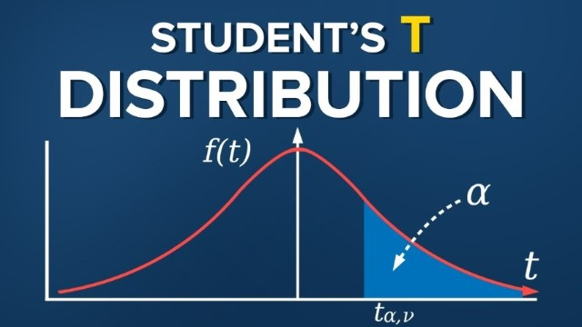
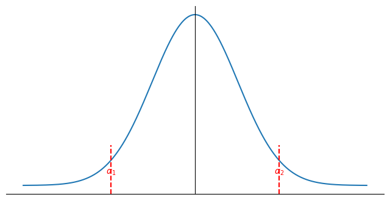
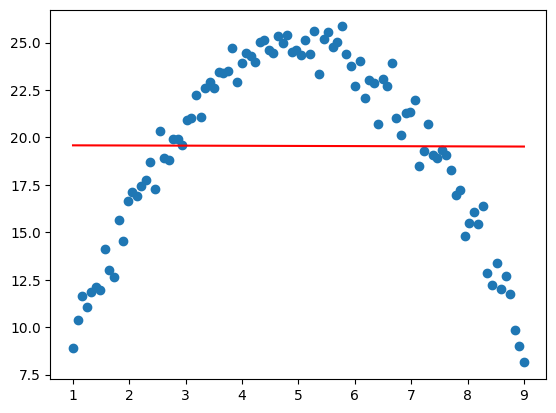

# 相關性分析

這裡，我們使用常態誤差歸回模型來進行相關性分析。

$$
Y_i=\beta_0+\beta_1X_i+\varepsilon_i
$$

## 估計量的分佈

之前我們已經證明了 $b_0, b_1$ 是線性的，也就是可以表達為：

$$
b_1=\sum k_iY_i \quad \text{with } k_i = \frac{X_i-\bar{X}}{\sum(X_i-\bar{X})^2}
$$

$$
b_0=\sum c_iY_i \quad \text{with } c_i = \frac{1}{n}-k_i\bar{X}
$$

因為 $k_i$ 是 $X_i$ 的函數，而 $X_i$ 是固定的，所以 $k_i$ 和 $c_i$ 是常數。因此 $b_0, b_1$ 是 $Y_i$ 的線性組合。因為 $Y_i\xlongequal{d}\varepsilon_i \overset{\text{iid}}{\sim} N(0, \sigma^2)$，所以 $b_0, b_1$ 也是常態分佈。

$$
\begin{align*}
   &b_1\sim N(E[b_1],\sigma^2[b_1])\xlongequal{d}N(\beta_1,\sigma^2\set{b_1}) \quad \text{with } \sigma^2\set{b_1}=\frac{\sigma^2}{\sum(X_i-\bar{X})^2}\\
   &b_0\sim N(E[b_0],\sigma^2[b_0])\xlongequal{d}N(\beta_0,\sigma^2\set{b_0}) \quad \text{with } \sigma^2\set{b_0}=\sigma^2\left(\frac{1}{n}+\frac{\bar{X}^2}{\sum(X_i-\bar{X})^2}\right)
\end{align*}
$$

$$
\implies \frac{b_i-\beta_i}{\sigma\set{b_i}}\sim N(0,1) \quad \text{with } \sigma\set{b_i}=\sqrt{\sigma^2\set{b_i}}
$$

:::tip[Lemma]
$$
\begin{align*}
    \sigma\set{\utilde{w}^t\utilde{Y}, \utilde{d}^t\utilde{Y}} &= \sigma^2 \cdot \utilde{w}^t\utilde{d}\\
    &=0\\
    \iff & \utilde{w}^t\utilde{d}=0, \quad \utilde{w}, \utilde{d} \text{ are linearly independent}
\end{align*}
$$
:::

這可以證明

$$
\text{SSE} \perp b_0, b_1
$$

:::tip[Theorem]
$$
\frac{\text{SSE}}{\sigma^2} \sim \chi^2_{n-p}\xlongequal{\text{SLP}}\chi^2_{n-2}
$$
:::

之前我們說 $(b_j-\beta_j)/\sigma\set{b_j}$ 是標準常態分佈。但在實際應用中，我們並不知道 $\sigma^2$，所以我們應該要用 $\text{SSE}$ 來估計 $\sigma^2$。

$$
\begin{align*}
    \frac{b_i-\beta_j}{S\set{b_i}} &= \frac{b_i-\beta_i}{\sigma\set{b_i}}\Big/\sqrt{\frac{S^2\set{b_i}}{\sigma^2\set{b_i}}=\frac{\text{MSE}}{\sigma^2}}\\
    &=\frac{b_i-\beta_i}{\sigma\set{b_i}}\Big/ \sqrt{\frac{\text{SSE}}{(n-p)\sigma^2}} \quad \text{note }\frac{\text{SSE}}{\sigma^2}\sim \chi^2_{n-p}\\
    &\overset{d}{=}\frac{N(0,1)}{\sqrt{\chi^2_{n-p}/(n-p)}}\sim t_{n-p} \quad \text{分子分母獨立}
\end{align*}
$$

$$
\implies \frac{b_i-\beta_i}{S\set{b_i}}\sim t_{n-p}\xlongequal{\text{SLR}}t_{n-2}
$$

## 信賴區間

之前我們計算的是在得到數據後，$\utilde{\beta}$ 最有可能的值。但單點估計大概率不會是真實值。因此我們還會關注 $\utilde{\beta}$ 會落在什麼範圍裡。

:::info[Definition]
$$
\text{Def } t_{m, \alpha_0} \text{ s.t. } P(t_{m}>t_{m, \alpha_0})=\alpha_0
$$

:::

在上面的定義中，我們只是計算可以讓右端的面積是 $\alpha_0$ 的點。我們還可以考慮左右兩端的面積加起來會是 $\alpha_0$ 的兩個點。

$$
\implies P\left(\left|\frac{b_i-\beta_i}{S\set{b_i}}\right|\le t_{n-p,\frac{\alpha}{2}} \right) = 1-\alpha_0
$$

$$
\implies P(b_i-S\set{b_i}t_{n-p,\frac{\alpha}{2}}\le\beta_i\le b_i+S\set{b_i}t_{n-p,\frac{\alpha}{2}}) = 1-\alpha_0
$$

$$
\implies P(\beta_i\in [b_i\plusmn S\set{b_i}t_{n-p,\frac{\alpha}{2}}]) = 1-\alpha_0
$$

:::info[Definition]
$$
CI(\beta;\alpha) = [b_i\plusmn S\set{b_i}t_{n-p,\frac{\alpha}{2}}] 
$$

被稱爲 $\beta_i$ 的 $100(1-\alpha)\%$ 信賴區間（Confidence Interval），i.e. 我們有 $100(1-\alpha)\%$ 的信心認為 $\beta_i$ 落在這個區間裡。
:::

**Fact**: 

在任何滿足 $\alpha_1+\alpha_2=\alpha_0$ 的組合中，$\alpha_1=\frac{\alpha_0}{2}=\alpha_2$ 會是最好的。$\implies CI(\beta; \alpha)$ 是 UMAU $1-\alpha$ 信賴區間。 

## 假設檢定

一般來說，當我們做假設檢定 $H_0:\beta_i=\beta_{i, 0}$ vs $H_1:\beta_i\neq\beta_{i, 0}$ 時

在顯著水平（Significance Level） $\alpha$ 下，我們會拒絕 $H_0$ $\iff \beta_{j,0}\notin CI(\beta_i;\alpha)=\left[b_i\plusmn S\set{b_i}t_{n-p,\frac{\alpha}{2}}\right]$

i.e. 

$$
\left|\frac{b_i-\beta_{i,0}}{S\set{b_i}}\right|>t_{n-p,\frac{\alpha}{2}}
$$

而如果 $|\frac{b_i-\beta_{i,0}}{S\set{b_i}}|<t_{n-p,\frac{\alpha}{2}}$，就代表數據沒有提供足夠的證據拒絕 $H_0$。

顯著水平其實就是 $H_0$ 被錯誤拒絕的機率，i.e. $\alpha=P(\text{rej }H_0|H_0 \text{ is true})$。

---

當我們想要知道 $X$ 和 $Y$ 是否有顯著的線性關係時，我們會做假設檢定 $H_0:\beta_1=0$ vs $H_1:\beta_1\neq 0$。

$$
t^*\triangleq\frac{b_1}{S\set{b_1}} \sim t_{n-2} \quad H_0:\beta_1=0
$$

根據已經得到的數據計算 $t^*=t^*_0$

- 如果 $|t^*_0|>t_{n-2,\frac{\alpha}{2}} \iff$ 拒絕 $H_0$，i.e. $X$ 和 $Y$ 在 sig. level $\alpha$ 下有顯著的線性關係。
- 如果 $|t^*_0|\le t_{n-2,\frac{\alpha}{2}} \iff$ 不拒絕 $H_0$，i.e.沒有足夠的證據認為 $X$ 和 $Y$ 有顯著的線性關係。

## P-value

在判斷是否拒絕 $H_0$ 前，我們需要先確定顯著水平 $\alpha$ 才能查表得到 $t_{n-2,\frac{\alpha}{2}}$。

注意到 $|t^*_0|>t_{n-2,\frac{\alpha}{2}}$ 代表 pdf 曲線下，$[-\infty, -|t^*_0|]$ 和 $[|t^*_0|, +\infty]$ 的面積加起來會小於 $\alpha$，因為 $|t^*_0|$ 會在 $t_{n-2,\frac{\alpha}{2}}$ 的右邊。

:::info[Definition]
$$
\text{P-value} = P_{H_0}(|t^*|>|t^*_0|)=P(|t_{n-p}|>|t^*_0|)
$$
:::

$\implies$ 在 sig. level $\alpha$ 下，我們拒絕 $H_0$ $\iff$ P-value $\le\alpha$。並且 P-value 的計算不需要提前知道 $\alpha$。

## ANOVA 表

在簡單線性迴歸的 ANOVA 表中，會做以下的假設檢定：

$$
H_0:\beta_1=0 \quad H_1:\beta_1\neq 0
$$

即檢驗 $X$ 和 $Y$ 是否有顯著的線性關係。

注意到

$$
(t^*)^2=\left(\frac{b_1}{S\set{b_1}} \right)^2\sim t_{n-p}\xlongequal{d}\frac{(N(0,1)^2)}{(\sqrt{\chi^2_{n-p}/(n-p)})^2}\xlongequal{d}\frac{\chi^2_1/1}{\chi^2_{n-p}/(n-p)}\xlongequal{d}F_{1,n-p}
$$

i.e. rej $H_0$ at level $\alpha\iff |t^*|>t_{n-p,\frac{\alpha}{2}}\iff (t^*)^2>(t_{n-p,\frac{\alpha}{2}})^2\iff (t^*)^2>F_{1,n-p,\alpha}$

Note

$$
t^{*2} = \frac{b^2}{S^2\set{b}} = \frac{b^2}{MSE\frac{1}{\sum (X_i-\bar{X})^2}}=\frac{b^2\sum (X_i-\bar{X})^2}{MSE}
$$

and

$$
\text{SSR}=\sum(\hat{Y}_i-\bar{Y})^2=\sum(b_0+b_1X_i-\bar{Y})^2=\sum(\bar{Y}-b1\bar{X}+b1X_i-\bar{Y})^2=b_1^2\sum(X_i-\bar{X})^2
$$

$$
\begin{align*}
  \implies t^{*2}&=\frac{\text{SSR}}{MSE} \\
  &=\frac{\text{SSR}/(p-1)}{\text{SSE}/(n-p)} \quad \text{with } p=2 \text{ in SLR}\\
  &= \frac{\text{MSR}}{\text{MSE}} \sim F_{p-1,n-p}
\end{align*}
$$

因此，在簡單形象迴歸中，對於假設檢定 $H_0:\beta_1=0$ vs $H_1:\beta_1\neq 0$ 的 ANOVA 表會如下：

| Source     | SS   | df  | MS=SS/df | F-value       | P-value              |
| ---------- | ---- | --- | -------- | ------------- | -------------------- |
| Regression | SSR  | p-1 | MSR      | MSR/MSE=$f^*$ | $P(F_{p-1,n-p}>f^*)$ |
| Error      | SSE  | n-p | MSE      |               |                      |
| Total      | SSTO | n-1 |          |               |                      |

$$
\text{Rej } H_0 \text{ at level } \alpha\iff F^*\triangleq\frac{\text{MSR}}{MSE}>F_{p-1,n-p,\alpha}\iff \text{P-value}=P(F_{p-1,n-p}>F^*)\le\alpha
$$

**Remark**: 對於單邊檢定 

- $H_0:\beta_1=\beta_{1,0} \text{ vs } H_1:\beta_1>\beta_{1,0}$，拒絕 $H_0 \iff \frac{b_1-\beta_{1,0}}{S\set{b_1}}>t_{n-p,\alpha}$
- $H_0:\beta_1=\beta_{1,0} \text{ vs } H_1:\beta_1<\beta_{1,0}$，拒絕 $H_0 \iff \frac{b_1-\beta_{1,0}}{S\set{b_1}}<-t_{n-p,\alpha}$

## 預測值平均的信賴區間

在簡單線性迴歸中，我們拿到數據 $\utilde{Y},\utilde{X}$ 後，假設我們關注一個新的 $X_h$ 所對應的 $Y_h$。$X_h$ 獨立於得到的數據 $\utilde{X}$，但它的值可能和 $\utilde{X}$ 中的值相同。

$$
Y_h=\beta_0+\beta_1X_h+\varepsilon_h
$$

而我們感興趣的是 $E[Y_h]=\beta_0+\beta_1X_h$。我們可以用 $b_0, b_1$ 來估計 $Y_h$。

$$
\begin{align*}
  \hat{Y}_h&=b_0+b_1X_h\\
  &=\sum c_iY_i+\sum k_iY_iX_h = \sum(c_i+k_iX_h)Y_i
\end{align*}
$$

因此 $\hat{Y}_h$ 是線性估計，並且

$$
E[\hat{Y}_h]=E[b_0]+E[b_1]X_h=\beta_0+\beta_1X_h=Y_h
$$

所以 $\hat{Y}_h$ 是 $E[Y_h]$ 的線性無偏估計（Linear Unbiased Estimator）。並且 $\hat{Y}_h$ 同樣是獨立的常態分佈之和，所以

$$
\hat{Y}_h\sim N(\beta_0+\beta_1X_h, \sigma^2\set{\hat{Y}_h})
$$

其中

$$
\begin{align*}
  \sigma^2\set{\hat{Y}_h}&=\sigma^2\set{\sum(c_i+K_iX_h)Y_i}\\
  &=\sum(c_i+k_iX_h)^2\sigma^2\set{Y_i}\\
  &=\sigma^2\sum(c_i+2k_iX_h+k_i^2X_h^2)\\
  &=\cdots\\
  &=\sigma^2\cdot\left(\frac{1}{n}+\frac{(X_h-\bar{X})^2}{\sum(X_i-\bar{X})^2}\right)
\end{align*}
$$

這個結果告訴我們：
1. 數據量越大，方差越小
2. 數據越分散，方差越小
3. $X_h$ 離中心點越遠，方差越大

這裡我們同樣需要用 MSE 來估計 $\sigma^2$ 的值。

$$
S^2\set{\hat{Y}_h}\triangleq \sigma^2\set{\hat{Y}_h}|_{\sigma^2=MSE}\implies \frac{S^2\set{\hat{Y}_h}}{\sigma^2\set{\hat{Y}_h}}=\frac{MSE}{\sigma^2}=\frac{SSE}{\sigma^2}\frac{1}{n-p}\sim\chi^2_{n-p}/(n-p)
$$

$$
\begin{align*}
  \implies \frac{\hat{Y}_h-E[Y_h]}{S\set{\hat{Y}_h}}&=\frac{\hat{Y}_h-(\beta_0+\beta_1X_h)}{\sigma\set{\hat{Y}_h}\cdot\sqrt{\frac{S^2\set{\hat{Y}_h}}{\sigma^2\set{\hat{Y}_h}}}} \quad \because b_0 \perp \text{SSE}, b_1 \perp \text{SSE}\\
  &\xlongequal{d}\frac{N(0,1)}{\sqrt{\chi^2_{n-p}/(n-p)}} \quad \text{上下分佈獨立}\\
  &\sim t_{n-p}\xlongequal{\text{SLR}}t_{n-2}
\end{align*}
$$

$$
\begin{align*}
  \implies 1-\alpha&=P(|t_{n-p}|\le t_{n-p,\frac{\alpha}{2}})\\
  &=P\left(\left|\frac{\hat{Y}_h-E[Y_h]}{S\set{\hat{Y}_h}}\right|\le t_{n-p,\frac{\alpha}{2}}\right)\\
  &=P(E[Y_h]\in [\hat{Y}_h\plusmn S\set{\hat{Y}_h}\cdot t_{n-p,\frac{\alpha}{2}}])\\
\end{align*}
$$

因此，對於任何給定的 $X=X_h$，預測平均 $E[Y_h]=\beta_0+\beta_1X_h$ 的 $1-\alpha$ conf. int. 是

$$
[\hat{Y}_h\plusmn S\set{\hat{Y}_h}\cdot t_{n-p,\frac{\alpha}{2}}]
$$

## 預測值的預測區間

如果我們對同樣在 $X_h$ 上的一個獨立的**隨機變量** $Y_{h,new}$ 感興趣 $\implies Y_{h,new}\perp\hat{Y}_h=b_0+b_1X_h$, 並且

$$
\begin{alignat*}{2}
  &Y_{h,new}& &\sim N(\beta_0+\beta_1X_h, \sigma^2)\\
  &\hat{Y}_h& &\sim N(\beta_0+\beta_1X_h, \sigma^2\set{\hat{Y}_h})
  
\end{alignat*}
$$

$$
\implies \hat{Y}_h-Y_{h,new}\sim N(0, \sigma^2\set{\text{perd}})
$$

$$
\text{with } \sigma^2\set{\text{perd}}=\sigma^2\set{\hat{Y}_h}+\sigma^2\set{Y_{h,new}}=\sigma^2\cdot\left(1+\frac{1}{n}+\frac{(X_h-\bar{X})^2}{\sum(X_i-\bar{X})^2}\right)>\sigma^2\set{\hat{Y}_h}
$$

用 MSE 來估計 $\sigma^2$ 的值，我們可以得到

$$
\begin{align*}
  &\frac{\hat{Y}_h-Y_{h,new}}{S\set{\text{perd}}}\sim t_{n-p}\xlongequal{\text{SLR}}t_{n-2}\\
  \implies & 1-\alpha=P(Y_{h,new}\in [\hat{Y}_h\plusmn S\set{\text{perd}}\cdot t_{n-p,\frac{\alpha}{2}}])
\end{align*}
$$

i.e. $[\hat{Y}_h\plusmn S\set{\text{perd}}\cdot t_{n-p,\frac{\alpha}{2}}]$ 是 $Y_{h,new}$ 的 $1-\alpha$ 預測區間（Prediction Interval）。

**Remark**: 在同一個 $X_h$ 上

$$

\begin{alignat}{4}
  &\beta_0+\beta_1X_h& &\in[\hat{Y}_h\plusmn S\set{\hat{Y}_h}\cdot t_{n-p,\frac{\alpha}{2}}]\quad &\text{with confi. }  1-\alpha\\
  &Y_{h,new}& &\in[\hat{Y}_h\plusmn S\set{\text{perd}}\cdot t_{n-p,\frac{\alpha}{2}}]\quad &\text{with confi. } 1-\alpha  
\end{alignat}
$$

$\implies (1) \subset (2)$

---

**Note**: 如果我們感興趣的是 $\bar{Y}_{h,new}=\frac{1}{m}\sum_{i=1}^m Y_{h,new,i}\sim N(\beta_0+\beta_1X_h,\frac{\sigma^2}{m})$，其中 $m$ 是固定的。

$$
\implies \hat{Y}_h-\bar{Y}_{h,new}\sim N(0, \sigma^2\set{\text{perd. mean}})
$$

$$
\text{with }\sigma^2\set{\text{perd. mean}}=\sigma^2\set{\hat{Y}_h}+\sigma^2\set{\bar{Y}_{h,new}}=\sigma^2\cdot\left(\frac{1}{m}+\frac{1}{n}+\frac{(X_h-\bar{X})^2}{\sum(X_i-\bar{X})^2}\right)>\sigma^2\set{\hat{Y}_h}
$$

同樣用 MSE 來估計 $\sigma^2$ 的值

$$
\implies [\hat{Y}_h\plusmn S\set{\text{perd. mean}}\cdot t_{n-p,\frac{\alpha}{2}}] \text{ is } 1-\alpha \text{ conf. int. for r.v.} \bar{Y}_{h,new} \tag{3}
$$

$\implies$ 在同一個 $X_h$ 上 $(1)\subset(3)\underset{m=1}{\subseteq}(2)$ 並且 $(3)\xrightarrow{m\to\infty}(1)$。$\because$ L.L.N. $\bar{Y}_{h,new}\xrightarrow[m\to\infty]{P}\beta_0+\beta_1X_h$

## 信賴區帶

我們之前討論的是給定一個 $X_h$，他所對應的 $Y_h$ 可能的範圍。但如果我們現在想要知道整條回歸線的範圍，也就是信賴區帶，那麼我們就沒辦法用之前的方法了。

**Remark**: 對於任意給定的 $X_h=X_{h,0},X_{h,1},\cdots$，$CI(\beta_0+\beta_1X_{h,j})$ 是 $\beta_0+\beta_1X_{h,j}$ 的 $1-\alpha$ conf. int. $\forall j$。

令 $A_{h,j}\triangleq\beta_0+\beta_1X_{h,j}\in CI(\beta_0+\beta_1X_{h,j})\implies P(A_{h,j})=1-\alpha, \forall j$

> 問題是：$P(A_{h,0}\cap A_{h,1})\overset{?}{=}1-\alpha$

並不會，通常 $P(A_{h,0}\cap A_{h,1})<1-\alpha$。如果 $A_{h,0}\perp A_{h,1}$，那麼 $P(A_{h,0}\cap A_{h,1})=(1-\alpha)^2<1-\alpha$。

所以我們需要找到一個新的數字 $M_\alpha$ s.t. $P(\beta_0+\beta_1X\in [\hat{Y}_h\plusmn M_\alpha S\set{\hat{Y}_h}],\forall X\in\R)=1-\alpha$。

---

**Note**:

$$
\forall X \quad\hat{Y}_x=b_0+b_1X\sim N(\beta_0+\beta_1X, \sigma^2\set{\hat{Y}_x}) \quad \text{with } \sigma^2\set{\hat{Y}_x}=\sigma^2\cdot\left(\frac{1}{n}+\frac{(X-\bar{X})^2}{\sum(X_i-\bar{X})^2}\right)
$$

並且

$$
\begin{align*}
  &b_0+b_1X=\bar{Y}-b_1\bar{X}+b_1X=\bar{Y}+b_1(X-\bar{X})\\
  &\beta_0+\beta_1X=E[\bar{Y}]-\beta_1\bar{X}+\beta_1X=E[\bar{Y}]+\beta_1(X-\bar{X})
\end{align*}
$$

i.e.

$$
\begin{align*}
  b_0+b_1X&=\bar{Y}+b_1(X-\bar{X})\quad \text{with } \bar{Y}\perp b_1\quad\because \sum k_i\cdot\frac{1}{n}=0\\
  \beta_0+\beta_1X&=E[\bar{Y}]+\beta_1(X-\bar{X})\quad \text{with } \bar{Y}\sim N(\beta_0+\beta_1\bar{X}, \sigma^2/n)
\end{align*}
$$

$$
\text{with }\bar{Y}\perp b_1\quad\because \sum k_i\cdot\frac{1}{n}=0
$$

$$
\text{and }\bar{Y}\sim N(\beta_0+\beta_1\bar{X}, \sigma^2/n)\qquad b_1\sim N(\beta_1, \frac{\sigma^2}{\sum(X_i-\bar{X})^2})
$$

$$
\begin{align*}
  \implies& \left| \frac{\hat{Y}_x-(\beta_0+\beta_1X)}{S\set{\hat{Y}_x}} \right| \le M_\alpha \quad \forall X\in\R\\
  \iff &\left[\frac{\bar{Y}-E\bar{Y}+(b_1-\beta_1)(X-\bar{X})}{S\set{\hat{Y}_x}} \right]^2 \le M^2_\alpha \quad \forall X\in\R\\
  \iff& \sup_X \left[\frac{\bar{Y}-E\bar{Y}+(b_1-\beta_1)(X-\bar{X})}{S\set{\hat{Y}_x}} \right]^2 \le M^2_\alpha\\
  \iff& \sup_X \left[\frac{\bar{Y}-E\bar{Y}+(b_1-\beta_1)(X-\bar{X})}{MSE\cdot(\frac{1}{n}+\frac{(X-\bar{X})^2}{\sum(X_i-\bar{X})^2})} \right]^2 \le M^2_\alpha\\
  \iff&\frac{1}{MSE}\sup_t \left[\frac{\bar{Y}-E\bar{Y}+(b_1-\beta_1)t}{\frac{1}{n}+\frac{t^2}{\sum(X_i-\bar{X})^2}} \right]^2 \le M^2_\alpha \quad \text{with } t\triangleq X-\bar{X}
\end{align*}
$$

Note:

$$
\max_{t\in\R}\frac{(a+b\cdot t)^2}{(c+d\cdot t)^2}=\frac{a^2}{c}+\frac{b^2}{d}
$$

$$
\begin{align*}
  \implies &\frac{1}{MSE}\sup_t \left[\frac{\bar{Y}-E\bar{Y}+(b_1-\beta_1)t}{\frac{1}{n}+\frac{t^2}{\sum(X_i-\bar{X})^2}} \right]^2\\
  =&\frac{\bar{Y}-E\bar{Y}}{\text{MSE}/n}+\frac{(b_1-\beta_1)^2}{\text{MSE}/\sum(X_i-\bar{X})^2}\\
  =&\frac{\bar{Y}-E\bar{Y}}{\sigma^2\cdot\text{MSE}/n\sigma^2}+\frac{(b_1-\beta_1)^2}{\sigma^2\cdot\text{MSE}/\sigma^2\sum(X_i-\bar{X})^2}\\
  =&\frac{(\frac{\bar{Y-E\bar{Y}}}{\sigma\set{\bar{Y}}})^2+(\frac{b_1-\beta_1}{\sigma\set{b_1}})^2}{\frac{SSE}{(n-2)\sigma^2}}\tag{*}
\end{align*}
$$

Note:

$$
(*)\xlongequal{d}\frac{\chi^2_1+\chi^2_1}{\frac{\chi^2_{n-2}}{n-2}} \quad\text{and each part is independent}
$$

$$
\because \frac{\frac{\chi^2_2}{2}}{\frac{\chi^2_{n-2}}{n-2}}\sim F_{2,n-2}\implies (*)\sim 2\cdot F_{2,n-2}
$$

也就是說

$$
\begin{align*}
   &\begin{align*}
     1-\alpha&=P(\beta_0+\beta_1X\in [\hat{Y}_x\plusmn S\set{\hat{Y}_x}M_\alpha ])\\
     &=P(2w\le M^2_\alpha)\quad \text{with } w\sim F_{2,n-2}\\
     &=P(w\le M^2_\alpha/2)\\
   \end{align*}\\

   \implies &M_\alpha=\sqrt{2F_{2,n-2,\alpha}}
\end{align*}
$$

:::tip[Theorem]
*Walking-Hotelling confidence band* for $\beta_0+\beta_1X$ with $1-\alpha$ confidence level is

$$
\left[\hat{Y}_x\plusmn \sqrt{2F_{2,n-2,\alpha}}\cdot S\set{\hat{Y}_x}\right]
$$
:::

## R squared

:::info[Definition]
$$
R^2=\frac{\text{SSR}}{\text{SSTO}}=1-\frac{\text{SSE}}{\text{SSTO}}
$$

$R^2$ 可以衡量 $Y$ 中的變異量有多少可以被 $X$ 解釋。也就是 $X$ 和 $Y$ 之間的線性關係有多強。
:::

**Note**:
1. $R^2\in[0,1]$
2. $R^2=1\iff \text{SSE}=0\iff e_i=0\quad\forall i \iff \hat{Y}_i=Y_i\quad\forall i$
   
   i.e. $Y_1, \cdots, Y_n$ 在一條直線上 $\implies X$ 可以完全解釋 $Y$ 的變異量。
3. $R^2=0\iff \text{SSR}=0\iff \hat{Y}_i=\bar{Y}\quad\forall i$
   
   i.e. 無論 $X$ 如何變動，$Y$ 的預測值都是一樣的 $\implies X$ 和 $Y$ 之間沒有**線性**關係。

   

注意到：
$$
\begin{align*}
   R^2&=\frac{\text{SSR}}{\text{SSTO}}=\frac{\sum(\hat{Y}_i-\bar{Y})^2}{\sum(Y_i-\bar{Y})^2}=\frac{b^2_1\sum(X_i-\bar{X}^2)}{\sum(Y_i-\bar{Y})^2}\quad \text{with } b_1=\frac{\sum(X_i-\bar{X})(Y_i-\bar{Y})}{\sum(X_i-\bar{X})^2}\\
   &=\frac{\left(\sum(X_i-\bar{X})(Y_i-\bar{Y})\right)^2}{\sum(X_i-\bar{X})^2\sum(Y_i-\bar{Y})^2}=\left[\frac{\sum(X_i-\bar{X})(Y_i-\bar{Y})}{\sqrt{\sum(X_i-\bar{X})^2\sum(Y_i-\bar{Y})^2}} \right]^2
\end{align*}
$$

而 $\utilde{X}, \utilde{Y}$ 的樣本協方差是 $\alpha\sum(X_i-\bar{X})(Y_i-\bar{Y})$，$\utilde{X}$ 的樣本方差是 $\alpha\sum(X_i-\bar{X})^2$

$\implies \frac{\sum(X_i-\bar{X})(Y_i-\bar{Y})}{\sqrt{\sum(X_i-\bar{X})^2\sum(Y_i-\bar{Y})^2}}=\rho$ 是 $\utilde{X}$ 和 $\utilde{Y}$ 的樣本相關係數。i.e. 

$$
R^2=\rho^2\iff \rho=\frac{b_1\sqrt{\sum(X_i-\bar{X})^2}}{\sqrt{\sum(Y_i-\bar{Y})^2}}
$$

因此 $\rho$ 與 $b_1$ 同號。但只有在 SLR 中，$R^2$ 和 $\rho$ 才有以上的關係。