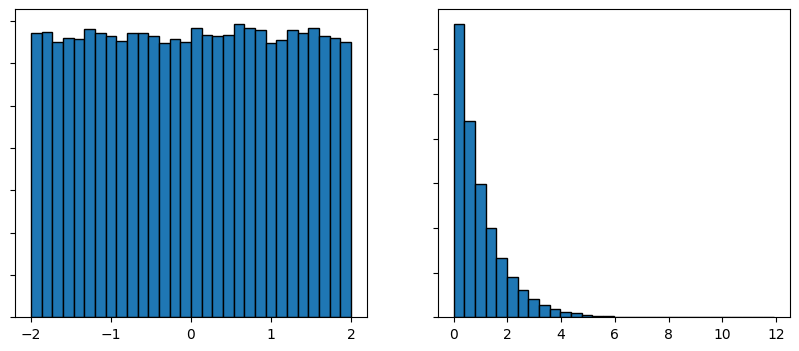
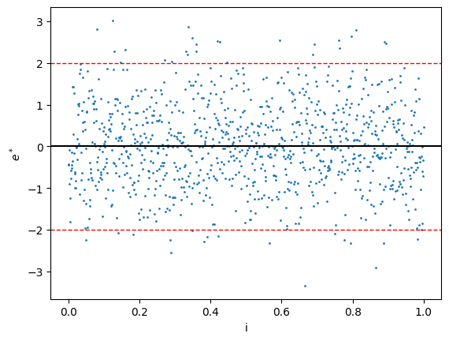
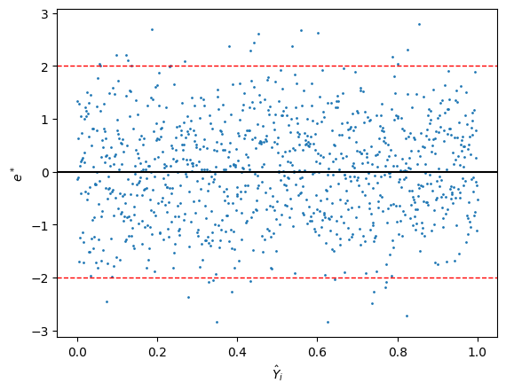
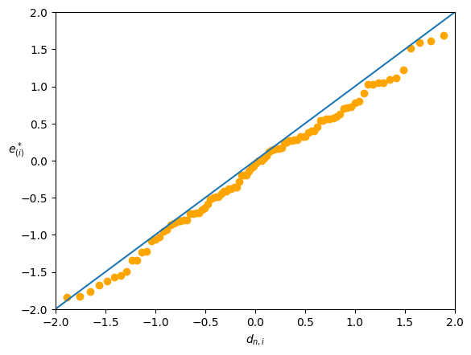
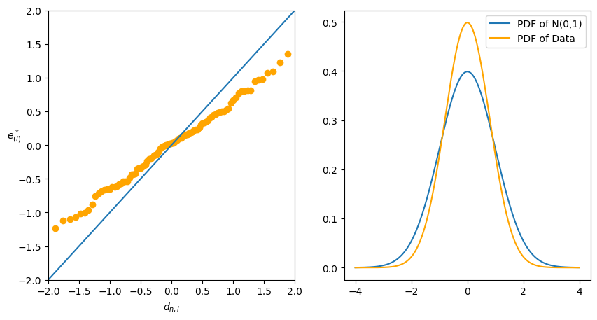
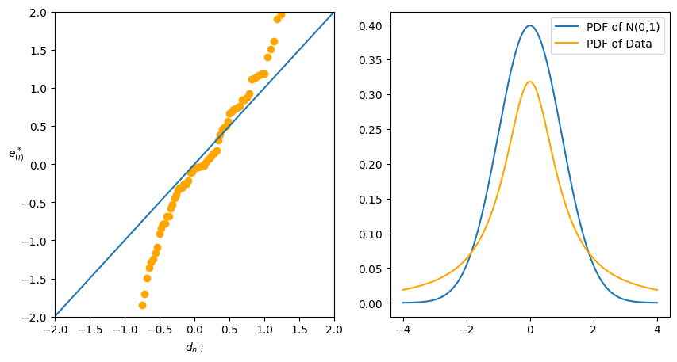

# 模型的診斷與補救（Diagnostic/Remedial techniques）

以往的推論，都是基於以下假設：

$$
\utilde{\varepsilon}\sim N(0,\sigma^2I)\qquad E(\utilde{y})=D\utilde{\beta}
$$

但是，收集到的數據並不一定符合這些假設。因此，在通過統計報表得到結論之前，我們需要檢查模型是否適合這筆數據。這種檢查稱為模型診斷（diagnostics）。

**Remark**: 通常會使用殘差 $e_i=y_i-\hat{y}_i$ 來診斷模型是否適合數據。因此我們會需要畫出殘差圖（residual plot）。如果診斷後發現模型不適合數據，那麼會有一些方法來修正模型，這些方法稱為模型補救（remedial techniques）。

**Idea**: 當模型正確的時候，我們可以推導出殘差應該符合的性質。因此，如果殘差圖嚴重違反這些性質，那麼我們就可以認為模型不適合數據。如果模型並沒有嚴重違背，那麼我們就可以認為模型適合這些數據。

:::danger
任何模型都是錯誤的，但有些模型是有用的。因此，我們不應該追求完美的模型，而是應該追求有用的模型。
:::

## 診斷

首先第一個問題，為什麼用殘差來診斷模型是否適合數據？

一般來說，在設計模型時，我們會讓設計矩陣 $D$ 是 full rank 的，i.e. $(D^tD)^t$ exists $\implies \utilde{\hat{Y}}=H\utilde{Y}$，其中 $H=D(D^tD)^{-1}D^t$ 為投影矩陣。

$$
\begin{align*}
    \implies \utilde{e}&=\utilde{Y}-\utilde{\hat{Y}}=(I-H)\utilde{Y}=M\utilde{Y}\overset{\text{d}}{=}M(D\utilde{\beta}+\utilde{\varepsilon})\\
    &=M\utilde{\varepsilon}=(I-H)\utilde{\varepsilon}
\end{align*}
$$

:::danger
這裡 $\utilde{e}, \utilde{\hat{Y}}, \utilde{Y}$ 是實際觀察到的數據，而 $M(D\utilde{\beta}+\utilde{\varepsilon})$ 是無法觀察到的隨機變量。因此在這裡不能使用 $=$ 來表示，而應該使用 $\overset{\text{d}}{=}$ 來表示。

$\utilde{Y}=D\utilde{\beta}+\utilde{\varepsilon}$ 是表示我們通過這個等式來建立模型，其中的 $\utilde{Y}$ 與實際觀察到的數據 $\utilde{Y}$ 是不同的。
:::

如果 $\utilde{\varepsilon}\sim N_n(0, \sigma^2I)\implies\utilde{e}\sim N_n(0, \sigma^2(I-H))$

令 $H=(\utilde{h_1},\cdots,\utilde{h_n})\implies \utilde{e}\overset{\text{d}}{=}(I-H)\utilde{\varepsilon}=\utilde{\varepsilon}-H^t\utilde{\varepsilon}$

$$
\forall i\quad e_i\overset{\text{d}}{=}\varepsilon_i-\utilde{h_i}^t\utilde{\varepsilon}=\varepsilon_i-\sum_{j=1}^n h_{ij}\varepsilon_j\tag{$\triangle_1$}
$$

- $E(e_i)=0$
- $\sigma^2\set{e_i}=(1-h_{ii})\sigma^2$

Note that $HH=H, H^t=H$ i.e. $h_{ii}=\utilde{h_i}^t\utilde{h_i},\forall i$
- $E(\utilde{h^t}\utilde{\varepsilon})=0$
- $\sigma^2\set{\utilde{h_i^t}\utilde{\varepsilon}}=\utilde{h_i^t}\sigma^2\set{\utilde{\varepsilon}\utilde{h_i}}=\sigma^2h_{ii}$

如果 $h_{ii}\approx 0\implies\sigma^2\set{\utilde{h_i^t}\utilde{\varepsilon}}\approx 0$ 根據 *Chebyshev's inequality*，如果方差很小，那麼這個隨機變量就會很接近於常數，並且這個常數會是它的期望值。i.e. $\utilde{h_i^t}\utilde{\varepsilon}\approx E(\utilde{h_i^t}\utilde{\varepsilon})=0$ almost surely。因此 $(\triangle_1)$ 會變成 $e_i\overset{\text{d}}{\approx}\varepsilon_i$。

- 因此，當 $h_{ii}\approx 0$ 時，殘差 $e_i$ 就會接近於 $\varepsilon_i$。

c.f. $\utilde{\varepsilon}$ 是互相獨立的，而 $\utilde{e}$ 不是，因為
1. $\sum e_i=0$，因此如果我知道了前 $n-1$ 個殘差，那麼我就可以知道第 $n$ 個殘差。
2. $\sigma^2\set{\utilde{e}}=\sigma^2\cdot M$，但 $M$ 通常不是對角矩陣，並且不是 full rank 的。

接下來的問題是 $h_{ii}$ 的值是多少？

$$
 \forall i\quad 0\le h_{ii}=\utilde{h_i}^t\utilde{h_i}=\sum_{j=1}^n h_{ij}^2=h_{ii}^2+\sum_{j\neq i}h_{ij}\ge h_{ii}^2
$$

$\implies h_{ii}\in[0,1]$ 並且 $\text{rank}(H)=\dim(\Omega)=p=\text{tr}(H)=\sum_{i=1}^n h_{ii}$

因此 $h_{ii}$ 的平均值大概就會是 $\frac{p}{n}$，而當 $n\gg p$ 時，$\frac{p}{n}\approx 0\implies h_{ii}\approx 0\implies\sum_{j=1}^nh_{ij}^2\approx 0\implies h_{ij}\approx 0$ $\forall j\neq i$

此時 $M$ 矩陣非對角線的元素都會很小，因此 $\utilde{e}$ 的相關性基本上可以忽略不計。並且 $M$ 矩陣的對角線元素也會接近於 $1$。因此在做診斷時，當 $n$ 足夠大時，才有較高的可信度。

$$
e_i\sim N(0,(1-h_{ii})\sigma^2)
$$

1. standardized residual: 
   
   $$
   \gamma_i\triangleq\frac{e_i}{\sqrt{\text{MSE}(1-h_{ii})}}\sim t_{n-p}\xrightarrow[n-p\to\infty]{} N(0,1)
   $$

2. $n\gg p$，直接假設 $h_{ii}=0$。semi-standardized residual:
   
   $$
    \utilde{e}^*_i\triangleq\frac{e_i}{\sqrt{\text{MSE}}}\simcolon N(0,1)
   $$

i.e. 

$$
n\gg p \implies\begin{cases}
    \gamma_1,\cdots,\gamma_n\\
    e^*_1,\cdots,e^*_n
\end{cases}\quad\text{ sample of size }n\text{ from }N(0,1) 
$$

## 殘差圖

在做診斷時，我們通常會畫出殘差圖（residual plot）來檢查模型是否適合數據。因為 $e_i$ 的方差還是與 $\sigma$ 相關，所以我們通常會用 $e^*_i$ 或 $\gamma_i$ 來畫殘差圖。

1. 殘差直方圖
   
因為理想狀況下我們認為殘差是服從期望值為 $0$ 的常態分佈。因此我們會先畫出殘差的分佈圖，並重點關注是否是對稱的，並且集中於 $0$ 附近。

- 理想：

     .png)

 - 非理想：
     

 要注意的是，當數據量少的時候，殘差的直方圖可能並不會呈現完美的常態分佈。在這種情況，我們可以直接把點畫出來，然後看是否集中於 $0$ 附近即可。

2. 時間序列圖（Time sequence plot）

因為 $\utilde{e}$ 可以一定程度上反映 $\utilde{\varepsilon}$ 的性質，而 $\utilde{\varepsilon}$ 是隨機的，不與具體的數據有關。因此，我們希望 $e_i$ 與 $i$ (e.g. 時間) 是無關的。

- 理想狀況下，$e_i/e^*_i/\gamma_i$ 和 $i$ 的點圖應該大致呈現一條在 x 軸附近的水平區帶。
  
  

- 如果點圖畫出來發現有線性或非線性的趨勢，那麼 $i$ 所代表的變數（e.g. 時間）也需要加入到模型中。
  
  而如果殘差圖的波動範圍有明顯變化，這代表數據違背了方差相等的假設。這可以通過做加權最小二乘法（WLSE）或通過轉換來解決。

3. $e_i/e^*_i/\gamma_i$ v.s. $\hat{Y}_i$。理想下，這個圖應該是一條在 x 軸附近的水平區帶。

- 理想：
  
  

- 非理想下：
  - 如果點的明顯更多在 x 軸以上或以下，i.e. $\sum e_i\neq 0$，代表模型設置有問題。有可能是指令錯誤，也可能忽略了模型的截距項。
  - 如果圖看起來像 2 次曲線
    - 模型中的一些變數可能需要平方，或者相乘（交互作用）。
    - 在分析之前，可能需要對 $Y_i$ 進行轉換。
 - 如果點的波動範圍有明顯變化，這代表數據違背了方差相等的假設。
   - 通過做加權最小二乘法（WLSE）
   - 通過對 $Y_i$ 進行轉換
  
4. $e_i/e^*_i/\gamma_i$ v.s. 每一個解釋變數 $x$
   
- 理想下，這個圖同樣也會是呈現一條在 x 軸附近的水平區帶。
- 非理想下：
  - 呈線性關係：這代表代碼可能有問題。如果 $x$ 確實加入到模型中，那麼 $x$ 的線性關係已經被模型考慮了，殘差圖不可能會呈現線性關係。
  - 曲線關係：
    - 可能需要在模型中加入額外的變數，e.g. $x^2$
    - 對 $Y_i$ 進行轉換
  - 波動範圍有明顯變化：
    - 通過做加權最小二乘法（WLSE）
    - 通過對 $Y_i$ 進行轉換

5. Normal probability plot(Normal Quantile-Quantile Plot)
   
理想下，q-q plot 畫出來的圖應該是直線的。

Note：$U_1,\cdots,U_n\sim U(0,1)$ 排序得到 $U_{(1)}\le\cdots\le U_{(n)}$

$$
\text{pdf of }U_{(i)}=\frac{n!}{(i-1)!(n-i)!}t^{i-1}(1-t)^{n-i}\quad t\in(0,1)
$$

$\implies U_{(i)}\sim \text{Beta}(i,n-i+1)$ 並且 $E(U_{(i)})=\frac{i}{n+1}$

$$
\begin{align*}
    U_{(i)}&=E(U_{(i)})+U_{(i)}-E(U_{(i)})\\
    &=\frac{i}{n+1}+\varepsilon^*_i\quad\text{where } E(\varepsilon^*_i)=0
\end{align*}
$$

因此這就會是一個簡單線性回歸模型。

Recall: 如果隨機變量 $W$ 有 cdf $F$，那麼 $F(W)\sim U(0,1)$

令 $W_1,\cdots,W_n\overset{\text{iid}}{\sim} N(\mu,\tau^2)$ 並排序得到 $W_{(1)}\le\cdots\le W_{(n)}$

$$
\frac{W_i-\mu}{\tau}\sim N(0,1)\implies\Phi\left(\frac{W_i-\mu}{\tau}\right)\sim U(0,1)
$$

因為 $\Phi$ 是遞增的，先排序再轉換，和先轉換再排序是一樣的。

$$
\therefore \Phi\left(\frac{W_{(i)}-\mu}{\tau}\right)\sim \text{Beta}(i,n-i+1)\implies E\left(\Phi\left(\frac{W_{(i)}-\mu}{\tau}\right)\right)=\frac{i}{n+1}
$$

:::note
Idea: 如果 $X$ 是隨機變量，我們可以將 $\Phi(X)$ 在 $E[X]$ 點處做一階泰勒展開：

$$
\begin{align*}
    &\Phi(X)\approx \Phi(E[X])+\phi(E[X])(X-E[X])\\
    \implies& E[\Phi(X)]\approx \Phi(E[X])+E[\phi(E[X])](E[X]-E[X])=E[\Phi(X)]
\end{align*}
$$
:::

$$
\begin{align*}
    &\implies \Phi\left(E\left[\frac{W_{(i)}-\mu}{\tau}\right]\right)\approx E\left[\Phi\left(\frac{W_{(i)}-\mu}{\tau}\right)\right]=\frac{i}{n+1}\\
    &\implies E\left(\frac{W_{(i)}-\mu}{\tau}\right)\approx\Phi^{-1}\left(\frac{i}{n+1}\right)\triangleq d_{n,i} (\text{quantile of }N(0,1))
\end{align*}
$$

Note that $\Phi(d_{n,i})=\Phi(\Phi^{-1}(\frac{i}{n+i}))=\frac{i}{n+i}\implies d_{n,1}<d_{n,i}<d_{n,n}$

$$
\begin{align*}
    &\iff E(W_{(i)})\approx\mu+\tau\cdot d_{n,i}\\
    &\iff W_{(i)}\approx\mu+\tau\cdot d_{n,i}+\varepsilon^*_i\text{ with } E(\varepsilon^*_i)=0
\end{align*}
$$

這看起來就像是一個簡單線性回歸模型，$W_{(i)}$ 是因變量，而 $d_{n,i}$ 是自變量。因此我們將 $W_{(i)}$ 對 $d_{n,i}$ 的圖畫出來，應該是一條直線，並且截距為 $\mu$，斜率為 $\tau$。

:::note
Some research results:

$$
E\left(\frac{W_{(i)}-\mu}{\tau}\right)\approx \Phi^{-1}\left(\frac{i-c}{n-2c+1}\right)\triangleq d_{n,i}^c,\quad \forall c \in [0,1]
$$
:::

因此，如果 $h_{ii}\approx 0$ (i.e. $n\gg p$)

$$
\implies\begin{align*}
    & e_i \simcolon N(0, \sigma^2)\\
    & e^*_i \simcolon N(0, 1)\\
    & \gamma_i \simcolon N(0, 1)
\end{align*}
$$

i.e. 截距 $\mu=0$，斜率 $\tau=\sigma$（使用 $e_{(i)}$） 或 $\tau=1$（使用 $e^*_{(i)}/\gamma_{(i)}$）

- 將 $W_{(i)}$ 對 $d_{n,i}$ 的圖畫出來，理想下應該是：

  

  因為 normal 分佈的 pdf 對於遠離中心的值很小，因此在 q-q plot 中，中心點的點會比較密集，而兩端的點會比較稀疏。因此我們會把看圖的重點放在兩端的部分。
  - 中心：可以不用是一條直線
  - 兩端：必須要是一條直線

- 不理想的圖會有兩種情況：
  - 兩端趨近 0：代表數據 pdf 的兩端較薄，而中心較厚。
  
    

  - 兩端遠離 0：代表數據 pdf 的兩端較厚，而中心較薄。

    
    
    這種情況更糟，這代表更有可能出現更極端的值，甚至沒有期望值（e.g. Cauchy 分佈）。

6. $e_i/e^*_i/\gamma_i$ v.s. 其他還未加入模型的變數 $x^*$

這裡為了檢查是否還有其他重要的變數沒有加入到模型中。

- 如果殘差圖呈現一條在 x 軸附近的水平區帶，那麼這代表 $x^*$ 並不是一個重要的變數。
- 如果殘差圖呈現線性關係，那麼就將 $x^*$ 加入到模型中。
- 如果殘差圖呈現二次曲線關係，則將 $x^*$ 和 ${x^*}^2$ 加入到模型中。
- 如果c殘差圖呈現波動範圍有明顯變化，那麼說明數據收集時可能有問題，比如資料的品質發生了變化。

## 離群點

當畫原始點 $Y$ 和 $x$ 之間的圖時，可能會發生一些點與其他點有明顯的差距。這些點會影響 $\utilde{b}$ 的結果。

有些會一定程度影響估計出的結果，而有些可能會讓估計呈現完全相反的結果。

:::tip[Definition]
1. **Outlier**: 與大部分數據有明顯差異的數據。會有不同的定義。
   $$
   \text{e.g. } |e^*_i|\triangleq\left|\frac{e_i}{\sqrt{\text{MSE}}}\right|>4\implies\text{outlier}
   $$
2. High-leverage point(influential): 是否包含這個數據會極大改變推論的結果。這個點的殘差可能會很小，因為回歸線會直接通過這個點。
:::

Remark: 直方圖、點圖或殘差圖可以幫我們找到 outliers，但可能無法找到 influential points。因此要用其他方法來找，比如：DBeta, DFitted, Cook's distance...