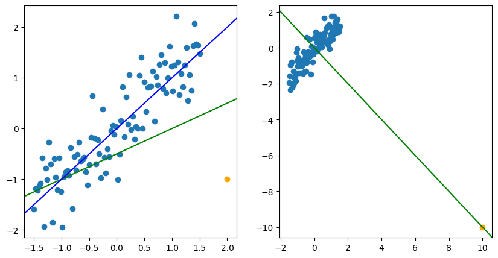
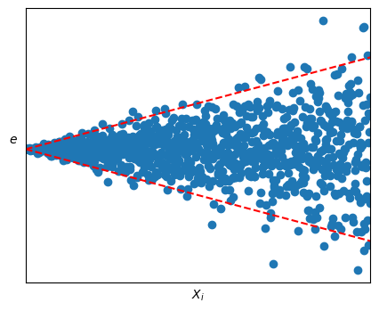
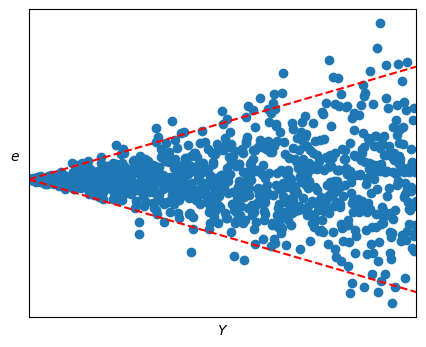
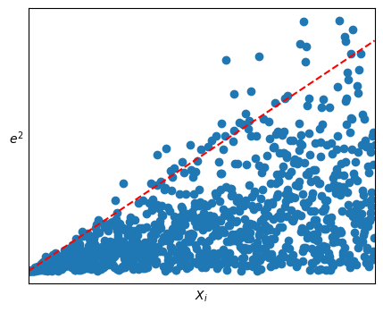
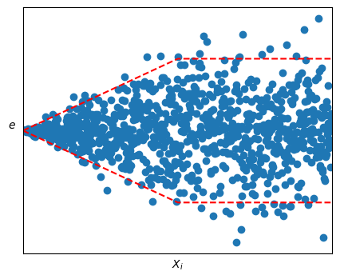

# 模型的診斷與補救（Diagnostic/Remedial techniques）

以往的推論，都是基於以下假設：

$$
\utilde{\varepsilon}\sim N(0,\sigma^2I)\qquad E(\utilde{y})=D\utilde{\beta}
$$

但是，收集到的數據並不一定符合這些假設。因此，在通過統計報表得到結論之前，我們需要檢查模型是否適合這筆數據。這種檢查稱為模型診斷（diagnostics）。

**Remark**: 通常會使用殘差 $e_i=y_i-\hat{y}_i$ 來診斷模型是否適合數據。因此我們會需要畫出殘差圖（residual plot）。如果診斷後發現模型不適合數據，那麼會有一些方法來修正模型，這些方法稱為模型補救（remedial techniques）。

**Idea**: 當模型正確的時候，我們可以推導出殘差應該符合的性質。因此，如果殘差圖嚴重違反這些性質，那麼我們就可以認為模型不適合數據。如果模型並沒有嚴重違背，那麼我們就可以認為模型適合這些數據。

:::danger
任何模型都是錯誤的，但有些模型是有用的。因此，我們不應該追求完美的模型，而是應該追求有用的模型。
:::

## 診斷

首先第一個問題，為什麼用殘差來診斷模型是否適合數據？

一般來說，在設計模型時，我們會讓設計矩陣 $D$ 是 full rank 的，i.e. $(D^tD)^t$ exists $\implies \utilde{\hat{Y}}=H\utilde{Y}$，其中 $H=D(D^tD)^{-1}D^t$ 為投影矩陣。

$$
\begin{align*}
    \implies \utilde{e}&=\utilde{Y}-\utilde{\hat{Y}}=(I-H)\utilde{Y}=M\utilde{Y}\overset{\text{d}}{=}M(D\utilde{\beta}+\utilde{\varepsilon})\\
    &=M\utilde{\varepsilon}=(I-H)\utilde{\varepsilon}
\end{align*}
$$

:::danger
這裡 $\utilde{e}, \utilde{\hat{Y}}, \utilde{Y}$ 是實際觀察到的數據，而 $M(D\utilde{\beta}+\utilde{\varepsilon})$ 是無法觀察到的隨機變量。因此在這裡不能使用 $=$ 來表示，而應該使用 $\overset{\text{d}}{=}$ 來表示。

$\utilde{Y}=D\utilde{\beta}+\utilde{\varepsilon}$ 是表示我們通過這個等式來建立模型，其中的 $\utilde{Y}$ 與實際觀察到的數據 $\utilde{Y}$ 是不同的。
:::

如果 $\utilde{\varepsilon}\sim N_n(0, \sigma^2I)\implies\utilde{e}\sim N_n(0, \sigma^2(I-H))$

令 $H=(\utilde{h_1},\cdots,\utilde{h_n})\implies \utilde{e}\overset{\text{d}}{=}(I-H)\utilde{\varepsilon}=\utilde{\varepsilon}-H\utilde{\varepsilon}$

$$
\forall i\quad e_i\overset{\text{d}}{=}\varepsilon_i-\utilde{h_i}^t\utilde{\varepsilon}=\varepsilon_i-\sum_{j=1}^n h_{ij}\varepsilon_j\tag{$\triangle_1$}
$$

- $E(e_i)=0$
- $\sigma^2\set{e_i}=(1-h_{ii})\sigma^2$

Note that $HH=H, H^t=H$ i.e. $h_{ii}=\utilde{h_i}^t\utilde{h_i},\forall i$
- $E(\utilde{h^t}\utilde{\varepsilon})=0$
- $\sigma^2\set{\utilde{h_i^t}\utilde{\varepsilon}}=\utilde{h_i^t}\sigma^2\set{\utilde{\varepsilon}\utilde{h_i}}=\sigma^2h_{ii}$

如果 $h_{ii}\approx 0\implies\sigma^2\set{\utilde{h_i^t}\utilde{\varepsilon}}\approx 0$ 根據 *Chebyshev's inequality*，如果方差很小，那麼這個隨機變量就會很接近於常數，並且這個常數會是它的期望值。i.e. $\utilde{h_i^t}\utilde{\varepsilon}\approx E(\utilde{h_i^t}\utilde{\varepsilon})=0$ almost surely。因此 $(\triangle_1)$ 會變成 $e_i\overset{\text{d}}{\approx}\varepsilon_i$。

- 因此，當 $h_{ii}\approx 0$ 時，殘差 $e_i$ 就會接近於 $\varepsilon_i$。

c.f. $\utilde{\varepsilon}$ 是互相獨立的，而 $\utilde{e}$ 不是，因為
1. $\sum e_i=0$，因此如果我知道了前 $n-1$ 個殘差，那麼我就可以知道第 $n$ 個殘差。
2. $\sigma^2\set{\utilde{e}}=\sigma^2\cdot M$，但 $M$ 通常不是對角矩陣，並且不是 full rank 的。

接下來的問題是 $h_{ii}$ 的值是多少？

$$
 \forall i\quad 0\le h_{ii}=\utilde{h_i}^t\utilde{h_i}=\sum_{j=1}^n h_{ij}^2=h_{ii}^2+\sum_{j\neq i}h_{ij}\ge h_{ii}^2
$$

$\implies h_{ii}\in[0,1]$ 並且 $\text{rank}(H)=\dim(\Omega)=p=\text{tr}(H)=\sum_{i=1}^n h_{ii}$

因此 $h_{ii}$ 的平均值大概就會是 $\frac{p}{n}$，而當 $n\gg p$ 時，$\frac{p}{n}\approx 0\implies h_{ii}\approx 0\implies\sum_{j=1}^nh_{ij}^2\approx 0\implies h_{ij}\approx 0$ $\forall j\neq i$

此時 $M$ 矩陣非對角線的元素都會很小，因此 $\utilde{e}$ 的相關性基本上可以忽略不計。並且 $M$ 矩陣的對角線元素也會接近於 $1$。因此在做診斷時，當 $n$ 足夠大時，才有較高的可信度。

$$
e_i\sim N(0,(1-h_{ii})\sigma^2)
$$

1. standardized residual: 
   
   $$
   \gamma_i\triangleq\frac{e_i}{\sqrt{\text{MSE}(1-h_{ii})}}\sim t_{n-p}\xrightarrow[n-p\to\infty]{} N(0,1)
   $$

2. $n\gg p$，直接假設 $h_{ii}=0$。semi-standardized residual:
   
   $$
    \utilde{e}^*_i\triangleq\frac{e_i}{\sqrt{\text{MSE}}}\simcolon N(0,1)
   $$

i.e. 

$$
n\gg p \implies\begin{cases}
    \gamma_1,\cdots,\gamma_n\\
    e^*_1,\cdots,e^*_n
\end{cases}\quad\text{ sample of size }n\text{ from }N(0,1) 
$$

### 殘差圖

在做診斷時，我們通常會畫出殘差圖（residual plot）來檢查模型是否適合數據。因為 $e_i$ 的方差還是與 $\sigma$ 相關，所以我們通常會用 $e^*_i$ 或 $\gamma_i$ 來畫殘差圖。

1. 殘差直方圖
   
因為理想狀況下我們認為殘差是服從期望值為 $0$ 的常態分佈。因此我們會先畫出殘差的分佈圖，並重點關注是否是對稱的，並且集中於 $0$ 附近。

- 理想：

     .png)

 - 非理想：
     

 要注意的是，當數據量少的時候，殘差的直方圖可能並不會呈現完美的常態分佈。在這種情況，我們可以直接把點畫出來，然後看是否集中於 $0$ 附近即可。

2. 時間序列圖（Time sequence plot）

因為 $\utilde{e}$ 可以一定程度上反映 $\utilde{\varepsilon}$ 的性質，而 $\utilde{\varepsilon}$ 是隨機的，不與具體的數據有關。因此，我們希望 $e_i$ 與 $i$ (e.g. 時間) 是無關的。

- 理想狀況下，$e_i/e^*_i/\gamma_i$ 和 $i$ 的點圖應該大致呈現一條在 x 軸附近的水平區帶。
  
  

- 如果點圖畫出來發現有線性或非線性的趨勢，那麼 $i$ 所代表的變數（e.g. 時間）也需要加入到模型中。
  
  而如果殘差圖的波動範圍有明顯變化，這代表數據違背了方差相等的假設。這可以通過做加權最小二乘法（WLSE）或通過轉換來解決。

3. $e_i/e^*_i/\gamma_i$ v.s. $\hat{Y}_i$。理想下，這個圖應該是一條在 x 軸附近的水平區帶。

- 理想：
  
  

- 非理想下：
  - 如果點的明顯更多在 x 軸以上或以下，i.e. $\sum e_i\neq 0$，代表模型設置有問題。有可能是指令錯誤，也可能忽略了模型的截距項。
  - 如果圖看起來像 2 次曲線
    - 模型中的一些變數可能需要平方，或者相乘（交互作用）。
    - 在分析之前，可能需要對 $Y_i$ 進行轉換。
 - 如果點的波動範圍有明顯變化，這代表數據違背了方差相等的假設。
   - 通過做加權最小二乘法（WLSE）
   - 通過對 $Y_i$ 進行轉換
  
4. $e_i/e^*_i/\gamma_i$ v.s. 每一個解釋變數 $x$
   
- 理想下，這個圖同樣也會是呈現一條在 x 軸附近的水平區帶。
- 非理想下：
  - 呈線性關係：這代表代碼可能有問題。如果 $x$ 確實加入到模型中，那麼 $x$ 的線性關係已經被模型考慮了，殘差圖不可能會呈現線性關係。
  - 曲線關係：
    - 可能需要在模型中加入額外的變數，e.g. $x^2$
    - 對 $Y_i$ 進行轉換
  - 波動範圍有明顯變化：
    - 通過做加權最小二乘法（WLSE）
    - 通過對 $Y_i$ 進行轉換

5. Normal probability plot(Normal Quantile-Quantile Plot)
   
理想下，q-q plot 畫出來的圖應該是直線的。

Note：$U_1,\cdots,U_n\sim U(0,1)$ 排序得到 $U_{(1)}\le\cdots\le U_{(n)}$

$$
\text{pdf of }U_{(i)}=\frac{n!}{(i-1)!(n-i)!}t^{i-1}(1-t)^{n-i}\quad t\in(0,1)
$$

$\implies U_{(i)}\sim \text{Beta}(i,n-i+1)$ 並且 $E(U_{(i)})=\frac{i}{n+1}$

$$
\begin{align*}
    U_{(i)}&=E(U_{(i)})+U_{(i)}-E(U_{(i)})\\
    &=\frac{i}{n+1}+\varepsilon^*_i\quad\text{where } E(\varepsilon^*_i)=0
\end{align*}
$$

因此這就會是一個簡單線性回歸模型。

Recall: 如果隨機變量 $W$ 有 cdf $F$，那麼 $F(W)\sim U(0,1)$

令 $W_1,\cdots,W_n\overset{\text{iid}}{\sim} N(\mu,\tau^2)$ 並排序得到 $W_{(1)}\le\cdots\le W_{(n)}$

$$
\frac{W_i-\mu}{\tau}\sim N(0,1)\implies\Phi\left(\frac{W_i-\mu}{\tau}\right)\sim U(0,1)
$$

因為 $\Phi$ 是遞增的，先排序再轉換，和先轉換再排序是一樣的。

$$
\therefore \Phi\left(\frac{W_{(i)}-\mu}{\tau}\right)\sim \text{Beta}(i,n-i+1)\implies E\left(\Phi\left(\frac{W_{(i)}-\mu}{\tau}\right)\right)=\frac{i}{n+1}
$$

:::note
Idea: 如果 $X$ 是隨機變量，我們可以將 $\Phi(X)$ 在 $E[X]$ 點處做一階泰勒展開：

$$
\begin{align*}
    &\Phi(X)\approx \Phi(E[X])+\phi(E[X])(X-E[X])\\
    \implies& E[\Phi(X)]\approx \Phi(E[X])+E[\phi(E[X])](E[X]-E[X])=E[\Phi(X)]
\end{align*}
$$
:::

$$
\begin{align*}
    &\implies \Phi\left(E\left[\frac{W_{(i)}-\mu}{\tau}\right]\right)\approx E\left[\Phi\left(\frac{W_{(i)}-\mu}{\tau}\right)\right]=\frac{i}{n+1}\\
    &\implies E\left(\frac{W_{(i)}-\mu}{\tau}\right)\approx\Phi^{-1}\left(\frac{i}{n+1}\right)\triangleq d_{n,i} (\text{quantile of }N(0,1))
\end{align*}
$$

Note that $\Phi(d_{n,i})=\Phi(\Phi^{-1}(\frac{i}{n+i}))=\frac{i}{n+i}\implies d_{n,1}<d_{n,i}<d_{n,n}$

$$
\begin{align*}
    &\iff E(W_{(i)})\approx\mu+\tau\cdot d_{n,i}\\
    &\iff W_{(i)}\approx\mu+\tau\cdot d_{n,i}+\varepsilon^*_i\text{ with } E(\varepsilon^*_i)=0
\end{align*}
$$

這看起來就像是一個簡單線性回歸模型，$W_{(i)}$ 是因變量，而 $d_{n,i}$ 是自變量。因此我們將 $W_{(i)}$ 對 $d_{n,i}$ 的圖畫出來，應該是一條直線，並且截距為 $\mu$，斜率為 $\tau$。

:::note
Some research results:

$$
E\left(\frac{W_{(i)}-\mu}{\tau}\right)\approx \Phi^{-1}\left(\frac{i-c}{n-2c+1}\right)\triangleq d_{n,i}^c,\quad \forall c \in [0,1]
$$
:::

因此，如果 $h_{ii}\approx 0$ (i.e. $n\gg p$)

$$
\implies\begin{align*}
    & e_i \simcolon N(0, \sigma^2)\\
    & e^*_i \simcolon N(0, 1)\\
    & \gamma_i \simcolon N(0, 1)
\end{align*}
$$

i.e. 截距 $\mu=0$，斜率 $\tau=\sigma$（使用 $e_{(i)}$） 或 $\tau=1$（使用 $e^*_{(i)}/\gamma_{(i)}$）

- 將 $W_{(i)}$ 對 $d_{n,i}$ 的圖畫出來，理想下應該是：

  

  因為 normal 分佈的 pdf 對於遠離中心的值很小，因此在 q-q plot 中，中心點的點會比較密集，而兩端的點會比較稀疏。因此我們會把看圖的重點放在兩端的部分。
  - 中心：可以不用是一條直線
  - 兩端：必須要是一條直線

- 不理想的圖會有兩種情況：
  - 兩端趨近 0：代表數據 pdf 的兩端較薄，而中心較厚。
  
    

  - 兩端遠離 0：代表數據 pdf 的兩端較厚，而中心較薄。

    
    
    這種情況更糟，這代表更有可能出現更極端的值，甚至沒有期望值（e.g. Cauchy 分佈）。

6. $e_i/e^*_i/\gamma_i$ v.s. 其他還未加入模型的變數 $x^*$

這裡為了檢查是否還有其他重要的變數沒有加入到模型中。

- 如果殘差圖呈現一條在 x 軸附近的水平區帶，那麼這代表 $x^*$ 並不是一個重要的變數。
- 如果殘差圖呈現線性關係，那麼就將 $x^*$ 加入到模型中。
- 如果殘差圖呈現二次曲線關係，則將 $x^*$ 和 ${x^*}^2$ 加入到模型中。
- 如果c殘差圖呈現波動範圍有明顯變化，那麼說明數據收集時可能有問題，比如資料的品質發生了變化。

### 離群點

當畫原始點 $Y$ 和 $x$ 之間的圖時，可能會發生一些點與其他點有明顯的差距。這些點會影響 $\utilde{b}$ 的結果。

有些會一定程度影響估計出的結果，而有些可能會讓估計呈現完全相反的結果。

:::tip[Definition]
1. **Outlier**: 與大部分數據有明顯差異的數據。會有不同的定義。
   $$
   \text{e.g. } |e^*_i|\triangleq\left|\frac{e_i}{\sqrt{\text{MSE}}}\right|>4\implies\text{outlier}
   $$
2. High-leverage point(influential): 是否包含這個數據會極大改變推論的結果。這個點的殘差可能會很小，因為回歸線會直接通過這個點。
:::

Remark: 直方圖、點圖或殘差圖可以幫我們找到 outliers，但可能無法找到 influential points。因此要用其他方法來找，比如：DBeta, DFitted, Cook's distance...

### Tests for Constancy of error Variance

當殘差圖呈現的波動沒有明顯變化或者明顯沒有變化時，我們會需要用一些檢驗來確認殘差的方差是否是常數。

#### Modified Levene test (Brown-Forsythe test)

適用於簡單線性回歸，並且方差隨著 $X$ 單調變化。並且在 $n\gg p$ s.t. $e_i$ 之間的相關性可以忽略。

Remark：在使用上，對於複回歸，我們也可以對每個解釋變數 $x_j$ 做檢驗。

假設有 $n$ 組原始數據。首先將原始數據按照 $X$ 低值和高值分成兩組分別有 $n_1$ 和 $n_2$ 組數據，並且 $n_1+n_2=n$。而殘差 $e_i$ 同樣也會被分成兩組 $e_{i1}$ 和 $e_{i2}$，相當於是殘差小和殘差大的兩組數據。

令 $\tilde{e}_j=\text{median}\set{e_{ij}:i=1,\cdots,n_j}, j=1,2$ 即兩組數據的中位數。殘差小的組距離其中位數的平均距離會比殘差大的組距離中位數的平均距離要小。

令 $d_{ij}=|e_{ij}-\tilde{e_j}|, i=1,\cdots,n_j, j=1,2$ 以及 $\bar{d}_j=\frac{1}{n_j}\sum_{i=1}^{n_j}d_{ij}$。

把兩組 $d_{ij}$ 當成兩組 normal 分佈的觀測值，而我們要檢定這兩個 normal 分佈的均值是否相等。如果均值不等就代表兩組 $e_{ij}$ 的分散程度不同。

$$
t^*_L\triangleq \frac{\bar{d}_1-\bar{d}_2}{S\sqrt{\frac{1}{n_1}+\frac{1}{n_2}}}\qquad \text{with } S^2=\frac{\sum(d_{i1}-\bar{d}_1)^2+\sum(d_{i2}-\bar{d}_2)^2}{n-2}
$$

在 $H_0:\sigma^2\set{\varepsilon_i}=\sigma^2 \forall i$ 下，即 $d_{i1}$ 和 $d_{i2}$ 母體的均值相等。並且 $n_1,n_2$ 沒有很小，那麼 $t^*_L\sim t_{n-2}$

因此在 level $\alpha$ 下，如果 $|t^*_L|>t_{n-2,\frac{\alpha}{2}}$，則拒絕 $H_0$，即殘差的方差不等。

#### Breusch-Pagan test

應用於樣本數足夠大，並且 $\ln\sigma^2_i=\gamma_0+\gamma_1x_i$ 即方差與 $X$ 有指數關係。I.e. $H_0:\sigma^2\set{\varepsilon_i}=\sigma^2$ $\forall i\implies H_0:\gamma_1=0$

首先對於 $e^2_i$ 做每個 $x_i$ 的簡單線性回歸，並得到 $\text{SSR}$ 記作 $\text{SSR}^*$。並且做 $Y$ 於 $x_i$ 的簡單線性回歸，得到 SSE。則有以下結論：

$$
X^2_{BP}\triangleq\frac{\frac{\text{SSR}^*}{2}}{\left(\frac{\text{SSE}}{n}\right)^2}\xrightarrow{n\to\infty}\chi^2_1
$$

因此，當 $X^2_{BP}>\chi^2_{1,\alpha}$ 時拒絕 $H_0:\sigma^2\set{\varepsilon_i}=\sigma^2\quad\forall i$ 可以得到 level $\approx \alpha$ 檢定。

## Remedial methods

如果發生了方差不等的情況，我們可以有以下方法來調整：
1. 在分析前先對 $Y_i$ 進行轉換
2. Weighted LSE(WLSE)

### Variance-stablization transformation

Let $E(Y_i)=\theta_i$ and $\sigma^2\set{Y_i}=\sigma^2(\theta_i)$ 即方差隨著均值的變化而變化。

我們希望找到一個函數 $f$ 使得 $f(Y_i)$ 的方差是常數。

Note：如果 $f'' <\infty$，我們可以找到一個與 $Y_i$ 和 $\theta_i$ 相關的 $\theta^*_i$ 使得

$$
\begin{align*}
   f(Y_i)&=f(\theta_i)+f'(\theta_i)(Y_i-\theta_i)+\frac{1}{2}f''(\theta^*_i)(Y_i-\theta_i)^2\\
   \iff f(Y_i)-f(\theta_i)&=f'(\theta_i)(Y_i-\theta_i)+\frac{1}{2}f''(\theta^*_i)(Y_i-\theta_i)^2
\end{align*}
$$

當 $(Y_i-\theta_i)^2\approx 0\implies E[f(Y_i-\theta_i)^2]\approx 0\implies E[f(Y_i)]\approx f(\theta_i)=f(E[Y_i])$

$\implies E[(f(Y_i)-f(\theta_i))^2]\approx \sigma^2\set{f(Y_i)}\approx f'(\theta_i)^2\sigma^2\set{Y_i}$

$$
\begin{align*}
    &\text{i.e. }\sigma^2\set{f(Y_i)}\approx \left(f'(\theta_i)\right)^2\sigma^2\set{Y_i}=\left(f'(\theta_i)\right)^2\sigma^2(\theta_i)=c^2\text{ const in }\theta_i\\
    &\text{i.e. }f'(\theta_i)=\frac{c}{\sigma(\theta_i)}
\end{align*}

$$

:::info[Definition]
A function $f$ s.t. 
$$
f'(\theta_i)=\frac{c}{\sigma(\theta_i)}
$$

with constant $c>0$ is called a **variance-stabilizing transformation** 方差穩定轉換。
:::

**Remark:** $\delta$-method:

$$
\begin{align*}
    &\sqrt{n}(T_n-\theta)\xrightarrow{D}N(0,\tau^2(\theta))\\
    \implies& \sqrt{n}(g(T_n)-g(\theta))\xrightarrow{D}N(0,\underbrace{(g'(\theta))^2\tau^2(\theta)}_{=c^2})
\end{align*}
$$

**EX**: 

1. $Y_i\sim P(\theta_i)$ with $E(Y_i)=\theta_i=\sigma^2\set{Y_i}$, i.e. $\sigma^2(\theta)=\sigma^2{Y_i}=\theta\implies\sigma(\theta)=\sqrt{\theta}$。注意我們並不知道 $\theta_i$ 的真實值。 
   
   $$
    \begin{align*}
       &\implies f(t)=\int \frac{1}{\sigma(t)} dt=\int \frac{1}{\sqrt{t}}dt\propto \sqrt{t}\\
       &\implies Y_i\xrightarrow[\text{variance}]{\text{stablitice}} \sqrt{Y_i}\triangleq Y^*_i
    \end{align*}
   $$

2. $Y_i\sim \exp(\frac{1}{\theta})$ with $\sigma^2(\theta)=\theta^2$ i.e. $\sigma(\theta)=\theta$。

   $$
    \implies f(t)=\int \frac{1}{\sigma(t)} dt=\int \frac{1}{t}dt\propto \ln(t)
   $$

3. $\sigma^2(\theta)=\theta^4$ i.e. $\sigma(\theta)=\theta^2$

   $$
    \implies f(t)=\int \frac{1}{\sigma(t)} dt=\int \frac{1}{t^2}dt\propto \frac{1}{t}
   $$

4. $Y_i\sim\text{Ber}(p)$ with $\sigma^2(\theta)=\theta(1-\theta)$ i.e. $\sigma(\theta)=\sqrt{\theta(1-\theta)}$

   $$
    \implies f(t)=\int \frac{1}{\sigma(t)} dt=\int \frac{1}{\sqrt{t(1-t)}}dt\propto \arcsin(\sqrt{t})
   $$

:::tip
**Most useful transformation in parctic**:

| $\sigma(\theta)$                 | data's range   | transformation                          |
| -------------------------------- | -------------- | --------------------------------------- |
| $k\theta$                        | $Y\ge 0$       | $\ln Y$                                 |
| $k\sqrt{\theta}$                 | $Y\ge 0$       | $\sqrt{Y}$                              |
| $\theta^2$                       | $Y\ge 0$       | $\frac{1}{Y}$                           |
| $\sqrt{\theta(1-\theta)}$        | $0\le Y\le 1$  | $\arcsin(\sqrt{Y})$                     |
| $\frac{\sqrt{1-\theta}}{\theta}$ | $0\le Y\le 1$  | $\sqrt{1-Y}\frac{(1-Y)^\frac{3}{2}}{3}$ |
| $1-\theta^2$                     | $-1\le Y\le 1$ | $\ln\left(\frac{1+Y}{1-Y}\right)$       |
:::

但轉換可能會改變原本數據的分佈

:::tip[Thory]
**Meta-theory**

對方差進行穩定轉換，通常會讓數據看起來更像常態分佈。
:::

因此如果發現方差不等的情況，要優先處理。

### Weighted LSE

與原本的模型假設不同的是，我們假設方差並不是常數，即：

$$
\utilde{Y}=D\utilde{\beta}+\utilde{\varepsilon}\quad\text{ where }\utilde{\varepsilon}\sim N_n(0,\bcancel{\sum}_{\utilde{\varepsilon}})\quad \bcancel{\sum}_{\utilde{\varepsilon}}=\text{diag}(\sigma^2_1,\sigma^2_2,\cdots,\sigma^2_n)
$$

假設 $\sigma^2_i=\sigma^2c^2_i$ with $c_i>0$，並且 $c_i$ 是已知的，這樣就只有一個未知數 $\sigma^2$。

$$
\begin{align*}
    &Y_i=\beta_0+\beta_1X_{i1} + \cdots +\beta_kX_{ik}+\varepsilon_i\\
    \iff& \frac{Y_i}{c_i}= \frac{\beta_0}{c_i}+\frac{\beta_1}{c_i}X_{i1} + \cdots +\frac{\beta_k}{c_i}X_{ik}+\frac{\varepsilon_i}{c_i}\\
    \text{i.e. }& \frac{Y_i}{c_i}=\frac{\beta_0+\beta_1X_{i1} + \cdots +\beta_kX_{ik}}{c_i}+\varepsilon^*_i \tag{$*$}
\end{align*}
$$

其中 $\varepsilon^*_i\triangleq \frac{\varepsilon_i}{c_i}\sim N(0,c_i)$。因此這個新的模型就符合我們對於方差的假設。為了找到 $\utilde{\beta}$ 在 $(*)$ 模型下的 LSE，我們需要最小化：

$$
\begin{align*}
    Q_W(\utilde{\beta})&\triangleq \sum_{i=1}^n\left(\frac{Y_i}{c_i}-\left(\frac{\beta_0+\beta_1X_{i1} + \cdots +\beta_kX_{ik}}{c_i}\right) \right)^2\\
    &=\sum_{i=1}^n\frac{1}{c_i^2}\left(Y_i-(\beta_0+\beta_1X_{i1} + \cdots +\beta_kX_{ik})\right)^2\\
    &=(\utilde{Y}-D\utilde{\beta})^tW(\utilde{Y}-D\utilde{\beta})\quad\text{ where } W=\text{diag}\set{\frac{1}{c_1^2},\cdots,\frac{1}{c_n^2}}=\text{diag}\set{w_1,\cdots,w_n}
\end{align*}
$$

:::info[Definition]
$\utilde{b}_W$ is the WLSE of $\beta$ under $\utilde{Y}=D\utilde{\beta}+\utilde{\varepsilon}$ with $\varepsilon_i=\sigma^2c_i^2$ if

$$
Q_W(\utilde{b}_W)=\min_{\utilde{\beta}}Q_W(\utilde{\beta})
$$
:::

與 LSE 相似，$Q_W(\utilde{b}_W)=\min_{\utilde{\beta}}Q_W(\utilde{\beta})\iff \utilde{b}_W$ 滿足 $D^tW\utilde{Y}=D^tWD\utilde{b}_W$ 

如果 $(D^tWD)^t$ 存在，則 $\utilde{b}_W=(D^tWD)^{-1}D^tW\utilde{Y}$

**Note**:

$$
\begin{align*}
    Q_W(\beta)&=(\utilde{Y}-D\utilde{\beta})^tW(\utilde{Y}-D\utilde{\beta})\\
    &=(W^\frac{1}{2}\utilde{Y}-W^\frac{1}{2}D\utilde{\beta})^t(W^\frac{1}{2}\utilde{Y}-W^\frac{1}{2}D\utilde{\beta})\quad\text{where }W^\frac{1}{2}=\text{diag}\set{\frac{1}{c_1},\cdots,\frac{1}{c_n}}\\
    &=(\utilde{Y}^*-D^*\utilde{\beta})^t(\utilde{Y}^*-D^*\utilde{\beta})\quad\text{where }\utilde{Y}^*=W^\frac{1}{2}\utilde{Y}, D^*=W^\frac{1}{2}D
\end{align*}
$$

這就想轉換成了一個新的模型 $\utilde{Y}^*=D^*\utilde{\beta}+\utilde{\varepsilon}^*$ with $\varepsilon^*_i\sim N(0,\sigma^2I_n)$，並且 $D^*$ is of full rank $\iff D$ is of full rank。

根據 **Gauss-Markov theorem**，$\utilde{b}_W$ 是 $\utilde{\beta}$ 的 BLUE。雖然用原始模型得到的 $\utilde{b}$ 仍然會是 $\utilde{\beta}$ 的無偏估計，但因為 $\utilde{b}_W$ 的方差更小，因此 $\utilde{b}$ 就不再是 BLUE。

在 $(D^*,\utilde{Y}^*)$ 模型下

$$
\begin{align*}
    \text{MSE}_W&\triangleq \frac{(\utilde{Y}^*-D^*\utilde{b}_W)^t(\utilde{Y}^*-D^*\utilde{b}_W)}{n-p}\\
    &=\frac{(\utilde{Y}-D\utilde{b}_W)^tW(\utilde{Y}-D\utilde{b}_W)}{n-p}\\
    &=\frac{\utilde{e}^tW\utilde{e}}{n-p}\\
    &=\frac{1}{n-p}\sum_{i=1}^n\frac{e_i^2}{c_i^2}\\
\end{align*}
$$

$$
\implies S^2\set{\utilde{b}_W}=\text{MSE}_W(D^tWD)^{-1}
$$

因此，如果 $\utilde{\varepsilon}\sim N_n(0,\sigma^2\text{diag}(c^2_1,\cdots,c^2_n))$ 其中 $\sigma^2$ 未知但 $c_i$ 已知，那麼我們應該用 $\utilde{b}_W$ 來估計 $\utilde{\beta}$。並且：
- $\utilde{\hat{Y}}=D\utilde{b}_W$
- $\utilde{e}=\utilde{Y}-\utilde{\hat{Y}}$
- $\text{MSE}_W=\frac{\utilde{e}^tW\utilde{e}}{n-p}$ 用於估計 $\sigma^2$

---

如果我們對 $\sigma^2_i$ 完全不知道，那我們就需要通過現有資料來估計 $\sigma^2_i$。

1. 做 $\utilde{Y}$ 的回歸模型，得到 $\utilde{e}$
2. 通過 $e_i$ 估計 $\sigma^2_i$
3. 當得到 $\sigma^2$ 的估計值 $S^2$ 後，令 $w_i=\frac{1}{S^2_i}$ 並得到 WLSE

以下是一些估計方法的經驗總結：

1. 如果 $e$ 與 $X_j$ 的圖呈麥克風形狀。做 $Y^*=|e|\sim X_{j}$ 的回歸，$\hat{Y_i^*}=S_i$

   
2. 如果 $e$ 與 $Y$ 的圖呈麥克風形狀。做 $Y^*=|e|\sim Y_i$ 的回歸，$\hat{Y_i^*}=S_i$

   
3. 如果 $e^2$ 與 $X_j$ 的圖呈上揚趨勢。做 $Y^*=e^2\sim X_{j}$ 的回歸，$\hat{Y_i^*}=S_i^2$

   

4. 如果 $e$ 與 $X_j$ 的圖變化率由大到小。做 $Y^*=|e|\sim X_j+X_j^2$ 的回歸，$\hat{Y_i^*}=S_i$

   
