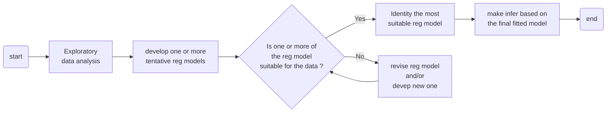
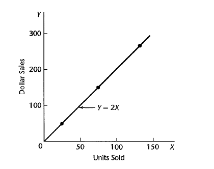
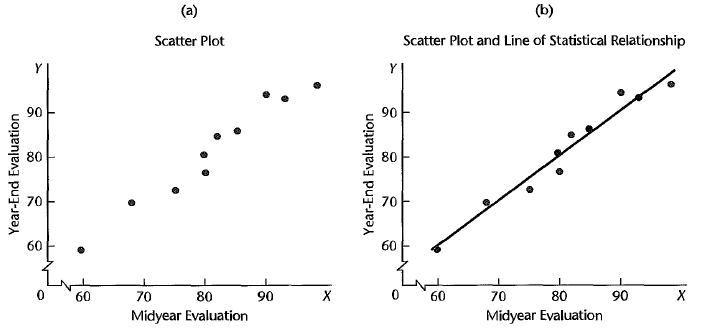

# Introduction

## 回歸分析的步驟

## 統計關係

在一般的函數關係中，給定 X 的值，那麼對於的 Y 值是確定的。

$$
Y=f(X)\xlongequal{e.g.}\beta_0+\beta_1X
$$

但在統計關係中，X 和 Y 之前除了函數關係，還存在一定的擾動項，也就是誤差項。這個誤差項是一個隨機變量，並且我們假設它的平均是 0。

$$
Y=f(X)+\varepsilon\xlongequal{e.g.}\beta_0+\beta_1X+\varepsilon \qquad \text{with} \quad E(\varepsilon)=0
$$

$$
\implies E[Y] = E[f(X)] + E[\varepsilon] = f(X)
$$

$f(X)$ 是 $Y$ 的平均函數，也就是回歸函數