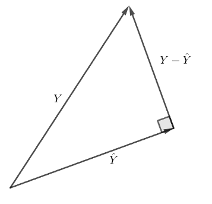
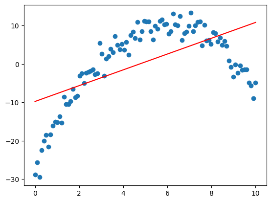
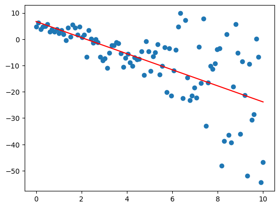
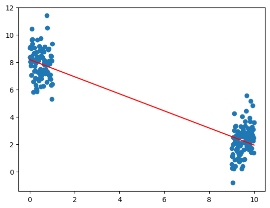
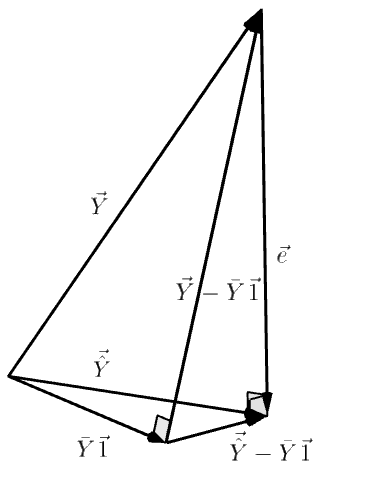

# 線性模型

## 簡單線性模型（Simple Linear Regression, SLR）

:::tip[Definition]
*SLR*
$i=1,\cdots,n, X_i\in \R^1$ and $E[\varepsilon_i]=0$

$$
Y_i=\beta_0+\beta_1X_i+\varepsilon_i
$$

$E[Y_i|X=X_i]=E[\beta_0+\beta_1X_i+\varepsilon_i$]=$\beta_0+\beta_1X_i=f(X_i, \utilde{\beta})$ 稱為回歸函數（regression function），其中 $\utilde{\beta}=(\beta_0, \beta_1)$ 是未知參數。

:::

## 複線性模型（Multiple Linear Model, MLR）

複線性模型與 SLR 類似，但區別在於 $X_i=(X_{i,1},X_{i,2},\cdots,X_{i,n})\in \R^n$ 是多為向量。

:::tip[Definition]
**MLR**

$i=1,\cdots,n \utilde{X_n}\in \R^k, k>1$

$$
Y_i=\beta_0+\beta_1X_{i,1}+\beta_2X_{i,2}+\cdots+\beta_kX_{i,k}+\varepsilon_i
$$

:::

:::info[Remark]
1. “線性”是指回歸函數 $f(x;\utilde{\beta})$ 中的參數都是線性的。
2. 在一些非線性關係中，通過將 $X$ 做一些變換，就也可以用線性模型來分析。
   
   e.g. $Y=\beta_0+\beta_1\sin t+\varepsilon \xRightarrow{x=\sin t} Y=\beta_0+\beta_1 x+\varepsilon$
:::

我們拿到一組數據 $(X_1,Y_1),\cdots,(X_n,Y_n)$，我們假設這組數據是由一個線性模型產生的，即 $Y_i=\beta_0+\beta X_i+\varepsilon_i$，但我們不知道 $\utilde{\beta}$，並且 $\varepsilon_i$ 是一個隨機變量。

我們的目標是通過這組數據來估計 $\utilde{\beta}$，得到 $\hat{\utilde{\beta}}$，然后通過 $\hat{\utilde{\beta}}$ 來得到预测值 $\hat{Y_i}=f(X_i;\hat{\utilde{\beta}})$。

## 最小二乘估計（Least Squares Estimation, LSE）

:::tip[Definition]
*残差*（residual）：$e_i=Y_i-\hat{Y_i}$
:::

我們希望預測值 $\hat{Y_i}$ 與實際值 $Y_i$ 的差距越小越好，即 $\sum_{i=1}^n e_i^2=\sum_{i=1}^n(Y_i-\hat{Y_i})^2$ 越小越好。為此，我們通常會使用 *最小二乘估計*（Least Squares Estimation, LSE）。

:::tip[Definition]
對於線性回歸 $Y_i=f(X_i;\utilde{\beta})+\varepsilon_i$，定義：
$$
Q(\utilde{\beta})=\sum_{i=1}^n(Y_i-E[Y_i])^2=\sum_{i=1}^n(Y_i-f(X_i;\utilde{\beta}))^2
$$

稱 $b$ 是 $\utilde{\beta}$ 的 LSE $\iff Q(b)=\min_{\utilde{\beta}} Q(\utilde{\beta})$
:::

:::tip[Theorem]
$$
\begin{align*}
   b_0&= \bar{Y}-b_1\bar{X} \\
   b_1&= \frac{\sum_{i=1}^n(X_i-\bar{X})(Y_i-\bar{Y})}{\sum_{i=1}^n(X_i-\bar{X})^2}= \frac{\sum_{i=1}^nX_i(Y_i-\bar{Y})}{\sum_{i=1}^n(X_i-\bar{X})^2}= \frac{\sum_{i=1}^n(X_i-\bar{X})Y_i}{\sum_{i=1}^n(X_i-\bar{X})^2}
\end{align*}
$$
:::

$\implies \hat{Y_i}=b_0+b_1X_i=\bar{Y}-b_1\bar{X}+b_1X_i=\bar{Y}+b_1(X_i-\bar{X})$。

$\implies e_i=Y_i-\bar{Y_i}=Y_i-\bar{Y}-b_1(X_i-\bar{X})$

1. $\sum_{i=1}^n e_i=\sum(Y_i-\bar{Y}-b_1(X_i-\bar{X}))=\sum(Y_i-\bar{Y})-b_1\sum(X_i-\bar{X})=0$
2. $\sum_{i=1}^n \hat{Y_i}=\sum(\bar{Y}-b_1(X_i-\bar{X}))=n\bar{Y}-b_1\sum(X_i-\bar{X})$
   
   $\implies \frac{1}{n}\sum_{i=1}^n \hat{Y_i}=\bar{Y}$, i.e. 預測值的中心點是數據值的中心點。
3.  

   $$
   \begin{align*}
      \sum_{i=1}^n(X_ie_i)&=\sum_{i=1}^n [X_i(Y_i-\bar{Y}-b_1(X_i-\bar{X}))] \\
      &=\sum_{i=1}^n X_i(Y_i-\bar{Y})-b_1\sum_{i=1}^n X_i(X_i-\bar{X}) \\
      &=\sum_{i=1}^n X_i(Y_i-\bar{Y})- \frac{\sum_{i=1}^nX_i(Y_i-\bar{Y})}{\sum_{i=1}^n(X_i-\bar{X})^2} \sum_{i=1}^n (X_i-\bar{X})^2 \quad \because\sum_{i=1}^n X_i(X_i-\bar{X})=\sum_{i=1}^n (X_i-\bar{X})^2\\
      &=0
   \end{align*}
   $$

   將 $\utilde{X}$ 和 $\utilde{e}$ 寫成向量，i.e. $\utilde{X}=(X_1,\cdots,X_n)^t\in \R^n, \utilde{e}=(e_1,\cdots,e_n)^t\in \R^n$，則 $\utilde{X}^t\utilde{e}=0 \implies \utilde{X} \perp \utilde{e}$ （垂直）。

4. $\sum_{i=1}^n\hat{Y_i}e_i=\sum_{i=1}^n b_0e_i+b_1\sum_{i=1}^nX_ie_i=0+0$, let $\utilde{\hat{Y}}=(\hat{Y_1},\cdots,\hat{Y_n})^t\in \R^n$

   $\implies \utilde{\hat{Y}}^t\utilde{e}=0$, i.e. $\utilde{\hat{Y}}\perp \utilde{e}$
   
   since $\utilde{e}=\utilde{Y}-\utilde{\hat{Y}}\implies\utilde{\hat{Y}}\perp\utilde{Y}-\utilde{\hat{Y}}$

   

   所以預測值 $\utilde{\hat{Y_i}}$ 是 $\utilde{Y}$ 的投影。

5. 擬合的回歸函數 $\hat{Y_i}=\bar{Y}+b_1(X_i-\bar{X})$ 通過點 $(\bar{X},\bar{Y})$。

## 最佳線性不偏預測（Best Linear Unbiased Estimator, BLUE）

> Q: 最小二乘法總是能得到一個好的 $\utilde{\hat{\beta}}$ 嗎？或者說，在什麼情況下最小二乘法難以得到一個好的 $\utilde{\beta}$？

1. 在下圖情況中，如果我們計算殘差 $e_i$，雖然可能會得到和為 0 的結果，但殘差的分佈有很明顯的正負聚集現象。而我們希望殘差的正負隨機分佈的。
   
   

   為了避免這種情況，我們需要誤差的期望為 0，即 $E[\utilde{\varepsilon}]=0$。

2. 下圖中的數據，隨著 $X$ 的增加，數據也越分散。
   
   

   為了避免這種情況，我們需要所有誤差的方差是一樣的，即 $Var[\utilde{e}]=\sigma^2$，其中 $\sigma^2$ 是一個常數。

4. 當沒有按照正規的程序獲取數據時，可能會出現下圖的情況。各個數據之間可能存在著相互關聯的情況。那麼擬合出來的回歸線會存在誤導性。
   
   

   為了避免這種情況，我們需要所有誤差之間是沒有線性關係的，即 $Cov[e_i, e_j]=0, \forall i\neq j$。

:::tip[Definition]

formal statement of the of linear regression model

$$
\begin{align*}
   Y_i&=f(\utilde{X_i}; \utilde{\beta})+\varepsilon_i \\
   &=\beta_0+\beta_1 X_{i,1}+\cdots+\beta_k X_{i,k}+\varepsilon_i \\
\end{align*}
$$

with the following conditions:

1. $E[\varepsilon_i]=0$
2. $Var[\varepsilon_i]=\sigma^2\set{\varepsilon_i}=\sigma^2$
3. $Cov[\varepsilon_i,\varepsilon_j]=\sigma\set{\varepsilon_i,\varepsilon_j}=0$
:::

我們可以直接得到結論：

1. $E[Y_i]=f(\utilde{X_i},\utilde{\beta})$ 是回歸函數。
2. $\sigma^2\set{Y_i}=\sigma^2\set{\varepsilon_i}=\sigma^2$，因為 $f(\utilde{X_i},\utilde{\beta})$ 是一個常數。
3. $\sigma\set{Y_i,Y_j}=\sigma\set{\varepsilon_i,\varepsilon_j}=0$.

---

**Recall** 對於 SLR，當我們已經拿到數據 $\utilde{X}$，$\beta_0, \beta_1$ 的 LSE 是:

$$
b_0=\bar{Y}-b_1\bar{X}, \qquad b_1=\frac{\sum_{i=1}^n(X_i-\bar{X})(Y_i-\bar{Y})}{\sum_{i=1}^n(X_i-\bar{X})^2}
$$

$$
\begin{align*}
   \implies & E[b_1] = \frac{\sum(X_i-\bar{X})EY_i}{\sum(X_i-\bar{X})^2}=\frac{\sum(X_i-\bar{X})(\beta_0+\beta_1 X_i)}{\sum(X_i-\bar{X})^2}=\beta_1 \\
   & E[b_0]=E[\bar{Y}-b_1\bar{X}]=E\bar{Y}-\bar{X}E[b_1]=\beta_0+\beta_1\bar{X}-\bar{X}\beta_1=\beta_0
\end{align*}
$$

$\implies E\hat{Y_i}=E[b_0+b_1X_i]=\beta_0+\beta_1X_i=EY_i$，因此 $\hat{Y_i}$ 是 $Y_i$ 的無偏估計。

$\implies E[e_i]\triangleq E[Y_i-\hat{Y_i}]=0$

:::tip[Definition]
$\sum w_iY_i$ 被稱為線性估計量（linear estimator）。
:::

$$
\begin{align*}
   &b_1 = \frac{\sum(X_i-\bar{X})Y_i}{\sum(X_i-\bar{X})^2}=\sum k_iY_i, \quad \text{with }k_i=\frac{X_i-\bar{X}}{\sum(X_i-\bar{X})^2} \text{ and } \sum k_i=0 \\
   &b_0 = \bar{Y}-b_1\bar{X}=\sum(\frac{1}{n}-k_i\bar{X})Y_i=\sum c_iY_i, \quad \text{with }c_i=\frac{1}{n}-k_i\bar{X} \text{ and } \sum c_i=1
\end{align*}
$$

因此 $b_0,b_1$ 是 $\beta_0,\beta_1$ 的線性無偏估計。

:::info[Remark]
Same for MLR
:::

:::tip[Theorem]
*Gauss-Markov theorem*

When $E(\varepsilon_i)=0, \sigma^2\set{\varepsilon_i}=0, \sigma\set{\varepsilon_i,\varepsilon_j}=0$

Then $\utilde{b}$ are the Best Linear Unbiased Estimators (BLUE) of $\utilde{\beta}$.
:::

$$
\begin{align*}
   \sigma^2\set{b_1}&=\sigma^2\set{\sum k_iY_i}\\
   &=\sum k_i^2\sigma^2\set{Y_i}+\sum_{i\neq j}k_ik_j\sigma\set{Y_i,Y_j}\\
   &=\sigma^2\sum k_i^2 \quad \text{since }\sigma^2\set{Y_i}=\sigma^2, \sigma\set{Y_i,Y_j}=0\\
   &=\sigma^2 \frac{\sum(X_i-\bar{X})^2}{(\sum(X_i-\bar{X})^2)^2}=\frac{\sigma^2}{\sum(X_i-\bar{X})^2}\\
   &\implies \text{數據越分散越好}\\

   \sigma^2\set{b_0}&=\sigma^2\set{\sum c_iY_i}\\
   &=\sum c_i^2\sigma^2\set{Y_i}+\sum_{i\neq j}c_ic_j\sigma\set{Y_i,Y_j}\\
   &=\sigma^2\sum c_i^2 \quad \text{since }\sigma^2\set{Y_i}=\sigma^2, \sigma\set{Y_i,Y_j}=0\\
   &=\sigma^2 \sum (\frac{1}{n^2}-2\frac{\bar{Xk_i}}{n}+k_i^2\bar{X}^2)\\
   &=\sigma^2 (\frac{1}{n}+\frac{\bar{X}^2}{\sum(X_i-\bar{X})^2}) \quad \text{since }\sum k_i=0\\
   &\implies \text{數據越多越好，並且希望使} \bar{X}=0
\end{align*}
$$

## 變異數分析（Analysis of Variance, ANOVA）

我們想要知道目標 $\utilde{Y}$ 的變化量能否被預測值解釋。而变异数分析是在计算数据与均值之间的差异。

**Note**:

$\utilde{\bar{Y}}\perp \utilde{e}=\utilde{Y}-\utilde{\bar{Y}} \implies ||\utilde{Y}||^2=||\utilde{\bar{Y}}||^2+||\utilde{e}||^2$

$\sum e_i=0\implies \utilde{e}\cdot \utilde{1}=0 \implies \utilde{e}\perp \utilde{1}$

$\implies \sum[e\cdot(\hat{Y_i}-\bar{Y})]=\sum e_i\hat{Y_i} + \bar{Y}\sum e_i\cdot 1 = 0 \implies \utilde{e}\perp \utilde{\hat{Y}}-\bar{Y}\utilde{1}$ 

$\implies ||\utilde{Y}-\bar{Y}\utilde{1}||^2=||\utilde{\hat{Y}}-\bar{Y}\utilde{1}||^2+||\utilde{e}||^2$

$$
\text{i.e.}\quad \underbrace{\sum(Y_i-\bar{Y})^2}_{\text{SSTO}}=\underbrace{\sum(\hat{Y_i}-\bar{Y})^2}_{\text{SSR}}+\underbrace{\sum(Y-\hat{Y_i})^2}_{\text{SSE}}
$$

:::tip[Definition]
$$
\begin{align*}
   \text{SSTO}&=\sum(Y_i-\bar{Y})^2 \quad \text{Sum of Squared Total var (Of Y)} \\
   \text{SSR}&=\sum(\hat{Y_i}-\bar{Y})^2 \quad \text{Regression Sum of Squares} \\
   \text{SSE}&=\sum(Y-\hat{Y_i})^2 \quad \text{Error Sum of Squares}
\end{align*}
$$
:::

- SSTO：表示數據 $Y$ 與其均值 $\bar{Y}$ 之間的差異，也就是數據的變異量。
- SSR：表示預測值 $\hat{Y}$ 與均值 $\bar{Y}$ 之間的差異。代表了模型解釋的變異量。SSR 越大，說明模型解釋的變異量越多。
- SSE：殘差的平方和。代表了模型無法解釋的變異量。SSE 越小，說明模型無法解釋的變異量越少。

:::tip[Theorem]
**Fundamental identity**

$$
\begin{alignat*}{4}
   \text{df} \quad& \text{SSTO}&\quad=&\quad\text{SSR}&+\quad&\text{SSE}\\
   \text{SLR} \quad&n-1&\quad=&\quad 1 &+ \quad&n-2\\
   \text{MLR} \quad&n-1&\quad=&\quad k &+ \quad&n-\underbrace{(k+1)}_{p= \text{參數量}}
\end{alignat*}
$$

- df: 自由度（degree of freedom）
- k: 自變量的個數
:::

$$
E[SSE]=E[\sum e_i^2]=\sum E[e_i^2]\xlongequal{E[e_i]=0} \sum \sigma^2\set{e_i}=(n-p)\sigma^2
$$

$$
\implies E[\frac{SSE}{n-p}]=\sigma^2
$$

:::tip[Definition]
$$
MSE\triangleq\frac{SSE}{n-p}\qquad MSR\triangleq\frac{SSR}{p-1}
$$
:::

Hence, MSE is unbiased for $\sigma^2$.

:::info[Remark]
在回歸中，我們通常使用 MSE 估計 $\sigma^2$。而 $\sigma$ 則用 $\sqrt{\text{MSE}}$ 估計。
:::

:::tip[Definition]
對於 $\sigma^2\set{*}=\sigma^2\cdot c$，我們定義一個估計方法：

$$
S^2\set{*}=MSE\cdot c = \hat{\sigma^2}\set{*}
$$
:::

E.g. 

$$
\sigma^2\set{b_1}= \sigma^2\frac{1}{\sum(X_i-\bar{X})^2}\implies S^2\set{b_1}= MSE\frac{1}{\sum(X_i-\bar{X})^2}
$$

因此 $\frac{S^2{*}}{\sigma^2\set{*}}$ 的比值永遠會是 $\frac{MSE}{\sigma^2}$。

## 常態誤差回歸模型（Normal Error Regression Model）

在回歸模型的基礎上，我們進一步假設誤差項 $\varepsilon_i$ 是服從常態分佈的。

:::tip[Definition]
$$
Y_i=f(\utilde{X_i};\utilde{\beta})+\varepsilon_i, \quad \varepsilon_i\overset{\text{iid}}{\sim} N(0,\sigma^2)
$$
:::

因此 $Y_i$ 也會獨立服從 $N(f(\utilde{X_i};\utilde{\beta}),\sigma^2)$。既然 $Y_i$ 的分佈是已知的，我們就可以構建它的似然函數。

$$
\begin{align*}
  L(\utilde{\beta},\sigma^2)&=\prod_{i=1}^n \frac{1}{\sqrt{2\pi\sigma^2}}\exp\left(-\frac{(Y_i-f(\utilde{X_i};\utilde{\beta}))^2}{2\sigma^2}\right)\\
   &=\frac{1}{(2\pi\sigma^2)^{n/2}}\exp\left(-\frac{1}{2\sigma^2}\sum_{i=1}^n(Y_i-f(\utilde{X_i};\utilde{\beta}))^2\right)\\
   &=\frac{1}{(2\pi\sigma^2)^{n/2}}\exp\left(-\frac{1}{2\sigma^2}\sum_{i=1}^n(Y_i-\hat{Y_i}))^2\right)\\
   &=\frac{1}{(2\pi\sigma^2)^{n/2}}\exp\left(-\frac{1}{2\sigma^2}Q(\utilde{\beta})\right)
\end{align*}
$$

$\implies$ 在 SLR 中，$\hat{\beta_0}_{MLE} = b_0, \hat{\beta_1}_{MLE} = b_1$。並且 

$$
\hat{\sigma^2}_{MLE}=\frac{1}{n}\sum_{i=1}^n(Y_i-\hat{Y_i})^2=\frac{SSE}{n}
$$
