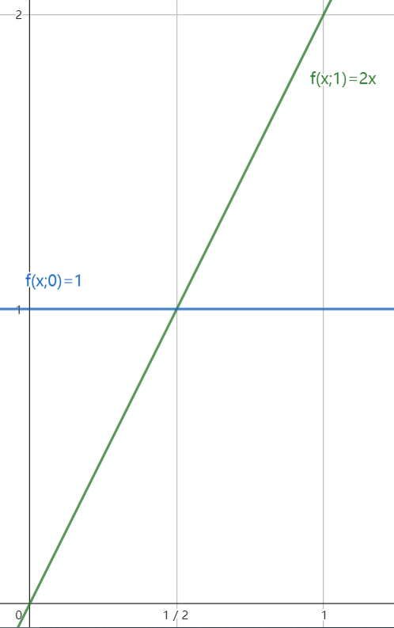

# 最大概式估計量（Maximum Likelihood Estimation, MLE）

給定一組從母體得到的樣本。MLE 的目標是找到那個最有可能得到這組樣本的母體參數。

:::tip[Definition]
Given $\utilde{X}=\utilde{x}$
1. Likelihood function: $L(\theta|\utilde{x})\triangleq f(\utilde{x};\theta)$，是 $\theta$ 的函數，$\utilde{x}$ 是固定的。
2. $\hat{\theta}=\hat{\theta}(\utilde{X})$ 如果滿足以下條件：
   1. $\hat{\theta}(\utilde{x})\in\Omega$
   2. $L(\hat{\theta}|\utilde{x})=\max_{\theta\in\Omega}L(\theta|\utilde{x})$, i.e. $\hat{\theta}$ 是最有可能得到結果 $\utilde{x}$ 的參數。
3. $\eta(\theta)$ 的 MLE 可以直接用 $\hat{\theta}_{MLE}$ 代入得到，i.e. $\widehat{\eta(\theta)}=\eta(\hat{\theta})$
:::

:::info[Remark]
1. MLE 不一定是唯一的
2. MLE 不一定是最小充分統計量的函數，因此可以用 Rao-Blackwell 定理進行改進
3. 如果 MLE 是唯一的，則它一定是最小充分統計量的函數
:::

**EX**: $\Omega=\set{0,1}$ and X is continuous

$$
X\stackrel{\text{iid}}{\sim} f(x;\theta)=
\begin{cases}
   1 & \theta=0\\
   2x & \theta=1
\end{cases}
$$

因为当 $x\in(\frac{1}{2},1)$ 时，$\theta=1$ 的概率密度函数比 $\theta=0$ 的大，而 $x\in(0,\frac{1}{2})$ 时，$\theta=0$ 的概率密度函数比 $\theta=1$ 的大。

$$
\implies \hat{\theta}(X)=
\begin{cases}
   0 & 0<x\le \frac{1}{2}\\
   1 & \frac{1}{2}<x\le 1
\end{cases}
$$

$$
\begin{align*}
   E_\theta[\hat{\theta}(X)] &= 0\cdot P_\theta(\hat{\theta}(X)=0)+1\cdot P_\theta(\hat{\theta}(X)=1)\\
   &= P_\theta(\frac{1}{2}<X\le 1)\\
   &=
   \begin{cases}
      \frac{1}{2} & \theta=0\\
      \frac{3}{4} & \theta=1
   \end{cases}\\
   &\neq \theta
\end{align*}
$$

因此 $\hat{\theta}(X)$ 不是無偏的。

---

:::info[Remark]
如果 $\Omega$ 包含了一個開區間，那麼 $\max L(\theta|\utilde{x})\iff \max \log L(\theta|\utilde{x})$
:::

**EX**: $X_1,\cdots, X_n \stackrel{\text{iid}}{\sim} B(1,p),p\in\Omega=[0,1]$

$$
\begin{align*}
   &\implies L(p|\utilde{x})=p^t(1-p)^{n-t},\qquad t=\sum_{i=1}^n x_i\\
   &\implies \log L(p|\utilde{x})=t\log p+(n-t)\log(1-p)\\
\end{align*}
$$

因為 $\log L(p|\utilde{x})$ 是 $p$ 的函數，所以可以用微分的方法找到最大值。為了避免用二次微分來確定是最大值還是最小值，我們用判斷一次微分的正負來確定峰值的位置。

$$
\begin{align*}
   &\frac{d}{dp}\log L(p|\utilde{x})=\frac{t}{p}-\frac{n-t}{1-p}>0\\
   \iff & t>np\\
   \iff & p<\bar{X}\\
   \implies & \hat{p}_{MLE}=\bar{X}
\end{align*}
$$

If $\eta(\theta)=p(1-p)$， then $\widehat{\eta(\theta)}=\hat{p}_{MLE}(1-\hat{p}_{MLE})=\bar{X}(1-\bar{X})$

現在令 $p\in\Omega=[\frac{1}{4}, \frac{4}{5}]$。因為 MLE 要求估計值是合理的，即 $\hat{\theta}\in\Omega$：

$$
\hat{p}_{MLE}=
\begin{cases}
   \frac{1}{4} &, 0<\bar{X} < \frac{1}{4}\\
   \bar{X} &, \frac{1}{4}\le\bar{X}\le \frac{4}{5}\\
   \frac{4}{5} &, \frac{4}{5}<\bar{X}
\end{cases}
$$

如果再令 $\Omega=(\frac{1}{4}, \frac{4}{5}]$
$$
\implies \hat{p}_{MLE}=
\begin{cases}
   \text{D.N.E} &, 0<\bar{X} < \frac{1}{4}\\
   \bar{X} &, \frac{1}{4}<\bar{X}\le \frac{4}{5}\\
   \frac{4}{5} &, \frac{4}{5}<\bar{X}
\end{cases}
$$

此時 MLE 不存在。