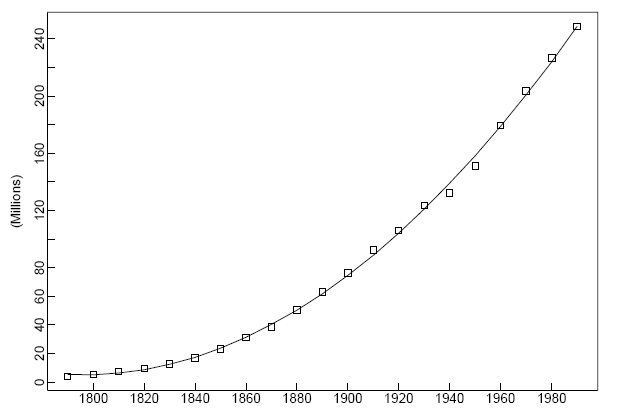
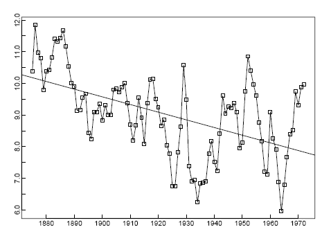
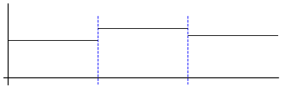

# 時間序列

## 簡單模型

時間序列的模型可以簡單的拆分為兩個部分：長期趨勢和誤差項，即：

$$
X_t=m_t+Y_t
$$

- $m_t$：長期趨勢函數
- $Y_t$：誤差項。我們認為誤差會在趨勢上下隨機分佈，i,e. $E[Y_t]=0$。如果誤差項不為 0，可以調整 $m_t$ 使其為 0。

E.g: $X_t=m_t+Y_t=(a+bt+ct^2)+Y_t$

有的數據可能會有週期性，這時可以加入週期項：

$$
X_t=m_t+S_t+Y_t
$$

- $S_t$：週期項

如果週期為 $d$，則 $\sum_{i=1}^d S_t=0$。如果數據週期的震蕩幅度遞增/遞減，可以用 $ln$ 函數進行壓縮。

:::tip[Definition]
定義：
- 退後運算子（Backward Operator）：$B^kX_t\triangleq X_{t-k}$
- 差分運算子（Difference Operator）：$\nabla\triangleq 1-B$
  
$d$ 步差分運算為：

$$
\nabla_dX_t=(1-B^d)X_t=X_t-X_{t-d}
$$
:::

注意：差分 $k$ 次記為 $\nabla^kX_t=(1-B)^kX_t$。E.g. $\nabla^2X_t=(1-B)^2X_t=X_t-2X_{t-1}+X_{t-2}$

如果長期趨勢是 $m$ 次多項式，則差分 $m$ 次後會得到一個水平的序列。

比如 $m_t=c_0+c_1t$，則 $\nabla^2m_t=m_t-m_{t-1}=c_0+c_1t-(c_0+c_1(t-1))=c_1$

---

$X_t=m_t+S_t+Y_t$， 估計 $m_t$ 和 $S_t$，假設週期為 $d$，并且总体趋势是缓慢变化的。

將第 $t$ 筆數據記為 $(j,k)$，即第 $j$ 周的第 $k$ 筆。他們的關係為 $t=(j-1)*d+k$。

將同一週期的 $X_t$ 做平均，即 

$$
\begin{align*}
    \bar{X}_j=\frac{1}{d}\sum_{k=1}^dX_{(j-1)d+k}=&\frac{1}{d}\sum_{k=1}^dm_{(j-1)d+k}+\frac{1}{d}\sum_{k=1}^dS_{(j-1)d+k}+\frac{1}{d}\sum_{k=1}^dY_{(j-1)d+k}\\
    =&\frac{1}{d}\sum_{k=1}^dm_{(j-1)d+k} \qquad \because \sum_{k=1}^dS_{(j-1)d+k}=0 ,\quad E[Y_t]=0\\
\end{align*}

$$

因此 $\hat{m_j}=\frac{1}{d}\sum_{k=1}^d m_k=\frac{1}{d}\sum_{k=1}^d X_k$ 是第 $j$ 周期的平均。

$\hat{S_k}$ 可以用每个周期的第 $k$ 筆 $X_k-m_k$ 的数据做平均得到。

$\hat{Y_{j,k}}=X_{j,k}-\hat{m_j}-\hat{S_k}$

## 穩定的時間序列

:::tip[Definition]

The **convaiance function** of ${X_j}$ is

$$
\gamma(j)\triangleq Cov(X_k, X_{k+j})=E[(X_k-E[X_k])(X_{k+j}-E[X_{k+j}])]
$$
:::

Given data $X_1, X_2, \cdots, X_n$，$\hat{\gamma(k)}=\frac{1}{n}\sum_{j=1}^{n-k}(X_j-\bar{X})(X_{j+k}-\bar{X})$

:::tip[Definition]
**Autocorrelation function** of ${X_j}$ is

$$
\rho_X(k)\triangleq\frac{\gamma(k)}{\gamma(0)}
$$
:::

:::tip[Definition]
如果 $\forall i,j$ and $i\neq j$ $\implies \gamma(i)=\gamma(j)$，即在任何時間點，等距時間的兩個數據的協方差相等，則 ${X_j}$ 是**穩定的**（stationary）。
:::

Suppose $X_t=Z_t+\theta Z_{t-1}$, $Z_t \stackrel{\text{iid}}{\sim} E[Z_t]=0, Var[Z_t]=\sigma^2$

$$
\begin{align*}
    \gamma(0) &= Cov(Z_t+\theta Z_{t-1}, Z_{t}+\theta Z_{t-1})\\
    &=Cov(Z_t, Z_t)+\theta Cov(Z_t, Z_{t-1})+\theta Cov(Z_{t-1}, Z_t)+\theta^2Cov(Z_{t-1}, Z_{t-1})\\
    &=\sigma^2 + 0 + 0 + \theta^2\sigma^2 \qquad \because Z_t \text{ and } Z_{t-1} \text{ are independent}\\
    &=\sigma^2(1+\theta^2)
\end{align*}
$$

$$
\begin{align*}
    \gamma(1) &= Cov(Z_t+\theta Z_{t-1}, Z_{t+1}+\theta Z_{t})\\
    &=Cov(Z_t, Z_{t+1})+\theta Cov(Z_t, Z_{t})+\theta Cov(Z_{t-1}, Z_{t+1})+\theta^2Cov(Z_{t-1}, Z_{t})\\
    &=0 + 0 + 0 + \theta\sigma^2 \qquad \because Z_t \text{ and } Z_{t+1} \text{ are independent}\\
    &=\theta\sigma^2\\
    &=\gamma(-1)
\end{align*}
$$

$$
\begin{align*}
    \gamma(2) &= Cov(Z_t+\theta Z_{t-1}, Z_{t+2}+\theta Z_{t+1})\\
    &=Cov(Z_t, Z_{t+2})+\theta Cov(Z_t, Z_{t+1})+\theta Cov(Z_{t-1}, Z_{t+2})+\theta^2Cov(Z_{t-1}, Z_{t+1})\\
    &=0 + 0 + 0 + 0\\
    &=0\\
    &=\gamma(-2)
\end{align*}
$$

如果 $\gamma(n)\neq 0$，則 $X_t$ 與前後 $n$ 個時間點的數據有關聯。如果 $\gamma(n)=0, \forall n$，則 $X_t$ 是獨立的。